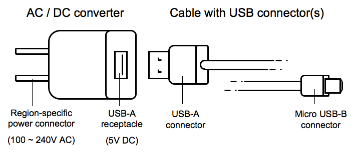

In 2009 the **Common External Power Supply** was introduced in
Europe for Smartphones. From now on, all Smartphones have compatible
power supply units. It looks like this

<figure>
    
    <figcaption><a href='https://commons.wikimedia.org/wiki/File:Common_EPS_components1.png'>Source</a></figcaption>
</figure>

With IEC 62700 standardization of notebook power supplies could be achieved.

## Sources
* [Major milestone: single charger for notebook computers will significantly reduce e-waste](http://www.iec.ch/newslog/2013/nr2713.htm)
* [Ein Ladegerät für alle Notebooks](http://www.golem.de/news/iec-62700-ein-ladegeraet-fuer-alle-notebooks-1312-103424.html)
