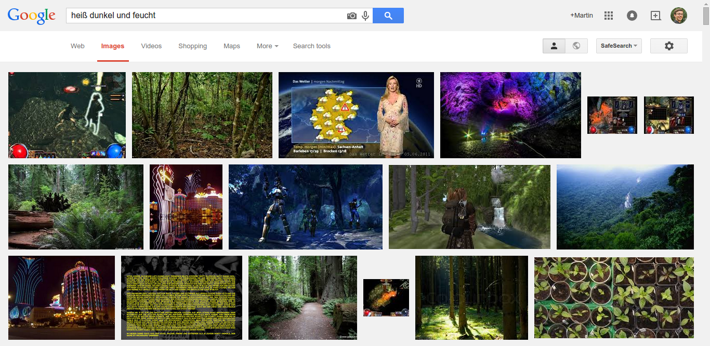
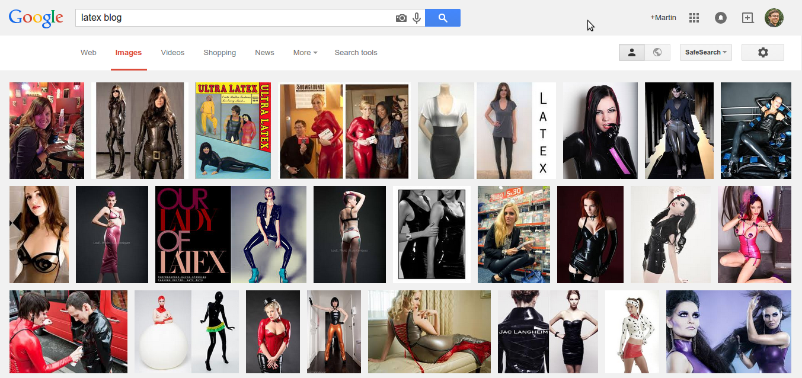

Search engines have a hard time figuring out what you actually wanted to find
when you typed your search words / phrase as natural language has very often
multiple meanings

## Hot Dark Wet

Recently in Big Bang theory they wanted to search for training places to test
the conditions of living / working in a mine. Sheldon searched for
"Hot dark wet". I tried it (in German, which has just the same double meaning)
and got surprisingly good results:

<figure>
    
    <figcaption>Hot dark wet</figcaption>
</figure>

## LaTeX

I searched for "LaTeX blog" - the typesetting language. I was so into
typesetting that I did not notice that there could other blogs come up. I did
this mistake in 2014. Now I get good results in the web search, but the image
search still thinks I mean the other "latex" (and makes it automatically
lowercase...):

<figure>
    
    <figcaption>LaTeX blog</figcaption>
</figure>
