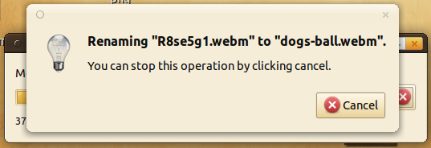

## ZSH: arg list too long




## File busy




## Crashes / Slow response times

My system responded always, no matter what I did. Now I had multiple crashes /
waiting times:

* Opening images of 24&nbsp;MB (some with about 50&nbsp;MB) &rightarrow; Eye of
  Mate crashes
* Opening a folder with about 60&thinsp;000 files &rightarrow; Caja gets
  *really* slow
* Opening a file with a single line which is very long &rightarrow; Sublime
  Text gets really slow

<figure class="wp-caption aligncenter img-thumbnail">
    
    <figcaption class="text-center">Renaming becomes really slow</figcaption>
</figure>


## Swapping

When your system starts to swap, it becomes unusably slow. You should stop
(kill) whatever you were doing and empty the swap:

```bash
# swapoff -a
# swapon -a
```

This takes several minutes.


## Long saving times

<figure class="wp-caption aligncenter img-thumbnail">
     </a>
    <figcaption class="text-center">Saving your data suddenly takes a long time</figcaption>
</figure>