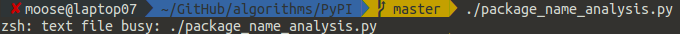
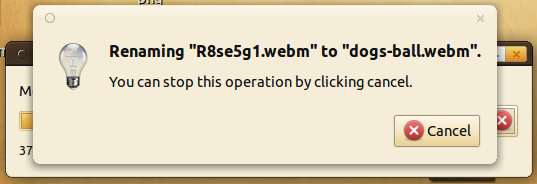
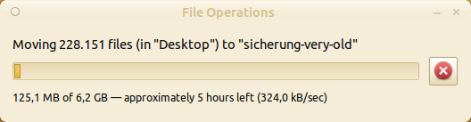

## ZSH: arg list too long

<figure>
    <a href="../images/2015/12/ml-not-seen-before-zsh-arg-list-too-long.png"></a>
    <figcaption>ZSH complaining that the argument list is too long</figcaption>
</figure>


## File busy

<figure>
    <a href="../images/2015/12/ml-not-seen-before-file-busy.png"></a>
    <figcaption>A small text files of about 200 lines with no more than 80 characters per line taking so much time that I'm faster starting it than it is with writing (heavy IO in the background)</figcaption>
</figure>


## Crashes / Slow response times

My system responded always, no matter what I did. Now I had multiple crashes /
waiting times:

* Opening images of 24&nbsp;MB (some with about 50&nbsp;MB) &rightarrow; Eye of
  Mate crashes
* Opening a folder with about 60&thinsp;000 files &rightarrow; Caja gets
  *really* slow
* Opening a file with a single line which is very long &rightarrow; Sublime
  Text gets really slow

<figure>
    <a href="../images/2015/12/ml-not-seen-before-renaming-time.png"></a>
    <figcaption>Renaming becomes really slow</figcaption>
</figure>


## Swapping

When your system starts to swap, it becomes unusably slow. You should stop
(kill) whatever you were doing and empty the swap:

```bash
# swapoff -a
# swapon -a
```

This takes several minutes.


## Long saving times

<figure>
    <a href="../images/2015/12/ml-not-seen-before-saving.png"></a>
    <figcaption>Saving your data suddenly takes a long time</figcaption>
</figure>
