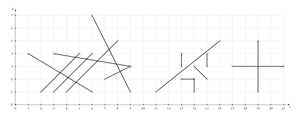

Suppose you're given a lot of lines. Your task is to give a list of all pairs of lines that cross.

The list of lines might be something like this:
<table>
<tr>
<td>
<ul>
    <li>a: {(1|4),(6|1)}</li>
    <li>b: {(2|1),(5|4)}</li>
    <li>c: {(3|1),(6|4)}</li>
    <li>d: {(4|1),(8|5)}</li>
    <li>e: {(3|4),(9|3)}</li>
</ul>
</td>
<td>
<ul>
    <li>f: {(7|2),(9|3)}</li>
    <li>g: {(6|7),(9|1)}</li>
    <li>h: {(11|1),(16|5)}</li>
    <li>i: {(13|3),(13|4)}</li>
    <li>j: {(15|3),(15|4)}</li>
</ul>
</td>
<td>
<ul>
    <li>k: {(13|2),(14|2)}</li>
    <li>l: {(14|1),(14|2)}</li>
    <li>m: {(17|3),(21|3)}</li>
    <li>n: {(19|5),(19|1)}</li>
    <li>o: {(11|1),(16|5)}</li>
</ul>
</td>
</tr>
</table>

You can visualize the given lines like this:
[caption id="attachment_53231" align="aligncenter" width="500"] Some lines[/caption]

Now your list of pairs should look like this:
[[a, b], [a, c], [a, d], [d, g], [e, b], [e, c], [e, d], [e, f], [e, g], [f, g], [k, l], [m, n], [h, o]]
So we have 15 lines and 13 intersections.

<h2>What is an intersection?</h2>

Two lines $a, b$ intersect $:\Leftrightarrow \exists \text{Point} P: P \in a \land P \in b$

This means, all of the following images show intersecting lines:

    ../images/2013/01/intersecting-lines-1.png  "Intersecting lines: #1"
    ../images/2013/01/intersecting-lines-2.png  "Intersecting lines: #2"
    ../images/2013/01/intersecting-lines-3.png  "Intersecting lines: #3"
    ../images/2013/01/intersecting-lines-4.png  "Intersecting lines: #4"
    ../images/2013/01/intersecting-lines-5.png  "Intersecting lines: #5"


You might want to read my article <a href="../how-to-check-if-two-line-segments-intersect/" title="How to check if two line segments intersect">How to check if two line segments intersect</a>, as we need a method that gets two line segments as parameters returns if they intersect.

<h2>How many intersections can exist?</h2>
Let $n$ be the number of lines.

$n=1$: If you have only one line, there is obviously no intersection. A line can only intersect with another line

$n=2$: The new line can only intersect with lines that are already there. So there is one new intersection.

$n=3$: As before, the new line can only intersect with existing lines. So you get at most two new intersection points. As the old lines can only have 1 intersection point at most, you have a maximum of 3 intersection points.

I guess you noticed the pattern. The maximum of intersection points of $n$ is $\displaystyle \sum_{i=1}^{n-1} i = \frac{(n-1)^2 + (n-1)}{2} = \frac{n^2 - 2n + 1 + n -1}{2} = \frac{n^2-n}{2}$

At the moment, this is only an upper border. We didn't prove that you can actually get that much intersections. We only showed that you can't get more intersections.

<h2>A simple solution</h2>

I know how to check if two line segments intersect (see <a href="../how-to-check-if-two-line-segments-intersect">article</a>). But lets say I have $n$ line segments and you want to find every pair of lines that intersect. You could simply go through each combination of pairs:

<h3>First way to think about it</h3>
<ul>
<li>First, I can check if the first line crosses the second, third, forth, ... n-th line.</li>
<li>Then I check if the second line crosses the third, forth, ... n-th line.</li>
<li>...</li>
<li>I check if the (n-1)-th line crosses the n-th line.</li>
</ul>

So I have to do $(n-1) + (n-2) + \dots + 1 = \sum_{i=1}^{n-1} i = \frac{(n-1)^2+(n-1)}{2} = \frac{n^2-n}{2} $checks.

<h3>Second way to think about it</h3>
I don't care about order. I have to do every check. So when I have $n$ elements and I want to choose $\binom{n}{2} = \frac{n!}{2!(n-2)!} = \frac{n \cdot (n-1)}{2} = \frac{n^2-n}{2}$

<h2>Sweep-Line algorithm</h2>
The sweep line algorithm for checking intersections in a set of line segments goes through the image from left to right. When the sweep line (which is only a x-coordinate!) goes over a new line segment, it adds this to a datastructure. When the sweep line comes over an end of a line segment, it removes the line segment from this data structure.
