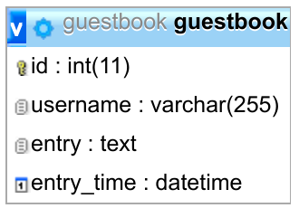

This mini article guides you through the process of creating a RESTful Web
Service with Java and Spring on Ubuntu 16.04. As an example, I chose a very
simple guestbook.

Much of this mini-article is from [Building a RESTful Web Service](https://spring.io/guides/gs/rest-service/)
by the official spring portal.


## The Guestbook

The users should have the possibility to enter their name and some text. This
will be stored as well as the time when it was submitted. All entries are displayed.


### User Experience

<figure class="wp-caption aligncenter img-thumbnail">
    
    <figcaption class="text-center">All guestbook entries are shown, ordered by time</figcaption>
</figure>


<figure class="wp-caption aligncenter img-thumbnail">
    
    <figcaption class="text-center">New guestbook entries can be made</figcaption>
</figure>

Those images are made with <a href="https://martin-thoma.com/how-can-i-sketch-an-application/">Balsamiq</a>.


### Database

```
CREATE TABLE `guestbook` (
  `id` int(11) NOT NULL,
  `username` varchar(255) NOT NULL,
  `entry` text NOT NULL,
  `entry_time` datetime NOT NULL DEFAULT CURRENT_TIMESTAMP
) ENGINE=InnoDB DEFAULT CHARSET=latin1;

ALTER TABLE `guestbook`
  ADD PRIMARY KEY (`id`);
```

<figure class="wp-caption aligncenter img-thumbnail">
    
    <figcaption class="text-center">Guestbook database (create with phpMyAdmin)</figcaption>
</figure>


###


## Java

```
$ sudo add-apt-repository ppa:webupd8team/java
$ sudo apt-get update -y
$ sudo apt-get install oracle-java8-installer
```

Make sure you have the right JRE version

```
$ java -version
java version "1.8.0_131"
Java(TM) SE Runtime Environment (build 1.8.0_131-b11)
Java HotSpot(TM) 64-Bit Server VM (build 25.131-b11, mixed mode)
```

Now check which JDK version you have:

```
$ javac -version
javac 1.8.0_131
```


## Maven

[Apache Maven](https://en.wikipedia.org/wiki/Apache_Maven) or short Maven is a
build automation tool like Gradle, Make, Rake, Grunt and [many more](https://en.wikipedia.org/wiki/List_of_build_automation_software).

In order to install the latest version of Maven, you can look in [this directory](http://www-eu.apache.org/dist/maven/maven-3/) and install it like this:

```
$ cd /opt/
$ sudo wget http://www-eu.apache.org/dist/maven/maven-3/3.5.0/binaries/apache-maven-3.5.0-bin.tar.gz -O maven.tar.gz
$ sudo tar -xvzf maven.tar.gz
$ sudo mv apache-maven-3.5.0 maven
$ sudo rm maven.tar.gz
```

Now add it to your environment variables e.g. by adding it to your `~/.profile`:

```
export M2_HOME=/opt/maven
export PATH=${M2_HOME}/bin:${PATH}
```

After sourcing your `~/.profile` (or restarting your terminal) you can check if everything
worked:

```
$ mvn --version
Apache Maven 3.5.0 (ff8f5e7444045639af65f6095c62210b5713f426; 2017-04-03T21:39:06+02:00)
Maven home: /opt/maven
Java version: 1.8.0_131, vendor: Oracle Corporation
Java home: /usr/lib/jvm/java-8-oracle/jre
Default locale: en_US, platform encoding: UTF-8
OS name: "linux", version: "4.4.0-81-generic", arch: "amd64", family: "unix"
```

Maven makes use of a `pom.xml` which is short for *Project Object Model*. It
could look like this:

```
<?xml version="1.0" encoding="UTF-8"?>
<project xmlns="http://maven.apache.org/POM/4.0.0" xmlns:xsi="http://www.w3.org/2001/XMLSchema-instance"
    xsi:schemaLocation="http://maven.apache.org/POM/4.0.0 http://maven.apache.org/xsd/maven-4.0.0.xsd">
    <modelVersion>4.0.0</modelVersion>

    <groupId>org.springframework</groupId>
    <artifactId>guestbook</artifactId>
    <version>0.1.0</version>

    <parent>
        <groupId>org.springframework.boot</groupId>
        <artifactId>spring-boot-starter-parent</artifactId>
        <version>1.5.2.RELEASE</version>
    </parent>

    <dependencies>
        <dependency>
            <groupId>org.springframework.boot</groupId>
            <artifactId>spring-boot-starter-web</artifactId>
        </dependency>
        <dependency>
            <groupId>org.springframework.boot</groupId>
            <artifactId>spring-boot-starter-test</artifactId>
            <scope>test</scope>
        </dependency>
        <dependency>
            <groupId>com.jayway.jsonpath</groupId>
            <artifactId>json-path</artifactId>
            <scope>test</scope>
        </dependency>
    </dependencies>

    <properties>
        <java.version>1.8</java.version>
    </properties>


    <build>
        <plugins>
            <plugin>
                <groupId>org.springframework.boot</groupId>
                <artifactId>spring-boot-maven-plugin</artifactId>
            </plugin>
        </plugins>
    </build>

    <repositories>
        <repository>
            <id>spring-releases</id>
            <url>https://repo.spring.io/libs-release</url>
        </repository>
    </repositories>
    <pluginRepositories>
        <pluginRepository>
            <id>spring-releases</id>
            <url>https://repo.spring.io/libs-release</url>
        </pluginRepository>
    </pluginRepositories>
</project>
```


## Project structure

A typical project structure is

```
.
├── pom.xml
└── src
    ├── main
    │   └── java
    │       └── hello
    └── test
        └── java
            └── hello
```


## Spring

This project returns IDs given a user name.

The file `src/main/java/hello/Greeting.java` represents the resource:

```
package hello;

public class Greeting {

    private final long id;
    private final String content;

    public Greeting(long id, String content) {
        this.id = id;
        this.content = content;
    }

    public long getId() {
        return id;
    }

    public String getContent() {
        return content;
    }
}
```

And the file `src/main/java/hello/GreetingController.java` handles the HTTP requests
and is called a *resource controller*:

```
package hello;

import java.util.concurrent.atomic.AtomicLong;
import org.springframework.web.bind.annotation.RequestMapping;
import org.springframework.web.bind.annotation.RequestParam;
import org.springframework.web.bind.annotation.RestController;

@RestController
public class GreetingController {

    private static final String template = "Hello, %s!";
    private final AtomicLong counter = new AtomicLong();

    @RequestMapping("/greeting")
    public Greeting greeting(@RequestParam(value="name", defaultValue="World") String name) {
        return new Greeting(counter.incrementAndGet(),
                            String.format(template, name));
    }
}
```

If you want the controller to handle only POST requests, change `@RequestMapping("/greeting")` to `@RequestMapping(value="/greeting", method=RequestMethod.GET)`.

To make the application runnable, add ``:

```
package hello;

import org.springframework.boot.SpringApplication;
import org.springframework.boot.autoconfigure.SpringBootApplication;

@SpringBootApplication
public class Application {

    public static void main(String[] args) {
        SpringApplication.run(Application.class, args);
    }
}
```


## Run the Service

```
$ mvn package
$ java -jar target/guestbook-0.1.0.jar
```

This will start a Tomcat server.

Now call `http://localhost:8080/greeting` to see the service running.


## Testing

To send requests, I like [HTTPie](https://martin-thoma.com/httpie/):

```
http --form POST http://localhost:8080/greeting name="Martin"
HTTP/1.1 405
Allow: GET
Content-Type: application/json;charset=UTF-8
Date: Tue, 27 Jun 2017 19:30:15 GMT
Transfer-Encoding: chunked

{
    "error": "Method Not Allowed",
    "exception": "org.springframework.web.HttpRequestMethodNotSupportedException",
    "message": "Request method 'POST' not supported",
    "path": "/greeting",
    "status": 405,
    "timestamp": 1498591815601
}

```

This call adds the line

```
2017-06-27 21:30:15.596  WARN 14228 --- [nio-8080-exec-3] o.s.web.servlet.PageNotFound             : Request method 'POST' not supported
```

to the log.
