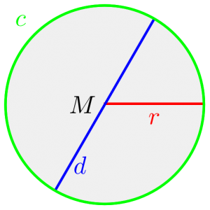

Pi can be defined as the ratio between circumference and diameter:

[caption id="attachment_68531" align="aligncenter" width="300"] Circle, diameter, radius and circumference[/caption]

It's first digits are:

$\pi = 3,14159 26535 89793 23846 26433 83279 50288 41971 …$

In the following, I will try to calculate as many digits as I can.

<h2>math.h</h2>

#include &lt;stdio.h&gt;
 
using namespace std;

#define _USE_MATH_DEFINES 
#include &lt;math.h&gt;

int main(int argc, char* argv[]) {
    printf(&quot;%.60f\n&quot;, atan(1)*4);
    printf(&quot;%.60f\n&quot;, M_PI);
    return 0;
}


gives (the last line is $\pi$):

3.141592653589793|115997963468544185161590576171875000000000000
3.141592653589793|115997963468544185161590576171875000000000000
3.141592653589793|2384626433832795028841971...


This is exact to 16 digits of pi.

<h2>Leibniz formula for $\pi$</h2>
<a href="http://en.wikipedia.org/wiki/Leibniz_formula_for_%CF%80">Leibniz formula for π is</a>:

$\displaystyle \pi = 4 \cdot \sum_{n=0}^\infty \, \frac{(-1)^n}{2n+1}$

You get this by knowing that $\tan(\frac{\pi}{4}) = 1 \Leftrightarrow \pi = 4 \cdot \tan^{-1}(1)$ and making a <a href="http://en.wikipedia.org/wiki/Taylor_series">Taylor series</a>.

Which can be implemented like this:

#include &lt;stdio.h&gt;
 
using namespace std;

int main(int argc, char* argv[]) {
    double pi = 0;
    int sign = 1.0;
    for(int i=1;i&lt;2000;i+=2){
        pi = pi + sign*4.0/i;
        sign *= -1;
    }

    printf(&quot;%.60f\n&quot;, pi);
    return 0;
}


This gives (pi is below):

3.14|0592653839790138192711310693994164466857910156250000000000
3.14|15926535897932384626433832795028841971...


This implementation is only exact to three digits!

You might think that I simply have to increase the upper bound. Lets increase it from 2000 to 1000000000:


3.14159265|1589793838695641170488670468330383300781250000000000
3.14159265|35897932384626433832795028841971...


Only nine digits for about 5 seconds execution time :-/
