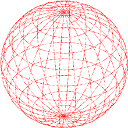
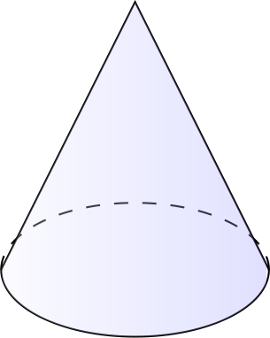

I have just found some interesting examples for 3D-Images done completely in LaTeX.

<h2>Sphere</h2>
[caption id="attachment_33601" align="aligncenter" width="128"]<a href="../images/2012/07/latex-sphere.png"></a> Sphere created with LaTeX (Tikz)[/caption]

```latex
\documentclass{article}
\usepackage[pdftex,active,tightpage]{preview}
\setlength\PreviewBorder{2mm}
\usepackage{tikz}
\usepackage{tikz-3dplot}
\usetikzlibrary{shapes, calc} 
\begin{document}
\begin{preview}
\tdplotsetmaincoords{55}{5}
\begin{tikzpicture}
    [scale=3,
        tdplot_main_coords,
        curve/.style={red,densely dotted,thick}]

    \coordinate (O) at (0,0,0);
    
    \foreach \angle in {-90,-75,...,90}
    {
        %calculate the sine and cosine of the angle
        \tdplotsinandcos{\sintheta}{\costheta}{\angle}%

        %define a point along the z-axis through which to draw
        %a circle in the xy-plane
        \coordinate (P) at (0,0,\sintheta);

        %draw the circle in the main frame
        \tdplotdrawarc[curve]{(P)}{\costheta}{0}{360}{}{}
        
        %define the rotated coordinate frame based on the angle
        \tdplotsetthetaplanecoords{\angle}
        
        %draw the circle in the rotated frame
        \tdplotdrawarc[curve,tdplot_rotated_coords]{(O)}{1}{0}{360}{}{}
    }

\end{tikzpicture}
\end{preview}
\end{document}
```

Source: <a href="http://www.latex-community.org/know-how/440-tikz-3dplot">latex-community.org</a>

<h2>Circular Cone</h2>
This one is actually a little bit cheated. It uses only 2D-Geometry:
[caption id="attachment_33611" align="aligncenter" width="305"]<a href="../images/2012/07/latex-circular-cone.png"></a> Circular Cone done with LaTeX (Tikz)[/caption]

\documentclass{article}
\usepackage[pdftex,active,tightpage]{preview}
\setlength\PreviewBorder{2mm}
\usepackage{tikz}
\usepackage{tikz-3dplot}
\usetikzlibrary{shapes, calc} 
\begin{document}
\begin{preview}
\tdplotsetmaincoords{55}{5}
\begin{tikzpicture}
    \newcommand{\height}{2}

    % Border
    \draw (-1,0) arc (180:360:1cm and 0.5cm) -- (0,\height) -- cycle;
    \draw[dashed] (-1,0) arc (180:0:1cm and 0.5cm);

    % blue shade
    \shade[left color=blue!5!white,right color=blue!40!white,opacity=0.3] (-1,0) arc (180:360:1cm and 0.5cm) -- (0,\height) -- cycle;
\end{tikzpicture}
\end{preview}
\end{document}
