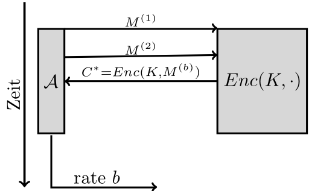

Ein Verschlüsselungsverfahren wird als <abbr title="indistinguishability under chosen-plaintext attacks">IND-CPA</abbr>-Sicher bezeichnet, wenn ein Angreifer bei einer bekannten Menge an Klartexten, wovon einer verschlüsselt wurde, nicht sagen kann, welcher das war.

Folgendes Szenario muss man sich also vorstellen:

[caption id="attachment_65191" align="aligncenter" width="512"] IND-CPA-Game[/caption]

Man hat also einen Angreifer $\mathcal{A}$, der sich zwei verschiedene (aber gleich lange) Klartexte $M^{(1)}$ und $M^{(2)}$ aussuchen darf. Diese schickt er an den Verschlüssler. Nun verschlüsselt dieser (zufällig, gleichverteilt) eine der Nachrichten und gibt dem Angreifer das Chiffrat. Der Angreifer muss nun entscheiden, ob $M^{(1)}$ oder $M^{(2)}$ verschlüsselt wurde. 

Wenn alle Angreifer hier nur selten richtig liegen, dann bezeichnet man ein Verschlüsselungsverfahren als IND-CPA-sicher.

