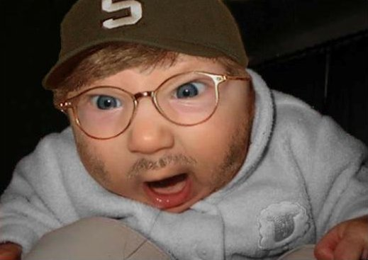
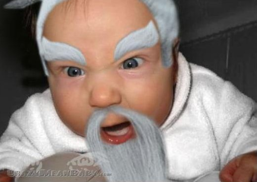

It's so funny what happens when Geeks get parents. 

This is what happens if your dad is a designer:











The Original (or at least the highest resolution I found) is <a href="http://sneezl.com/wp-content/uploads/2008/04/graphic-designer-baby.pdf">here as PDF</a>.

Giving your child some funny T-shirts is also quite common:




A friend of mine just shared this photo:


Do you have more images or perhaps stories of geeky parents? Please let me know in a comment!
