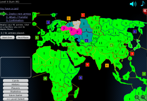

<a href="http://en.wikipedia.org/wiki/Risk_(game)">Risk</a> is a great strategic game in which you have to conquer the world.

Now I've found a clone called "Warlight":
<figure class="aligncenter">
            
            <figcaption class="text-center">Warlight</figcaption>
        </figure>

<strong>Go to the Game</strong>: <a href="http://www.kongregate.com/games/FizzerWL/warlight">WarLight</a> on Kongregate
<strong>Task</strong>: Conquer the world.
<strong>How to play</strong>: Each turn you get armies depending on the number of countries / territories you control.
<strong>My Record</strong>: I could solve Level 1 - 3 and Europe.
