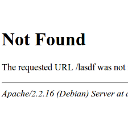

<a href="../images/2011/10/404-Not-Found.png"></a> A 404 http status code means that no document could be found at the given URL. The reason could be a misspelled URL or moved content. 

Anyway, the user needs help now. The standard error page doesn't provide much information, so you should create a custome one.

If you like more information, just google for "custom 404 page".

<h2>How to create a custom 404 error page</h2>
Simply add the following line to your .htaccess file:
```apache
ErrorDocument 404 /notfound.php
```

(This will work only on an Apache webserver, of course).

Now you have to create a notfound.php file. This file should provide the following information:
<ul>
  <li>Tell the user that he typed a wrong URL or that the link pointed to a target which doesn't exist</li>
  <li>Provide a search box</li>
  <li>Provide a link to a graphical sitemap</li>
  <li>Provide some funny / interesting content</li>
  <li>Make sure that a 404 http status code is still returned after your changes</li>
</ul>

<h2>Good examples</h2>
<ul>
  <li><a href="http://www.hongkiat.com/blog/60-really-cool-and-creative-error-404-pages/">60 Really Cool And Creative Error 404 Pages</a></li>
  <li><a href="http://dzineblog.com/2008/11/custom-error-404-pages.html">36 Cool Custom Error 404 Pages</a></li>
  <li><a href="http://www.smashingmagazine.com/2007/08/17/404-error-pages-reloaded/">404 Error Pages: Reloaded</a></li>
</ul>

<h2>Further Reading</h2>
<ul>
  <li><a href="http://www.404errorpages.com/">404 Error Pages .com</a></li>
  <li><a href="http://en.wikipedia.org/wiki/HTTP_404">Wikipedia</a></li>
</ul>
