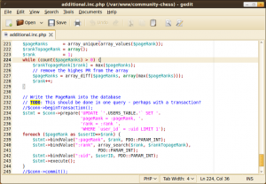

<a href="http://en.wikipedia.org/wiki/Gedit">gedit</a> is a very lightweight text editor. It supports syntax highlighting for every programming language I can think of and is highly customizable.

It belongs to GNOME, but it is also available for Windows. This is how it looks like:

<figure class="aligncenter">
            
            <figcaption class="text-center">gedit screenshot</figcaption>
        </figure>

You might want to install gedit-plugins:
sudo apt-get install gedit-plugins

<h2>External Tools</h2>
gedit allows you to run external command line tools by pressing shortcuts. You can find the external tools plugins in your preferences:
<figure class="aligncenter">
            
            <figcaption class="text-center">gedit external tools</figcaption>
        </figure>

You can assign shortcuts by clicking into an input field and simply using the shortcut once:
<figure class="aligncenter">
            
            <figcaption class="text-center">external tools java</figcaption>
        </figure>

<h3>Java</h3>
#!/bin/sh
cd $GEDIT_CURRENT_DOCUMENT_DIR
if javac $GEDIT_CURRENT_DOCUMENT_NAME;
then
java ${GEDIT_CURRENT_DOCUMENT_NAME%\.java}
else
echo "Failed to compile"
fi

<h2>Code Comment</h2>
This neat little plugin detects which programming language you are using. If you select a code block and press ctrl+m it gets marked as a comment. If you press ctrl+shift+m a block of comments gets "decommented" to a block of code. It uses # for Python and // for Java.

<h2>Bracket Completion</h2>
Well, I guess the name is meaningful, isn't it? As soon as you type a bracket - (, [ or { it gets completed with }, ] or ).

<h2>Better Python Console</h2>
The <a href="http://live.gnome.org/Gedit/Plugins/BetterPythonConsole">Better Python Console Plugin</a> allows you to press F5 and execute the current code in an interactive Python console. This means, you can access the current variables!

You install it by extracting and copying the whole folder (with plugins!) to ~/gnome2/gedit.

<h2>What could be better</h2>
The design could be similar to Chrome ☺ So they could have some nicer tabs. Nothing really important.

I really miss comment folding since I have to write Java code with a lot of Doc comments

<h2>Further reading and resources</h2>
<ul>
    <li><a href="http://projects.gnome.org/gedit/">Official Website</a>: You can find the Windows Binary here.</li>
    <li><a href="http://live.gnome.org/Gedit/ExternalToolsPluginCommands">External Tools</a></li>
    <li><a href="http://www.makeuseof.com/tag/top-plugins-to-extend-and-make-gedit-a-more-useful-text-editor-linux/">13 Gedit Plugins to Make It a More Useful Text Editor</a>: Seems as if you could also have a class browser in gedit</li>
</ul>
