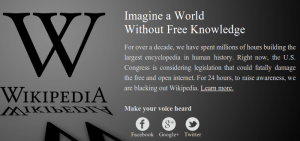

Some of the biggest sites in the internet are currently calling US citizens up to protest. SOPA - the Stop Online Piracy Act - is endangering some key aspects of the internet.

I am a little bit disappointed that Google had no special doodle today and twitter had no message at all :-( Well, at least did Google offer <a href="https://www.google.com/landing/takeaction/">some information</a>.

Here is a neat explanation of SOPA:
<iframe src="http://player.vimeo.com/video/31100268?byline=0&amp;portrait=0" width="512" height="288" frameborder="0" webkitAllowFullScreen mozallowfullscreen allowFullScreen></iframe>

<h2>Wikipedia</h2>
Completely blacked out:

Twitter: #WikipediaBlackout

By the way, if you disable JavaScript you can view Wikipedia as always.

<h2>German Wiki</h2>


<h2>The Oatmeal</h2>
<a href="http://theoatmeal.com/sopa">The Oatmeal</a> has also completely blacked out its website:



<h2>Zachstronaut</h2>
<a href="http://www.zachstronaut.com/lab/text-shadow-box/stop-sopa.html">zachstronaut.com</a> offers an interactive one:


<h2>Boing Boing</h2>
<a href="http://boingboing.net/2012/01/14/boing-boing-will-go-dark-on-ja.html">Boing Boing</a> is completely blacked out:


<h2>Tucows</h2>
Tucows - a site with $80.939 million USD revenue - offers some information and a <a href="http://tucowsinc.com/news/2012/01/why-we-dont-like-sopa/">link</a> on the top. They normally offer shareware and freeware:


<h2>Notes</h2>
Many big companies (AOL, eBay, Facebook, Google, LinkedIn, mozilla, twitter, Yahoo, zynga) wrote <a href="http://www.protectinnovation.com/downloads/letter.pdf">a letter</a> to the Committee on the Judiciary.

<h2>Participate</h2>
If you want to participate, take a look at <a href="http://sopastrike.com/">SOPAstrike.com</a>, <a href="http://AmericanCensorship.org/">americancensorship.org</a> or <a href="https://twitter.com/#!/search/realtime/%23StrikeTools">#striketools</a>.

<h2>Additional</h2>

<object width="526" height="374">
<param name="movie" value="http://video.ted.com/assets/player/swf/EmbedPlayer.swf"></param>
<param name="allowFullScreen" value="true" />
<param name="allowScriptAccess" value="always"/>
<param name="wmode" value="transparent"></param>
<param name="bgColor" value="#ffffff"></param>
<param name="flashvars" value="vu=http://video.ted.com/talk/stream/2012S/Blank/ClayShirky_2012S-320k.mp4&su=http://images.ted.com/images/ted/tedindex/embed-posters/ClayShirky_2012S-embed.jpg&vw=512&vh=288&ap=0&ti=1329&lang=en&introDuration=15330&adDuration=4000&postAdDuration=830&adKeys=talk=defend_our_freedom_to_share_or_why_sopa_is_a_bad_idea;year=2012;theme=media_that_matters;theme=master_storytellers;event=TEDSalon+NY2012;tag=Business;tag=Technology;tag=creativity;tag=media;tag=politics;&preAdTag=tconf.ted/embed;tile=1;sz=512x288;" />
<embed src="http://video.ted.com/assets/player/swf/EmbedPlayer.swf" pluginspace="http://www.macromedia.com/go/getflashplayer" type="application/x-shockwave-flash" wmode="transparent" bgColor="#ffffff" width="526" height="374" allowFullScreen="true" allowScriptAccess="always" flashvars="vu=http://video.ted.com/talk/stream/2012S/Blank/ClayShirky_2012S-320k.mp4&su=http://images.ted.com/images/ted/tedindex/embed-posters/ClayShirky_2012S-embed.jpg&vw=512&vh=288&ap=0&ti=1329&lang=en&introDuration=15330&adDuration=4000&postAdDuration=830&adKeys=talk=defend_our_freedom_to_share_or_why_sopa_is_a_bad_idea;year=2012;theme=media_that_matters;theme=master_storytellers;event=TEDSalon+NY2012;tag=Business;tag=Technology;tag=creativity;tag=media;tag=politics;&preAdTag=tconf.ted/embed;tile=1;sz=512x288;"></embed>
</object>

<ul>
  <li>Paper of the <a href="https://www.eff.org/sites/default/files/One-Page-SOPA_0.pdf">Electronic Frontier Foundation</a> and <a href="https://www.eff.org/free-speech-weak-link">web page</a></li>
  <li>Position of <a href="http://dyn.com/sopa-breaking-dns-parasite-stop-online-piracy/">dyn.com</a></li>
  <li>Position of <a href="http://xkcd.com/1005/">xkcd</a></li>
</ul>
