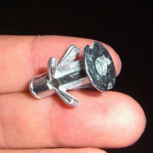
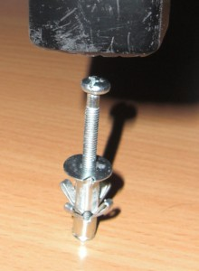
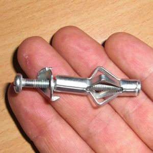
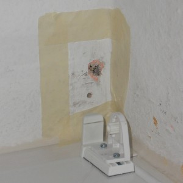
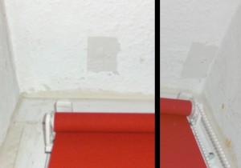



I've decided to fill some holes in my ceiling and my wall today. I don't want to paint my room the next time as it is too cold at the moment, but the holes were really ugly. I've added a photo of them. So I went to the next hardware store and asked what could be done. I thought I needed to use gypsum which is gray, so it wouldn't look very good. Additionally you can buy gypsum only in 1.5 kg bags. 
 
 
 
<h2>Situation before</h2>


<h2>The tools</h2>
The guy at the hardware store suggested to use acrylic paint. So I did. These were the tools I needed:
<ul>
  <li><a href="http://en.wikipedia.org/wiki/Acrylic_paint">Acrylic paint</a>: about 4.00 Euro</li>
  <li>some <a href="http://en.wikipedia.org/wiki/Masking_tape">masking tape</a></li>
  <li>a <a href="http://en.wikipedia.org/wiki/Putty_knife">putty knife</a></li>
</ul>

<table>
<tr>
<td><figure class="aligncenter">
            
            <figcaption class="text-center">Masking tape and putty knife</figcaption>
        </figure></td>
<td><figure class="aligncenter">
            
            <figcaption class="text-center">Acrylic paint</figcaption>
        </figure></td>
</tr>
</table>

<h2>One special problem</h2>
As I had a wall plug in my ceiling I needed to remove it before I could start. I could not simply push it into the wall (it didn't work, I've tried it). And removing this special wall plug isn't that easy. This is how it looks like in the wall:

<figure class="aligncenter">
            
            <figcaption class="text-center">Wall plug</figcaption>
        </figure>

So I tried to stretch it:

<figure class="aligncenter">
            
            <figcaption class="text-center">Stretching the wall plug with the hammer didn&#039;t work</figcaption>
        </figure>

<figure class="aligncenter">
            
            <figcaption class="text-center">Stretching the wall plug with a wrench worked ...</figcaption>
        </figure>

<figure class="aligncenter">
            
            <figcaption class="text-center">... kind of</figcaption>
        </figure>

<h2>Filling the hole</h2>
First you need to clean both holes so that the acrylic paint can stick. Then you have to use the masking tape to get a clean border:

<figure class="aligncenter">
            
            <figcaption class="text-center">Use the masking tape</figcaption>
        </figure>

You have to use the putty knife to get a clean, smooth surface with the acrylic paint. Maybe you need to fill the hole repeatedly with acrylic paint. As soon as the surface looks okay, you can stop. Now remove the masking tape and then wait some hours until the acrylic paint is dry. The time you have to wait depends on the acrylic paint you use, but mine is dry enough for painting after 4 - 6 hours.

<h2>Situation afterwards</h2>
Afterwards, it looks like this:
<figure class="aligncenter">
            
            <figcaption class="text-center">Filled hole in the ceiling</figcaption>
        </figure>

Hmm ... well ... it looks different when I look at it. I can barely see it as it's not that bright at the ceiling. Nether the less, I will have to paint in the summer.
