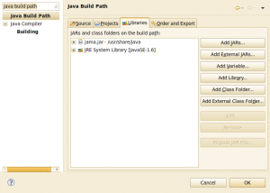
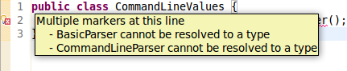

If you are using Eclipse, you might want to add your arguments. To specify them, go to:
Run &rarr; Run Configurations ... &rarr; Arguments

<h2>args4j</h2>
<blockquote>args4j is a small Java class library that makes it easy to parse command line options/arguments in your CUI application.</blockquote>
Source: <a href="http://args4j.kohsuke.org/">args4j.kohsuke.org</a>

Lets see how easy it really is.

<h3>Requirements</h3>
First, you have to get the package. It is not in my Ubuntu-Version, but <a href="http://packages.ubuntu.com/quantal/libargs4j-java">Ubuntu Quantal will have args4j</a>. The package is called <code>libargs4j-java</code>.

If you can't install it this way, you have to <a href="http://maven.jenkins-ci.org/content/repositories/releases/args4j/">download args4j</a>. Currently, it is <a href="http://maven.jenkins-ci.org/content/repositories/releases/args4j/args4j/2.0.21/args4j-2.0.21.jar">args4j-2.0.21.jar</a>.

You can add this as an external jar to Eclipse:
<ol>
  <li>Right-click on your project.</li>
  <li>Select "Properties"</li>
  <li>Type "java build path" in the input field at the upper left corner of the window.</li>
</ol>

Now it should look like this:
<figure class="aligncenter">
            <a href="../images/2012/07/java-eclipse-project-properties-libraries-300x214.png"></a>
            <figcaption class="text-center">Project properties in Eclipse - Libraries</figcaption>
        </figure>

Now you have to click on "Add External Jar" and add the args4j.jar file.

<h3>Source Example</h3>
As always in Java, you add another class for parsing your command line values. I've called it CommandLineValues.java and it does only check for the command line argument <code>-i FILE</code> or <code>--input FILE</code>.

```java
import java.io.File;

import org.kohsuke.args4j.CmdLineException;
import org.kohsuke.args4j.CmdLineParser;
import org.kohsuke.args4j.Option;

/**
 * This class handles the programs arguments.
 */
public class CommandLineValues {
    @Option(name = "-i", aliases = { "--input" }, required = true,
            usage = "input file with two matrices")
    private File source;

    private boolean errorFree = false;

    public CommandLineValues(String... args) {
        CmdLineParser parser = new CmdLineParser(this);
        parser.setUsageWidth(80);
        try {
            parser.parseArgument(args);

            if (!getSource().isFile()) {
                throw new CmdLineException(parser,
                        "--input is no valid input file.");
            }

            errorFree = true;
        } catch (CmdLineException e) {
            System.err.println(e.getMessage());
            parser.printUsage(System.err);
        }
    }

    /**
     * Returns whether the parameters could be parsed without an
     * error.
     *
     * @return true if no error occurred.
     */
    public boolean isErrorFree() {
        return errorFree;
    }

    /**
     * Returns the source file.
     *
     * @return The source file.
     */
    public File getSource() {
        return source;
    }
}
```

Here is some part of the main file:
```java
public static void main(String[] args) {
    CommandLineValues values = new CommandLineValues(args);
    CmdLineParser parser = new CmdLineParser(values);

    try {
        parser.parseArgument(args);
    } catch (CmdLineException e) {
        System.exit(1);
    }

    // Now you can use the command line values
    List<ArrayList<ArrayList<Integer>>> matrices =
        read(values.getSource());
    ArrayList<ArrayList<Integer>> A = matrices.get(0);
    ArrayList<ArrayList<Integer>> B = matrices.get(1);
    int[][] C = ijkAlgorithm(A, B);
    printMatrix(C);
}
```

<h3>Usage Examples</h3>
If you do not specify the required parameters, you get a quite good error message:
```bash
moose@pc07:~/Desktop$ java -jar matrix-multiplication.jar
Option "-i (--input)" is required
 -i (--input) FILE : input file with two matrices
```

Help is <strong>not</strong> automatically generated:
```bash
moose@pc07:~/Desktop$ java -jar matrix-multiplication.jar --help
"--help" is not a valid option
 -i (--input) FILE : input file with two matrices
```

If you want to have default parameters, you simply assign the values to the attributes:
```java
@Option(name = "-l", aliases = { "--leafsize" }, required = false,
        usage = "input file with two matrices")
private int leafsize = 32;
```
Note: <a href="http://stackoverflow.com/q/7834111/562769">How can I prevent Eclipse from adding the 'final' for certain lines of Java code?</a>

<h2>Commons CLI</h2>
<h3>Installation</h3>
As for args4j, they offer a jar file which is in <a href="http://ftp-stud.hs-esslingen.de/pub/Mirrors/ftp.apache.org/dist//commons/cli/binaries/commons-cli-1.2-bin.tar.gz">commons-cli-1.2-bin.tar.gz</a> on the <a href="http://commons.apache.org/cli/download_cli.cgi">download-page</a>.

If you just want to test if you have the required packages, copy this piece of code to Eclipse:
```java
public class CommandLineValues {
    CommandLineParser parser = new BasicParser();
}
```

If you get the following error, you don't have the required <code>org.apache.commons.cli</code>:
<figure class="aligncenter">
            <a href="../images/2012/07/java-eclipse-cli-lib-error.png"></a>
            <figcaption class="text-center">Java error mentioned by Eclipse: Missing org.apache.commons.cli</figcaption>
        </figure>

<h3>Usage examples</h3>
I have not found a single, complete and working usage example.

<h2>See also</h2>
<ul>
  <li><a href="http://stackoverflow.com/q/367706/562769">Is there a good command line argument parser for Java?</a> - A lot of other command line parsers are mentioned for Java.</li>
  <li><a href="http://args4j.kohsuke.org/args4j/apidocs/">args4j JavaDoc</a></li>
  <li><a href="http://commons.apache.org/cli/api-release/index.html">Apache CLI JavaDoc</a></li>
</ul>
