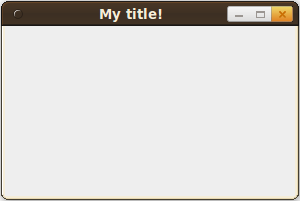

<a href="http://en.wikipedia.org/wiki/Swing_(Java)">Swing</a> is a Java package for creating graphical user interfaces (GUI). I will give you complete, runnable examples how you could use Swing. All examples are done in <code>test.java</code>

<h2>Basic examples</h2>
<h3>JFrame</h3>
The basic class is <a href="http://docs.oracle.com/javase/7/docs/api/javax/swing/JFrame.html">JFrame</a>:
```java
import javax.swing.JFrame;

public class test {
    public static void main(String[] args) {
        JFrame frame = new JFrame("My title!");
        frame.setVisible(true);
        frame.setSize(200, 200);
        frame.setDefaultCloseOperation(JFrame.EXIT_ON_CLOSE);
    }
}
```

You will get:
<a href="../images/2012/07/java-swing-JFrame.png"></a>

<h3>JPanel</h3>
You add your elements to a JPanel:
```java
import javax.swing.JButton;
import javax.swing.JFrame;
import javax.swing.JLabel;
import javax.swing.JPanel;

public class test {
    public static void main(String[] args) {
        JFrame frame = new JFrame("My title!");
        frame.setVisible(true);
        frame.setSize(300, 150);
        frame.setDefaultCloseOperation(JFrame.EXIT_ON_CLOSE);

        JPanel panel = new JPanel();
        frame.add(panel);

        JLabel label = new JLabel("my label");
        panel.add(label);

        JButton button = new JButton("my button");
        panel.add(button);
    }
}
```

It looks like this:
<a href="../images/2012/07/java-swing-jpanel.png"></a>

<h2>Action Listeners</h2>
This is the most simple example of an <a href="http://docs.oracle.com/javase/7/docs/api/java/awt/event/ActionListener.html">ActionListener</a>. When you click on the button, it creates a new JFrame.

```java
import java.awt.event.ActionEvent;
import java.awt.event.ActionListener;

import javax.swing.JButton;
import javax.swing.JFrame;
import javax.swing.JLabel;
import javax.swing.JPanel;

public class test {
    public static void main(String[] args) {
        JFrame frame = new JFrame("My title!");
        frame.setVisible(true);
        frame.setSize(300, 150);
        frame.setDefaultCloseOperation(JFrame.EXIT_ON_CLOSE);

        JPanel panel = new JPanel();
        frame.add(panel);

        JLabel label = new JLabel("my label");
        panel.add(label);

        JButton button = new JButton("my button");
        panel.add(button);
        button.addActionListener(new MyAction());
    }

    static class MyAction implements ActionListener {
        @Override
        public void actionPerformed(ActionEvent e) {
            JFrame frame2 = new JFrame("clicked");
            frame2.setVisible(true);
            frame2.setSize(200,200);
        }
    }
}
```

<h2>See also</h2>
<ul>
  <li><a href="http://docs.oracle.com/javase/7/docs/api/javax/swing/package-summary.html">Java 7 Swing Documentation</a></li>
  <li><a href="http://docs.oracle.com/javase/tutorial/uiswing/">Trail: Creating a GUI With JFC/Swing</a></li>
</ul>

<div class="info">Continue with part II: <a href="../swing-ii-how-to-arrange-objects/">How to arrange Objects with Swing</a></div>
