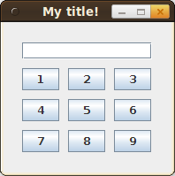

<h2>Without GUI</h2>
Objects can be arranged with <a href="http://docs.oracle.com/javase/7/docs/api/java/awt/GridBagLayout.html">GridBagLayout</a> and <a href="http://docs.oracle.com/javase/7/docs/api/java/awt/GridBagConstraints.html">GridBagConstraints</a>. This is an example:

Code:
import java.awt.GridBagConstraints;
import java.awt.GridBagLayout;
import java.awt.Insets;
import java.awt.MouseInfo;
import java.awt.Point;

import javax.swing.JButton;
import javax.swing.JFrame;
import javax.swing.JPanel;
import javax.swing.JTextField;

public class test {
    public static void main(String[] args) {
        // Open the window where the mouse pointer is
        Point location = MouseInfo.getPointerInfo().getLocation();
        int x = (int) location.getX();
        int y = (int) location.getY();

        JFrame frame = new JFrame("My title!");
        frame.setLocation(x, y);
        frame.setVisible(true);
        frame.setSize(200, 200);
        frame.setDefaultCloseOperation(JFrame.EXIT_ON_CLOSE);

        JPanel panel = new JPanel(new GridBagLayout());
        frame.add(panel);

        //set the size of the window to the maximum
        //frame.setExtendedState(frame.getExtendedState() |
        //                                    Frame.MAXIMIZED_BOTH);

        JButton button1 = new JButton("1");
        JButton button2 = new JButton("2");
        JButton button3 = new JButton("3");
        JButton button4 = new JButton("4");
        JButton button5 = new JButton("5");
        JButton button6 = new JButton("6");
        JButton button7 = new JButton("7");
        JButton button8 = new JButton("8");
        JButton button9 = new JButton("9");

        Insets i = new Insets(5, 5, 5, 5);

        JTextField tf = new JTextField(13);
        GridBagConstraints cText = new GridBagConstraints();
        cText.gridx = 0;
        cText.gridy = 0;
        cText.gridwidth = GridBagConstraints.REMAINDER;
        cText.insets = i;
        panel.add(tf,cText);

        GridBagConstraints c1 = new GridBagConstraints();
        c1.gridx = 0;
        c1.gridy = 1;
        c1.insets = i;
        panel.add(button1, c1);

        GridBagConstraints c2 = new GridBagConstraints();
        c2.gridx = 1;
        c2.gridy = 1;
        c2.insets = i;
        panel.add(button2, c2);

        GridBagConstraints c3 = new GridBagConstraints();
        c3.gridx = 2;
        c3.gridy = 1;
        c3.insets = i;
        panel.add(button3, c3);

        GridBagConstraints c4 = new GridBagConstraints();
        c4.gridx = 0;
        c4.gridy = 2;
        c4.insets = i;
        panel.add(button4, c4);

        GridBagConstraints c5 = new GridBagConstraints();
        c5.gridx = 1;
        c5.gridy = 2;
        c5.insets = i;
        panel.add(button5, c5);

        GridBagConstraints c6 = new GridBagConstraints();
        c6.gridx = 2;
        c6.gridy = 2;
        c6.insets = i;
        panel.add(button6, c6);

        GridBagConstraints c7 = new GridBagConstraints();
        c7.gridx = 0;
        c7.gridy = 3;
        c7.insets = i;
        panel.add(button7, c7);

        GridBagConstraints c8 = new GridBagConstraints();
        c8.gridx = 1;
        c8.gridy = 3;
        c8.insets = i;
        panel.add(button8, c8);

        GridBagConstraints c9 = new GridBagConstraints();
        c9.gridx = 2;
        c9.gridy = 3;
        c9.insets = i;
        panel.add(button9, c9);
    }
}

<h2>Google WindowBuilder</h2>
Goole offers a free Eclipse plugin called <a href="https://developers.google.com/java-dev-tools/wbpro/">WindowBuilder</a>:

<blockquote>WindowBuilder is a powerful and easy to use bi-directional Java GUI designer that makes it very easy to create Java GUI applications without spending a lot of time writing code to display simple forms.</blockquote>

<h3>Installation</h3>
They offer great <a href="https://developers.google.com/java-dev-tools/wbpro/installation/">installation instructions</a>!

(The download takes a while. Time to make a cup of tea.)

<h3>Editing</h3>
You have to open your project with the window builder:


The Window-Builder-View looks like this:


You can easily resize the window:


Positioning single components is also simple:


Adding a menu bar worked fine:


<h2>See also</h2>
<ul>
  <li><a href="http://docs.oracle.com/javase/tutorial/uiswing/layout/gridbag.html">How to Use GridBagLayout</a></li>
  <li><a href="http://stackoverflow.com/q/1832432/562769">Which Swing layout(s) do you recommend?</a></li>
</ul>
