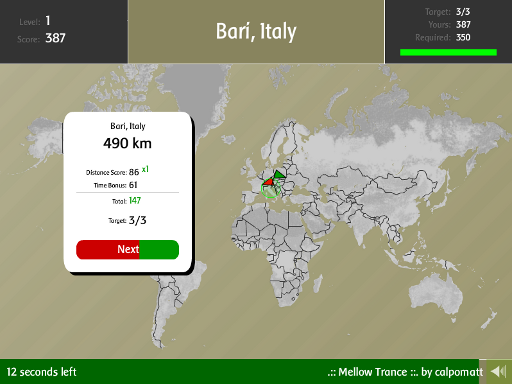

<figure class="aligncenter">
            
            <figcaption class="text-center">Globetrotter - A game to learn cities and countries</figcaption>
        </figure>
<strong>Go to the Game</strong>: <a href="http://www.kongregate.com/games/crafics/globetrotter-xl">Globetrotter XL</a> on Kongregate
<strong>Task</strong>: Find a city on a map
<strong>How to play</strong>: You're given the name of a city and its country and a map. In the first levels this map has borders, but no names of countries or cities. In the later levels even the borders are not shown.
<strong>My Record</strong>: Level 6, about 1400 points
