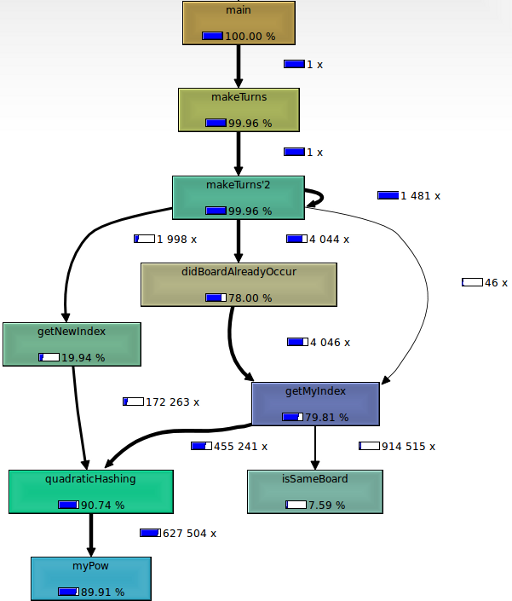

If you have a working program and you want to improve its execution speed, you might want to profile it. An easy way to do so, is adding global variables, increasing them at interesting points and counting how often these points are executed. A more sophisticated way is using a profiler.

<h2>valgrind and kcachegrind</h2>
Install valgrind and kcachegrind. For Ubuntu users:
```bash
sudo apt-get install valgrind kcachegrind
```

Create a profile:
```bash
valgrind --tool=callgrind ./connectfour
```
(I've profiled a connect four application. Replace that with your application)
This command will create a file called similar to "callgrind.out.4846".

Take a look at the profile:
```bash
kcachegrind callgrind.out.4846
```

You can also create a call-graph:
<figure class="aligncenter">
            <a href="../images/2012/11/call-graph2.png"></a>
            <figcaption class="text-center">Call graph of connect four game graph creation program</figcaption>
        </figure>

Just take a look at it by yourself. You will see much more than I could tell you now.
