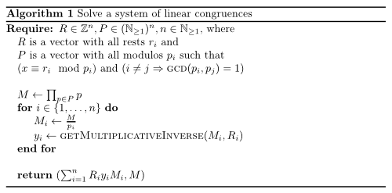

When you have a system of linear congruences like:

$$
\begin{align}
x &\equiv 4 \mod 19\\
x &\equiv 12 \mod 37\\
x &\equiv 14 \mod 43
\end{align}
$$

you can solve it quite easily.
Johannes Schickling has written a very nice <a href="http://schickling.github.io/algorithms/#/chinese-remainder-theorem">JavaScript Application</a> that applies the following algorithm online. I've used his source code to write the following Python code.

<h2>Pseudocode</h2>
<figure class="aligncenter">
            
            <figcaption class="text-center">Solve a system of linear congruences</figcaption>
        </figure>

<h2>Python</h2>

#!/usr/bin/env python
# -*- coding: utf-8 -*-

def ExtendedEuclideanAlgorithm(a, b):
	"""
		Calculates gcd(a,b) and a linear combination such that
		gcd(a,b) = a*x + b*y

		As a side effect:
		If gcd(a,b) = 1 = a*x + b*y
		Then x is multiplicative inverse of a modulo b.
	"""
	aO, bO = a, b

	x=lasty=0
	y=lastx=1
	while (b!=0):
		q= a/b
		a, b = b, a%b
		x, lastx = lastx-q*x, x
		y, lasty = lasty-q*y, y

	return {
		"x": lastx,
		"y": lasty,
		"gcd": aO * lastx + bO * lasty
	}

def solveLinearCongruenceEquations(rests, modulos):
	"""
	Solve a system of linear congruences.

	>>> solveLinearCongruenceEquations([4, 12, 14], [19, 37, 43])
	{'congruence class': 22804, 'modulo': 30229}
	"""
	assert len(rests) == len(modulos)
	x = 0
	M = reduce(lambda x, y: x*y, modulos)

	for mi, resti in zip(modulos, rests):
		Mi = M / mi
		s = ExtendedEuclideanAlgorithm(Mi, mi)["x"]
		e = s * Mi
		x += resti * e
	return {"congruence class": ((x % M) + M) % M, "modulo": M}

if __name__ == "__main__":
	import doctest
	doctest.testmod()


<h2>Links</h2>
<ul>
  <li><a href="http://schickling.github.io/algorithms/#/chinese-remainder-theorem">Try it online</a></li>
  <li><a href="https://github.com/MartinThoma/LaTeX-examples/tree/master/source-code/Pseudocode/SolveLinearCongruences">Sources</a></li>
</ul>
