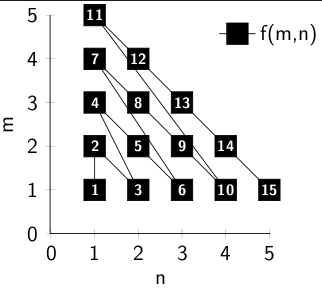

This is a quick article I had for quite a while as a draft.
It might not be finished or have other problems, but I still want to share
it.

Eine Menge B heißt <strong>abzählbar</strong> $: \Leftrightarrow \exists (a_n) \in B: B = \{a_1, a_2, a_3, ...\}$
$\Leftrightarrow \exists f : \mathbb{N} \rightarrow B $ mit $f$ surjektiv.

Die natürlichen Zahlen sind abzählbar.
<strong>Beh.:</strong> $\mathbb{N}$ ist abzählbar.
<strong>Bew.</strong>: direkt
Sei $f: \mathbb{N} \rightarrow \mathbb{N}$ definiert durch $f(n) := n$. $f$ ist also die identität und damit bijektiv und insbesondere surjektiv $\blacksquare$

Die ganzen Zahlen sind abzählbar.
<strong>Beh.:</strong> $\mathbb{Z}$ ist abzählbar.
<strong>Bew.</strong>: direkt
Sei $f: \mathbb{N} \rightarrow \mathbb{Z}$ definiert durch $f(n) :=
\begin{cases}
\frac{n-1}{2}   & \text{, falls n ungerade} \\
- \frac{n}{2} & \text{, falls n gerade}
\end{cases}$.
Also:
$\forall z \in \mathbb{Z}: \exists x \in \mathbb{N} : f(x) = z$
da:
$\forall x \in \mathbb{Z}: n =
\begin{cases}
- 2 \cdot x   & \text{, falls x negativ} \\
2 \cdot x + 1 & \text{, falls x positiv}
\end{cases}$

Es gibt also für jede ganze Zahl z eine natürliche Zahl n, die ich in $f$ stecken kann um z zu erhalten $\blacksquare$

<strong>Beh.:</strong> $\mathbb{N} \times \mathbb{N}$ ist abzählbar.
<strong>Bew.</strong>: direkt
Sei $f: \mathbb{N} \times \mathbb{N} \rightarrow \mathbb{N}$ rekursiv definiert durch $f(1,1) := 1$ und
$f (m, n) := \begin{cases}
f(m + 1, n - 1) + 1 & \text{, falls } n \neq 1 \\
f(1, m - 1)         & \text{sonst}
\end{cases}$
Diese Abbildung sieht wie folgt aus:
[caption id="attachment_20501" align="aligncenter" width="322" caption="Abbildung, die N x N auf N abbildet"][/caption]

Ich finde es ist intuitiv klar, dass diese Funktion bijektiv ist. Hat jemand dafür einen sauberen Beweis?

Also gibt es eine Umkehrfunktion (die auch bijektiv ist). Also ist $\mathbb{N} \times \mathbb{N}$ abzählbar $\blacksquare$

<strong>Beh.:</strong> $\mathbb{Q}^+$ ist abzählbar.
<strong>Bew.</strong>: über $N \times N$
Jede Zahl $x \in \mathbb{Q}^+$ kann  mit zwei natürlichen Zahlen dargestellt werden: $x = \frac{p}{q}$. Also gibt es eine Funktion $f: \mathbb{N} \times \mathbb{N} \rightarrow \mathbb{Q}$ mit
$f(m, n) := \frac{m}{n}$. Diese Abbildung ist offensichtlich surjektiv. $\blacksquare$

<h2>Material</h2>
Die LaTeX-Dateien für die Bilder sind in diesem <a href='//martin-thoma.com/wp-content/uploads/2012/03/countable-sets.zip'>Archiv</a> zu finden.<!--TODO-->
