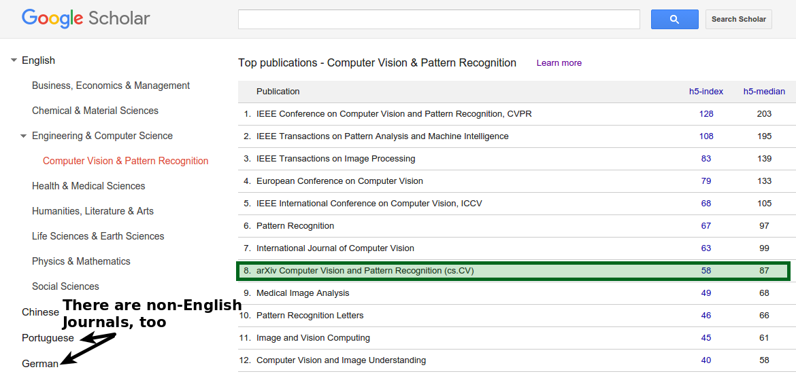
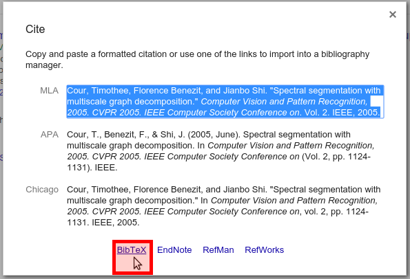
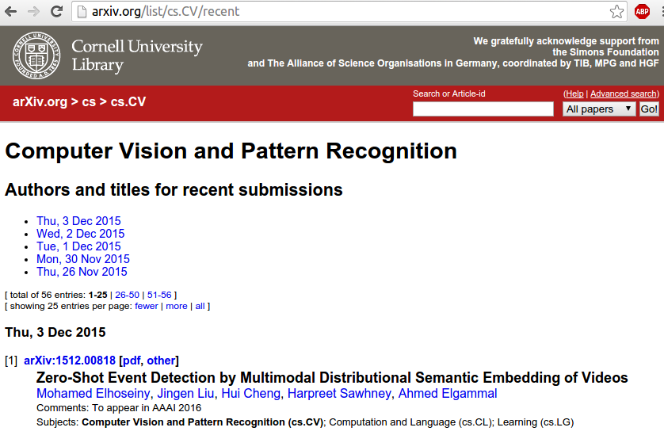

A couple of people who are just participating in their first seminar might ask
themselves how you can find interesting new publications (papers). I would like
to shed some light on it.

## Initial Research
The hardest part is when you're new to a field. You don't know which journals
are the important ones, which authors are most respected in the field, which
terms are used.

### Journal Rankings

Automated journal rankings like the h5-index used by Google Scholar (see
[metrics](https://scholar.google.com/intl/en/scholar/metrics.html),
[Wikipedia](https://en.wikipedia.org/wiki/H-index)) is one way to deal with the
lack of domain knowledge. Google Scholar even publishes a list of journals
per field (see [Top publications in Computer Vision and Pattern Recognition](https://scholar.google.com/citations?view_op=top_venues&hl=en&vq=eng_computervisionpatternrecognition)).

<figure class="aligncenter">
            
            <figcaption class="text-center">Google Scholar Journal ranking</figcaption>
        </figure>

### Algorithmic Ideas

I've never tried it (on purpose), but the idea just came to my head: Use a
random walk. You start with some paper of which you don't really know if it is
good. Look at the references and try to weild out the ones which are obviously
not work trying (e.g. because they are websites). Now take a random one to
continue with. Do this a couple of times.

The idea is that papers which are more important are much more often cited. So
you can hope to get to more important papers over time.

### The hard way

Search for papers via Google. Look at the references. Search for papers in the
reference. Get a feeling for the language being used.

## Ongoing Research

When you have a little bit of domain knowledge (or a starting paper given to
you by your supervisor) everything gets a lot easier.

There are a couple of key strategies:

* Looking at the references of a paper
* Looking at what else the same author published
* Looking for similar titles
* Reading Journals

For all three of them, I can highly recommend
[Google Scholar](https://scholar.google.com). They also offer a nice overview
/ statistics about authors so that you can get a feeling for their scientific
activity. But don't let you fool you by those numbers: It is possible to fake
them.

The other nice thing is that Google Scholar makes citing publications
incredibly easy:

<figure class="aligncenter">
            
            <figcaption class="text-center">Searching for a publication on Google Scholar</figcaption>
        </figure>

<figure class="aligncenter">
            
            <figcaption class="text-center">Citing a publication via Google Scholar</figcaption>
        </figure>

### The arXiv

The arXiv can be seen as THE "modern way" journal. Depending on the field, it
has a VERY high reputation.

For Pattern Recognition the reputation of the arXiv is amongst the highest ten
journals, but it there are some fields like physics where it is THE top journal
in several subfields like cosmology or high energy physics.

What makes the arXiv stand out is the fact that you can read new papers every
day. I like to have a view at
[cs.CV/recent](http://arxiv.org/list/cs.CV/recent) to keep myself informed
about new stuff. There are about&nbsp;20 new publications per day. On some
days, there is nothing interesting, on other days like today quite a bit:

* [The MegaFace Benchmark: 1 Million Faces for Recognition at Scale](http://arxiv.org/pdf/1512.00596.pdf)
* [Rethinking the Inception Architecture for Computer Vision](http://arxiv.org/pdf/1512.00567.pdf)
* [Labeling the Features Not the Samples:
Efficient Video Classification with Minimal Supervision](http://arxiv.org/pdf/1512.00517.pdf)
* [Attribute2Image: Conditional Image Generation from Visual Attributes](http://arxiv.org/pdf/1512.00570.pdf)

<figure class="aligncenter">
            
            <figcaption class="text-center">Latest submissions on arXiv in Pattern Recognition and Computer Vision</figcaption>
        </figure>

## Filtering

I filter publications like this:

* First, I look at the title. If that doesn't look interesting, I skip it. The
  more exact the title is, the better. If it is too vague, I sometimes skip it
  too because the authors seem not to be familiar with the scientific style of
  writing and thus are probably not able to write an interesting paper.
* Then I read the abstract. I expect to get to know what the paper is about.
* Then I look at images / tables (depending on the subject)
* I read the conclusion / last part
* I read the end of the introduction where it often says "the paper is
  structured as follows"

I guess many researchers filter like this. This is important to know when you
write a paper.

Recently, I've also got to know
[shortscience.org](http://www.shortscience.org/). It's a website where anybody
can add summaries / remarks of papers. This is pretty awesome if you want to
get the paper in context (especially of work which was released after the paper)
or if you just want to see what the key idea behind a paper is.

## See also

* [Tools for Academia](https://martin-thoma.com/tools-for-academia/)
* [trendingarxiv](https://trendingarxiv.smerity.com/)
