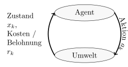

Dieser Artikel beschäftigt sich mit der Vorlesung &bdquo;Probabilistische Planung&ldquo; am KIT. Er dient als Prüfungsvorbereitung. Ich habe die Vorlesungen bei <a href="http://ies.anthropomatik.kit.edu/mitarbeiter.php?person=huber">Herrn Dr.-Ing. Marco Huber</a> im Sommersemester 2015 und 2016 gehört. Die Inhalte sind dementsprechend stark an der Vorlesung angelehnt bzw. komplette Teile sind daraus übernommen. Der Artikel dient als Prüfungsvorbereitung und ist noch am Entstehen.

In der Vorlesung 'Probabilistische Planung' führt in das Thema Reinforcement
Learning ein. Dabei werden drei Themenfelder besprochen:

* Markov'sche Entscheidungsprobleme (MDPs)
* Planung bei Messunsicherheiten (POMDPs)
* Reinforcement Learning (RL)

An Algorithmen sind insbesondere der Label-Korrektur-Algorithmus, das
Dynamische Programmieren, der <a href="https://martin-thoma.com/kalman-filter/">Kalman-Filter</a>
sowie die Werte- und Strategieiteration zu nennen.

## Behandelter Stoff

### Übersicht

<table>
<tr>
    <th>#</th>
    <th>Datum</th>
    <th>Kapitel</th>
    <th>Inhalt</th>
</tr>
<tr>
    <td>1</td>
    <td>26.04.2016</td>
    <td>Grundlagen</td>
    <td>Wahrscheinlichkeitsraum, Grundraum, Ereignis&shy;raum, Resultate,
        Elementar&shy;ereignis, $\sigma$-Algebra, Wahrscheinlichkeits&shy;maß,
        Bedingte Wahrscheinlichkeit, Ziegenproblem, Dichtefunktion</td>
</tr>
<tr>
    <td>2</td>
    <td>28.04.2016</td>
    <td>Grundlagen</td>
    <td><a href="#allais-paradoxon">Allais-Paradoxon</a>, Nutzentheorie, <a href="#preference">Präferenzrelation</a>, Nutzenfunktion</td>
</tr>
<tr>
    <td>3</td>
    <td>06.05.2016</td>
    <td>Grundlagen</td>
    <td>Einführung in die Optimierungstheorie: Notwendige und Hinreichende
        Bedingungen, Konvexe Optimierung, Numerische Methoden</td>
</tr>
<tr>
    <td>4</td>
    <td>11.05.2016</td>
    <td>MDPs</td>
    <td>Definition eines MDP, Plan vs. Strategie, Optimalitätsprinzip, <abbr title="Dynamische Programmierung">DP</abbr></td>
</tr>
<tr>
    <td>5</td>
    <td id="2016-05-18">18.05.2016</td>
    <td>MDPs</td>
    <td>Endliche Planungsprobleme, Value- und Policy-Iteration</td>
</tr>
<tr>
    <td>6</td>
    <td id="2016-05-25">25.05.2016</td>
    <td>MDPs</td>
    <td>Kürzeste-Wege Suche (Tiefensuche, Breitensuche, Dijkstra, A*, Branch &amp; Bound; Label-Korrektur-Algorithmus); Trellis-Diagramm; Differentialantrieb; Pontryagin's Minimumprinzip</td>
</tr>
<tr>
    <td>7</td>
    <td id="2016-06-01">01.06.2016</td>
    <td>MDPs (<a href="https://ies.anthropomatik.kit.edu/ies/download/lehre/proplan/ProPlan-8-Folien.pdf">Folien</a>)</td>
    <td>Pontryagin's Minimumprinzip, Hamilton-Funktion, Riccati-Gleichung; LQR; <a href="#certainty-equivalence">Sicherheitsäquivalenz</a></td>
</tr>
<tr>
    <td>8</td>
    <td id="2016-06-08">08.06.2016</td>
    <td>POMDPs</td>
    <td>Motivation und Definition von POMDP; Hinreichende Statistik; Bayes-Schätzer</td>
</tr>
<tr>
    <td>9</td>
    <td id="2016-06-15">15.06.2016</td>
    <td>POMDPs</td>
    <td>Lineare Planungsprobleme (Kalman-Filter); Sperationsproblem; <abbr title="Linearer Quadratischer Regulator">LQR</abbr>, Endliche Planungsprobleme</td>
</tr>
<tr>
    <td>10</td>
    <td id="2016-06-22">22.06.2016</td>
    <td>POMDPs</td>
    <td>Endliche Planungsprobleme (Optimale Strategie, $\alpha$-Vektoren); Approximative Planung: <a href="#ol-planung">OL</a>, <a href="#olf-planung">OLF</a>, Modellprädiktive Planung</td>
</tr>
<tr>
    <td>11</td>
    <td id="2016-06-29">29.06.2016</td>
    <td>POMDPs</td>
    <td>Parametrische / Nichtparametrische approximative Planung (Sicherheitsäquivalenz bei deterministischen Problemen); Funktionsapproximatoren für Wertefunktion / Strategie; Sensoreinsatzplanung</td>
</tr>
<tr>
    <td>12</td>
    <td id="2016-07-06">06.07.2016</td>
    <td>POMDPs, <abbr title="Reinforcement Learning">RL</abbr></td>
    <td>POMDPs: Sensoreinsatzplanung</td>
</tr>
<tr>
    <td>13</td>
    <td id="2016-07-13">13.07.2016</td>
    <td><abbr title="Reinforcement Learning">RL</abbr></td>
    <td>Monte Carlo Verfahren (Strategiebewertung), Exploration vs Exploitation, Explorations-Strategien; Strategie-Iteration; Temporal Difference Verfahren (Einschritt TD, Mehrschritt TD)</td>
</tr>
<tr>
    <td>14</td>
    <td id="2016-07-20">20.07.2016</td>
    <td><abbr title="Reinforcement Learning">RL</abbr></td>
    <td>Eligibility Traces (TD-Verfahren); Funktionsapproximatoren; Modellernende Verfahren (Dyna-Q, Adaptive DP, PILCO)</td>
</tr>
</table>

Folien:

* 25.05.2016: Folie 4 - Die Knoten sind Zustände und die Kanten sind Aktionen
* $g_{ij}^k = \infty$: Kein Übergang von $i$ nach $j$ in Schritt $k$.

### Grundlagen

Slides: `ProPlan-1-Anschrieb.pdf`

<dl>
  <dt><dfn>$\sigma$-Algebra</dfn></dt>
  <dd>Sei $S$ eine Menge und $\mathcal{A}$ ein Menge aus Teilmengen von $S$.
      $\mathcal{A}$ heißt eine $\sigma$-Algebra über $S$, genau dann, wenn
      gilt:

      <ul>
          <li>$S \in \mathcal{A}$</li>
          <li>$\forall M \in \mathcal{A} \Rightarrow (S \setminus M) \in \mathcal{A}$</li>
          <li>$M_1, M_2, \dots \in \mathcal{A} \Rightarrow \bigcup_{n \in \mathbb{N}} M_n \in \mathcal{A}$</li>
      </ul>

      </dd>
  <dt><dfn>Wahrscheinlichkeitsmaß</dfn></dt>
  <dd>Eine Funktion $P: A \rightarrow \mathbb{R}$ heißt Wahrscheinlichkeitsmaß,
      wenn die Kolmogorov'schen Axiome gelten:

      <ul>
          <li>$\forall M \in \mathcal{A}: P(M) \geq 0$</li>
          <li>$\forall P(S) = 1$</li>
          <li>$M_1, M_2 \in \mathcal{A} \land M_1 \cap M_2 = \emptyset \Rightarrow P(M_1 \cup M_2) = P(M_1) + P(M_2)$</li>
      </ul>

      </dd>
  <dt><dfn>Normalverteilung</dfn></dt>
  <dd>Die Normalverteilung $\mathcal{N}(\mu, \sigma^2)$ ist eine
      kontinuierliche Verteilung mit der Dichtefunktion

      $$f(x) = \frac{1}{\sqrt{2 \pi \sigma^2}} e^{- \frac{(x - \mu)^2}{2\sigma^2}}$$

      Die multivariate Normalverteilung $\mathcal{N}(\mu, \Sigma)$ hat die
      Dichtefunktion

      $$f(x) = \frac{1}{ \sqrt{(2\pi)^n \det(\Sigma)} } \exp \left(-\frac{1}{2}({\mathbf x}-{\boldsymbol\mu})^\mathrm{T}{\boldsymbol\Sigma}^{-1}({\mathbf x}-{\boldsymbol\mu}) \right)$$

      </dd>
</dl>

### Markov'sche Entscheidungs&shy;probleme

Slides: `11.05.2016`

<dl>
  <dt><dfn id="mdp">Markov'sches Entscheidungsproblem</dfn> (<dfn>Markov Decision Process</dfn>, <dfn>MDP</dfn>)</dt>
  <dd>Ein MDP wird durch 8&nbsp;Eigenschaften gekennzeichnet:

      <ol>
          <li>Zustandsraum $X \subseteq \mathbb{R}^n$ mit Zuständen
              $x \in \mathcal{X}$.</li>
          <li>Diskrete Zeitschritte $k=0, 1, \dots, N$ mit Endzeitpunkt
              $N$. Dabei ist der 0-te Schritt gegeben.</li>
          <li>Initialzustand $x_o \in \mathcal{X}$ des Agenten zum Zeitpunkt $k=0$.</li>
          <li>Nichtleere Aktionsmenge $A_k(x_k) \subseteq A$ mit Aktion $a_k$.
              Häufig $A_k(x_k)=A$ für alle $k=0, \dots, N$ (Zeit- und Zustandsinvarianz)</li>
          <li>Übergangswahrscheinlichkeit $x_{k+1} \sim P_x(\cdot | x_k, a_k)$. 
              Markov-Annahme: $P_x(\cdot | x_k, a_k) = P(\cdot | x_{0:k}, a_{0:k})$,
              wobei die Notation $x_{0:k} = x_0, x_1, \dots, x_k$ bedeutet.
              Das heißt, der Folgezustand ist nur vom Zustand $x_k$ und
              der gewählten Aktion $a_k$ abhängig. 
              Im Fall diskreter Zustände ist die
              Übergangs&shy;wahrscheinlichkeit eine bedingte Zähldichte:
              $$f(x_{k+1} | x_k, a_k) = P_x(x=x_{k+1} | x_k, a_k)$$ 
              Bei kontinuierlichen Zuständen eine bedingte Wahrscheinlichkeits&shy;dichte:
              $$f(x_{k+1} | x_k, a_k) = \frac{\partial F(x | x_k, a_k)}{\partial x} |_{x=x_{k+1}}$$</li>
          <li>Additive Kostenfunktion
              $$g_N (x_N) + \sum_{k=0}^{N-1} g_k(x_k, a_k)$$
              wobei $g_N$ die terminalen Kosten und $g_k$ Schrittkosten genannt
              werden.</li>
          <li>Der Zustand ist für jedes $k$ <strong>direkt beobachtbar</strong>.

              <ul>
                  <li><strong>Vor</strong> Anwendung bzw Auswahl einer Aktion
                      $a_k$ zum Zeitpunkt $k$
                      $$x_{k+1} \sim P_x(\cdot | x_k, a_k)$$
                      wobei $x_k, a_k$ exakt bekannt sind.</li>
                  <li><strong>Nach</strong> Anwendung der Aktion $a_k$ zum
                      Zeitpunkt $k+1$ ist $x_{k+1}$ exakt bekannt.</li>
              </ul>
          </li>
          <li><strong>Ziel</strong>: Minimierung der erwarteten Kosten
              $$J_{\pi_{0:N-1}}(x_0) := \mathbb{E} \left (g_N(x_k) + \sum_{k=0}^{N-1} g_k (x_k, \pi_k(x_k)) \right )$$
              bzgl. einer Strategie $\pi_{0:N-1} = (\pi_0, \pi_1, \dots, \pi_{N-1})$
              mit Funktionen $\pi_k(x_k) = a_k \in A_k(x_k)$.</li>
      </ol>
  </dd>
  <dt><dfn id="policy">Policy</dfn> (<dfn>Strategie</dfn>)</dt>
  <dd>Eine <b>Strategie $\pi: S \rightarrow A$</b> ist die Vorschrift, in
      welchem Zustand welche Aktion ausgeführt werden soll. 
       
      Eine Strategie ist ein Plan mit Zustandsrückführung.</dd>
  <dt><a href="https://de.wikipedia.org/wiki/Pr%C3%A4ferenzrelation"><dfn id="preference">Präferenzrelation</dfn></a></dt>
  <dd>Sei $\mathcal{X}$ eine Zustandsmenge und $\geq \subseteq \mathcal{X} \times \mathcal{X}$
      eine binäre Relation auf $\mathcal{X}$. $\geq$ heißt (schwache)
      Präferenzrelation, wenn gilt:
      <ul>
          <li>$\geq$ ist vollständig: $\forall x, y \in \mathcal{X}: x \geq y \lor y \geq x$</li>
          <li>$\geq$ ist transitiv: $\forall x, y, z \in \mathcal{X}: x \geq y \land y \geq z \Rightarrow x \leq z$</li>
      </ul></dd>
  <dt><dfn>Indifferenz</dfn></dt>
  <dd>Zwei Elemente $x, y \in \mathcal{X}$ heißen bzgl. einer Präferenzrelation
      $\geq \subseteq \mathcal{X} \times \mathcal{X}$ indifferent, wenn gilt:
      $$x \leq y \land y \leq x$$</dd>
  <dt><a href="https://de.wikipedia.org/wiki/Nutzenfunktion"><dfn id="nutzenfunktion">Nutzenfunktion</dfn></a></dt>
  <dd>Sei $\mathcal{X}$ eine Zustandsmenge und $u: \mathcal{X} \rightarrow \mathbb{R}$
      eine Funktion. Sei außerdem $\geq$ eine Präferenzrelation. $u$ heißt
      eine Nutzenfunktion welche $\geq$ abbildet, wenn gilt:
      $$\forall x, y \in \mathcal{X}: x \geq y \Leftrightarrow u(x) \geq u(y)$$

      Jede Präferenzrelation hat mindestens eine Nutzenfunktion. Sie ist
      eindeutig bis auf streng monoton steigende Transformationen.</dd>
  <dt><a href="https://en.wikipedia.org/wiki/Von_Neumann%E2%80%93Morgenstern_utility_theorem#The_axioms"><dfn id="von-neumann-morgenstern-axioms">Von-Neumann-Morgenstern Axiome</dfn></a></dt>
  <dd>Sei $\mathcal{X}$ eine Zustandsmenge und $\mathcal{P}$ die Menge aller
      Verteilungen $P: \mathcal{X} \rightarrow [0, 1]$.

        <ol>
            <li id="VNM-1">$\geq$ ist eine Präferenzrelation</li>
            <li id="VNM-2">Unabhängigkeitsaxiom: Gilt für $P, Q \in \mathcal{P}$ die
                Beziehung $P \geq Q$, dann gilt auch:
                $$\alpha \cdot P + (1 - \alpha) R \geq \alpha Q + (1 - \alpha) R$$
                für beliebiges $R \in \mathcal{P}$ und beliebiges $\alpha \in [0, 1]$.
                 
                <u>Salopp:</u> Störungen $R$ beeinflussen die Präferenz von $P$
                und $Q$ nicht.
                </li>
            <li id="VNM-3">Stetigkeitsaxiom: Für beliebige
                           $P, Q, R \in \mathcal{P}$ mit
                           $P > Q > R$ gibt es $\alpha, \beta \in (0, 1)$
                           derart, dass
                           $$\alpha \cdot P + (1 - \alpha) \cdot R > Q > \beta \cdot P + (1-\beta)R$$
                           gilt. 
                           <u>Salopp:</u> Präferenzrelationen sind nicht
                           anfällig gegenüber kleinen Änderungen.</li>
        </ol>

  </dd>
  <dt><a href="https://de.wikipedia.org/wiki/Allais-Paradoxon"><dfn id="allais-paradoxon">Allais Paradoxon</dfn></a></dt>
  <dd>

      Das Allais-Paradoxon ist ein experimentell beobachtbarer Verstoß gegen
      das Unabhängigkeitsaxiom der wirtschaftswissenschaftlichen
      Entscheidungstheorie. Dieses besagt, dass die Hinzu-/Wegnahme von
      gemeinsamen Konsequenzen einer Entscheidung die Präferenz des
      Entscheiders nicht verändern darf. 
       
      <ul>
          <li>Lotterie 1:

              <ul>
                  <li>a: $P(X = 2500) = 0.33$, $P(X = 2400) = 0.66$, $P(X = 0) = 0.01$</li>
                  <li>b: $P(X = 2400) = 1$</li>
              </ul>
          </li>
          <li>Lotterie 2:

             <ul>
                 <li>a': $P(X = 2500) = 0.33$, $P(X = 0) = 0.67$</li>
                 <li>b': $P(X = 2400) = 0.34$, $P(X = 0) = 0.66$</li>
             </ul>

          </li>
      </ul>

  </dd>
  <dt><dfn id="rational-decision">Rationale Entscheidung</dfn></dt>
  <dd>

      Folgt eine Präferenzrelation $\geq$ den Von-Neumann-Morgenstern-Axiomen,
      so werden Planungsentscheidungen auf der Grundlage von $\geq$ als
      <i>rational</i> bezeichnet.

  </dd>
  <dt><dfn id="theorem-rational-decisions">Satz der rationalen Entscheidungen</dfn> (PrPlan-2, Folie 19)</dt>
  <dd>

       Eine Relation $\geq$ auf $P$ erfüllt die Von-Neumann-Morgenstern Axiome
       genau dann, wenn eine Funktion $u: X \rightarrow \mathbb{R}$ existiert,
       sodass
       $$P \geq Q \Leftrightarrow \mathbb{E}_P (u(x)) \geq E_Q (u(x))$$
       gilt. Die Funktion $u$ ist bist auf affine Transformationen
       $$c \cdot u(x) + d \text{ mit } c>0$$
       eindeutig.

  </dd>
  <dt><dfn id="kritik-nutzentheorie">Kritik an der Nutzentheorie</dfn></dt>
  <dd>

      <ul>
          <li>Die Nutzenfunktion kann nicht systematisch konstruiert werden.</li>
          <li>Die Nutzenfunktion bzw. -theorie stimmt nicht mit der
              Menschlichen Intuition überein (vgl. <a href="#allais-paradoxon">Allais Paradoxon</a>)</li>
          <li>Verteilungen müssen bekannt sein.</li>
      </ul>

      <u>Alternative</u>: MinMax

  </dd>
  <dt><dfn>Optimierungsproblem</dfn></dt>
  <dd>Ein allgemeines optimierungsproblem besteht aus einer Optimierungsvariable
      $x \in \mathbb{R}^n$, für welche ein "bester" Parameter gewählt werden
      soll. Dafür gibt es eine Bewertungsfunktion $f$ (Zielfunktion):

        $$
        \begin{align}
        &\underset{x}{\operatorname{minimize}}& & f(x) \\
        &\operatorname{subject\;to}
        & &g_i(x) \leq 0, \quad i = 1,\dots,m \\
        &&&h_i(x) = 0, \quad i = 1, \dots,p
        \end{align}
        $$

        Siehe auch: <a href="../optimization-basics">Optimization Basics</a>

      </dd>
  <dt><dfn>Positiv Definite Matrix</dfn></dt>
  <dd>

      Eine Matrix $A \in \mathbb{R}^{n \times n}$ heißt positiv definit, wenn
      $$x^T A x > 0 \quad \forall x \in \mathbb{R}^n \setminus \{0\}$$

      Äquivalent gilt: $A$ heißt positiv definit, wenn alle Eigenwerte von $A$
      positiv definit sind.

  </dd>
  <dt><dfn>Notwendige Bedingung für optimale Lösung</dfn></dt>
  <dd>$\nabla f(x) \overset{!}{=} 0$</dd>
  <dt><dfn>Hinreichende Bedingung für optimale Lösung</dfn></dt>
  <dd>$\nabla f(x) \overset{!}{=} 0$ und $\nabla^2 f(x) =: H_f$ ist
      positiv definit. Dabei ist $H_f$ die Hessematrix:

      $$\begin{pmatrix}
\frac{\partial^2 f}{\partial x_1 \partial x_1} & \dots & \frac{\partial^2 f}{\partial x_1 \partial x_l}\\
\vdots & \ddots & \vdots\\
\frac{\partial^2 f}{\partial x_l \partial x_1} & \dots & \frac{\partial^2 f}{\partial x_l \partial x_l}
\end{pmatrix}$$

      Allerdings ist diese Bedingung nicht notwendig. Beispielsweise ist für
      $$f(x) = x^4$$
      an der Stelle $x=0$ das globale Minimum. Es gilt:
      $$\nabla f(x) = 4 x^3$$
      und
      $$H_f(x^*) = 12 (x^*)^2 = 0$$
      Damit ist $H_f(x^*)$ nicht positiv definit und somit keine Entscheidung
      darüber möglich, ob $x^* = 0$ ein Minimum ist.

      </dd>
  <dt><dfn>Ableitungsregeln für Matrizen</dfn></dt>
  <dd>

      Es seien im Folgenden $x, a$ Vektoren.

      $$\frac{\partial x^T a}{\partial x} = \frac{\partial a^T x}{\partial x} = a$$

      Es sei $A$ eine quadratische Matrix:

      $$\frac{\partial x^T A}{\partial x} = \frac{\partial A x}{\partial x} = A$$

      $$\frac{\partial x^T A x}{\partial x} = 2 A x$$

  </dd>
  <dt><dfn id="convex-optimization">Konvexe Optimierungsprobleme</dfn></dt>
  <dd>

      Eine Funktion $f: \mathbb{R}^l \rightarrow \mathbb{R}$ heißt
      <i>konvex</i>, wenn gilt:

      $$f(\Theta u + (1 - \Theta) \cdot v) \leq \Theta f(u) + (1-\Theta) \cdot f(v)$$

      für beliebige $u, v \in \mathbb{R}^l$ und $\Theta \in [0, 1]$ gilt. 
      <u>Salopp</u>: Der Graph der Funktion ist unter der Sekante. 
       
      Ein Optimierungsproblem heißt <i>konvex</i>, wenn die
      Gleichungsnebenbedingungen affin und die Zielfunktion sowie die
      Ungleichungsnebenbedingungen konvex sind. 
       
      Ein Optimierungsproblem mit konvexer Zielfunktion $f$ hat folgende
      besonderen Eigenschaften

      <ul>
          <li>Jedes lokale Optimum ist ein globales Optimum.</li>
          <li>Ein strikt konvexes Optimierungsproblem hat ein eindeutiges
              Optimum.</li>
          <li>Die notwendige Bedingung ist auch hinreichend:

              <ul>
                  <li>Ohne Nebenbedingungen: $\nabla f(x) \overset{!}{=} 0$</li>
                  <li>Mit Nebenbedingungen: $(\nabla f(x^*))^T \cdot (x - x^*) \geq 0 \quad \forall x \in \mathcal{F}$, wobei $\mathcal{F}$ eine konvexe Menge ist.</li>
              </ul>
          </li>
      </ul>

  </dd>
  <dt><dfn>Iterativer Abstieg</dfn> (<dfn id="iterative-descent">Iterative Descent</dfn>)</dt>
  <dd>

      Der Iterative Abstieg ist ein numerisches Optimierungsverfahren ohne
      Nebenbedingungen. Man geht wie folgt vor:

      <ol>
          <li>Wähle einen Startwert $x_k$ mit $k=0$ beliebig.</li>
          <li>Wähle einen weiteren Wert
              $$x_{k+1} = x_k + \alpha \cdot d_k$$
              wobei $\alpha > 0$ die Schrittweite (oder Lernrate) genannt wird.
              $d_k$ ist die Abstiegsrichtung.
          </li>
          <li>Weiter zu 2.</li>
      </ol>

      <u>Wahl der Abstiegsrichtung</u>:
      <ul>
          <li>Taylor-Reihenentwicklung von $f$ um $x_k$:

              $$f(x_{k+1}) = f(x_k + \alpha d_k) = f(x_k) + \underbrace{\alpha_k \nabla f(x_k)^T \cdot d_k}_{\text{dominiert } O(\alpha_k) \text{ für kleine } \alpha_k} + O(\alpha_k)$$
              Wähle dann $\alpha_k \nabla f(x_k)^T \cdot d_k < 0 \Rightarrow$
              $f(x_{k+1}) < f(x_k)$, d.h. der Gradient und die Abstiegsrichtung
              müssen einen Winkel von mehr als 90° einschließen. (TODO: Warum?)
          </li>
          <li>Häufig wird $d_k = - D_k \nabla f(x_k)$ gewählt, wobei
              $D_k$ eine positiv definite Matrix ist.
          <ul>
              <li>$D_k = I$: Gradientenabstieg ("Steilster Abstieg")</li>
              <li>$D_k = H_f^{-1}(x_k)$: Newton-Verfahren</li>
          </ul>

          </li>
      </ul>

      <u>Wahl der Schrittweite</u>:
      <ul>
          <li>$\alpha_k$ konstant</li>
          <li>$\alpha_k$ (streng) monoton fallend</li>
          <li>Liniensuche, d.h. Optimierung bzgl. $\alpha_k$: $\alpha_k^* = \text{arg }\min_{\alpha > 0} f(x_k + \alpha_k d_k)$</li>
      </ul>

  </dd>
  <dt style="background-color:#cac0c0;"><a href="https://en.wikipedia.org/wiki/Bellman_equation"><dfn id="bellman-equation">Bellman-Gleichungen</dfn></a></dt>
  <dd style="background-color:#ffefef;">Eine Bellman-Gleichung stellt die Lösung eines Problems rekursiv dar.
      Sie zeigt, dass und wie man die Lösung eines komplexen Problems aus
      Lösungen von Teilproblemen aufbauen kann. 
      Die Belmann-Gleichungen lauten:
      $$
      \begin{align}
J_N(x_n) &= g_N(x_N)\\
J_k(x_k) &= \min_{a_k \in A_k(x_k)} \left (g_k(x_k, a_k) + \mathbb{E}(J_{k+1}(x_{k+1})| x_k, a_k) \right )
\end{align}
      $$
       
      Probleme, für die man eine Bellman-Gleichung aufstellen kann haben
      <b>optimale Substruktur</b>.
       
      Example with the value function:
      $$V(s) = \max_{a} (R(s, a) + \gamma \sum_{s'} T(s, a, s') V(s'))$$
      where $V(s)$ is the value of the state $s$, $R(s,a)$ is the reward
      you get when you apply action $a$ in state $s$, $\gamma \in [0, 1]$ is
      the discount factor, $T(s, a, s') \in [0, 1]$ is the transormation matrix
      which gives you the probability that you will end up in state $s'$ when
      you apply action $a$ in state $s$.</dd>
  <dt><dfn id="differentiation-rules">Differentiation Rules</dfn></dt>
  <dd>

      $$
      \begin{align}
          \frac{\partial x^T a}{\partial x} &= \frac{\partial a^T x}{\partial x} = a\\
          \frac{\partial x^T A}{\partial x} &= \frac{\partial A x}{\partial x} = A \qquad A \in \mathbb{R}^{n \times n}\\
          \frac{\partial x^T A x}{\partial x} &= 2 A x \qquad A \in \mathbb{R}^{n \times n}
      \end{align}
      $$

  </dd>
  <dt><dfn id="q-function">Q-Funktion</dfn> (<dfn>Action-Value function</dfn>, <dfn>Quality function</dfn>)</dt>
  <dd>Die Funktion $Q^\pi: S \times A \rightarrow \mathbb{R}$ gibt den
      erwarteten Wert einer eines Zustandes $s$ unter der Strategie $\pi$, wenn
      die Aktion $a$ ausgeführt wird an. 
       
      Es gilt: $$Q^\pi(s, \pi(s)) = V^\pi(s)$$

  </dd>
  <dt><a href="https://de.wikipedia.org/wiki/Dynamische_Programmierung"><dfn id="dynamic-programming">Dynamische Programmierung</dfn></a> (<dfn>Dynamic Programming</dfn>)</dt>
  <dd>Dynamische Programmierung ist eine Methode zum Lösen von
      Optimierungsproblemen. Dabei wird die Tatsache genutzt, dass für jeden
      initialen Zustand $x_0 \in \mathcal{X}$ die optimalen Kosten $J^*(x_0)$
      in
      $$J^*(x_0) = \min_{\pi_{0:N-1}} J_{\pi_{0:N-1}} (x_0)$$
      gleich dem Wert $J_0(x_0)$, welcher sich aus dem letzten Schritt der
      Rekursion
      $$
      \begin{align}
          J_N(x_N) &= g_N (x_N)\\
          J_k(x_k) &= \min_{a_k \in A_k(x_k)} \{g_k (x_k, a_k) + \mathbb{E}(J_{k+1} (x_{k+1})|x_k, a_k)\}
          \text{ für } k = 0, \dots, N-1
      \end{align}
      $$
      ergibt. 
      
       
      Laufzeitkomplexität: $\mathcal{O}(N |\mathcal{X}|^2 |A|)$

  </dd>
</dl>

18.05.2016

<dl>
    <dt><dfn>Endliche Planungsprobleme</dfn></dt>
    <dd>Hat man einen endlichen Zustandsraum $\mathcal{X} = \{1, 2, \dots, n_x\} \subsetneq \mathbb{N}$ und eine endliche Aktionsmenge $A = \{1, 2, \dots, n_a\} \subsetneq \mathbb{N}$,
        in einem Planungsproblem, so spricht man von einem endlichen
        Planungsproblem.</dd>
    <dt><dfn>Markov-Kette</dfn></dt>
    <dd>Übergangswahrscheinlichkeiten in einem endlichen Planungsproblem
        sind gegeben.

        Die naive Lösung mit Brute-Force ist in $\mathcal{O}(|A|^{N \cdot |X|})$.

    </dd>
    <dt><dfn>Planungsprobleme nach Horizont</dfn></dt>
    <dd>

        <ul>
            <li>$N=1$: Gierige Planung, ein einschrittiges Planungsproblem.
                       Hat geringe Komplexität, aber zukünftige Effekte werden
                       nicht berücksichtig. Bei submodularen Kostenfunktionen
                       kann man die Kosten, die durch die gierige Planung
                       entstehen, abschätzen.</li>
            <li>$N<\infty$: Wurde bisher betrachtet und betrifft die meisten
                       Planungsprobleme. Nachteil ist, dass die Strategie $\pi_k$
                       zeitinvariant ist.</li>
            <li>$N = \infty$: Bei Planungsproblemen mit sehr langem Horizont,
                       wenn ein Ende nicht abzulesen ist. Beispiele sind die
                       kürzeste-Wege-Suche sowie bei Reinforcement Learning.
                       Probleme sind unendliche Kosten und die Zeitabhängigkeit
                       der Schrittkosten und Übergangswahrscheinlichkeiten.</li>
        </ul>

    </dd>
    <dt><dfn id="discount-factor">Discount factor</dfn> (<dfn>Diskontierungsfaktor</dfn>)</dt>
    <dd>

        Ein Diskontierungsfaktor $\gamma \in [0, 1]$ encodiert den
        Bedeutungsverlust zwischen einer direkten Belohnung und einer späteren
        Belohnung. Es sollte $\gamma < 1$ gelten um unendliche Belohnungen zu
        vermeiden.

    </dd>
    <dt><dfn>Diskontiertes Planungsproblem</dfn></dt>
    <dd>

        <ol>
            <li>Übergangswahrscheinlichkeiten und Schrittkosten sind
                Zeitinvariant, dh. $f_{ij}^k(a) = f_{ij}(a)$ und
                $g_k(i,a) = g(i, a) \forall k$.</li>
            <li>Es gilt die optimale Wertefunktion $J^*$ zu finden, welche
                durch
                $$J^*(x_0) = \min_{\pi_0, \pi_1, \dots} (J_{\pi_0}(x_0))$$

                definiert ist. Diese minimiert die erwarteten <i>diskontierten
                Kosten</i>

                $$J_{\pi_0} (x_0) = \lim_{N \rightarrow \infty} \mathbb{E}(\alpha^N g(x_N)+ \sum_{k=0}^{N-1} \alpha^k \cdot g(x_k, \pi_k(x_k)))$$

                Dabei heißt $\alpha \in (0, 1)$ ein <i>Diskontierungsfaktor</i>.
                Er verhindert, dass die Kosten unendlich werden.
            </li>
        </ol>

        Dies kann man mit DP lösen, indem man eine Vorwärtsrekursion macht:

        $$
        \begin{align}
        J_k(1) &= \min_{a \in A(i)}(g(i, a) + \alpha \sum_{j=1}^{n_x} f_{ij}(a) \cdot J_{k-1}(j))\\
        J_0(i) &= g(i)
        \end{align}
        $$

        Das ist möglich, da das Problem zeitinvariant ist. Dies kann man durch
        Indexverschiebung zeigen.
    </dd>
    <dt><dfn>Bellman-Operator</dfn></dt>
    <dd>$$(T J) (i) = \min_{a \in A(i)} (g(i,a) + \alpha \cdot \sum_j f_{ij}(a) \cdot J(j))$$

        $$T^k J = \begin{cases}(T(T^{k-1} J)) &\text{if } k \geq 1\\
                               J              &\text{otherwise}
                  \end{cases}$$

        Es gilt: $$J^* = \lim_{N \rightarrow \infty} T^N J \text{ für beliebiges } J$$
    </dd>
    <dt><dfn>Strategiebewertung</dfn></dt>
    <dd>$$(T_\pi J)(i) = g(i, \pi(i)) + \alpha \cdot \sum_j f_{ij} (\pi(i)) \cdot J(j)$$

        Für eine optimale Strategie $\pi^*$ gilt:

        $$(T J)(i) = (T_{\pi^*} J)(i)$$
    </dd>
    <dt><dfn>Wertevektor</dfn></dt>
    <dd>$$J = (J(1), \dots, J(nx))^T$$</dd>
    <dt><a href="https://de.wikipedia.org/wiki/Kontraktion_(Mathematik)"><dfn>Kontraktion</dfn></a></dt>
    <dd>Eine Funktion $f: M \rightarrow M$ in einem metrischen Raum $(M, d)$
        heißt Kontraktion genau dann, wenn
        $$\exists \lambda \in [0, 1) \forall x, y \in M: d(f(x), f(y)) \leq \lambda d(x, y)$$
        gilt.</dd>
    <dt><a href="https://de.wikipedia.org/wiki/Fixpunktsatz_von_Banach"><dfn>Banach'scher Fixpunktsatz</dfn></a></dt>
    <dd>

        Sei $(M, d)$ ein vollständig metrischer Raum und $f$ eine Kontraktion,
        welche Lipschitz-Stetig ist mit Konstante $0 \leq \lambda < 1$.
        Dann gilt:

        <ul>
            <li>Es gibt genau einen Fixpunkt $\xi \in M$ mit $f(\xi) = \xi$.</li>
            <li>A-priori-Abschätzung: $d(x_n,\xi)\le\frac{\lambda^n}{1-\lambda}d(x_0,x_1)$</li>
            <li>A-posteriori-Abschätzung: $d(x_n,\xi)\le\frac{\lambda}{1-\lambda}d(x_{n-1},x_n)$</li>
        </ul>

    </dd>
    <dt><dfn>T-Kontraktion</dfn></dt>
    <dd>Für beliebige Wertevektoren $J, J'$, eine beliebige Strategie $\pi$
        und für alle $k=0,1, \dots$ gilt:

        $$d(T^k J, T^k J') \leq \alpha^k \cdot d(J, J')$$ <!-- TODO: \alpha = gamma? -->
        $$d(T^k_\pi J, T_T^k J') \leq \alpha^k \cdot d (J, J')$$ <!-- TODO: \alpha = gamma? -->
    </dd>
    <dt><dfn>Werte-Iteration</dfn> (<dfn id="value-iteration">Value iteration</dfn>)</dt>
    <dd>$$J^* = \lim_{N \rightarrow \infty} T^N J$$
        wobei $J^*$ die optimalen Kosten, $T$ der Bellman-Operator und $N$
        der Planungshorizont ist. $g$ ist die Schrittkostenfunktion. 

        

        </dd>
    <dt><dfn>Satz von der Sationären Strategie</dfn></dt>
    <dd>

        <ol>
            <li>Für jede stationäre Strategie $\pi = \pi_{0:N-1}$ erfüllt der
                dazugehörige Wertevektor $J_\pi$ die Fixpunktgleichung
                $J_\pi = T_\pi J_\pi$.
                Dabei ist $J_\pi$ der eindeutige Fixpunkt.</li>
            <li>Eine sationäre Strategie $\pi^*$ ist genau dann optimal, wenn
                $\pi^*$

                $$T J^* = T_{\pi^*} J^*$$

                erfüllt. (Also: Die optimale Strategie ist eine stationäre Strategie)</li>
        </ol>

        Der Beweis für (1) folgt aus dem Banach'schen Fixpunktsatz.
    </dd>
    <dt><dfn>Strategie-Iteration</dfn> (<dfn id="policy-iteration">Policy iteration</dfn>)</dt>
    <dd>Man kann beobachten, dass bei der Werte-Iteration die Stategie schneller
        konvergiert als der Wertevektor. Außerdem ist die Anzahl der
        Strategien endlich, aber es gibt unendlich viele Wertevektoren. 
        
         
        Die folgenden beiden Schritte werden alternierend ausgeführt:

        <ol>
            <li>Strategieauswertung:
                $$V^\pi(s) \gets R(s, \pi(s)) + \gamma \sum_{s'} T(s, \pi(s), s') V^\pi(s')$$
            </li>
            <li>Strategieverbesserung:
                $$\pi'(s) \gets \text{arg max}_a (R(s, a) + \gamma \sum_{s'} T(s, a, s') V^\pi(s'))$$
            </li>
        </ol>

        Siehe <a href="https://www.cs.cmu.edu/afs/cs/project/jair/pub/volume4/kaelbling96a-html/node20.html">CMU</a>
    </dd>
    <dt><dfn>Value iteration vs Policy iteration</dfn></dt>
    <dd>
        <ul>
            <li>Strategieiteration konvergiert in weniger Schritten</li>
            <li>Jeder Schritt der Strategieiteration ist teurer als in der
                Werteoperation, da die Strategieauswertung die Lösung eines
                LGS ist (in $\mathcal{O}(n_x^3)$). Außerdem ist
                die Strategieiteration nie für $\alpha=1$ lösbar (kann auch
                sonst passieren).</li>
        </ul>
    </dd>
    <dt><dfn>Label-Korrektur-Algorithmus</dfn></dt>
    <dd>Der Label-Korrektur-Algorithmus ist ein Meta-Algorithmus zur
        kürzeste-Wege-Suche dient. Spezialfälle von diesem sind die
        Tiefensuche (K ist LIFO-Liste / Stack) und Breitensuche (K ist FIFO-Liste), der <a href="https://de.wikipedia.org/wiki/Dijkstra-Algorithmus">Dijkstra-Algorithmus</a> (K ist Priority-Queue), der <a href="https://de.wikipedia.org/wiki/A*-Algorithmus">A*-Algorithmus</a> (K ist Priority-Queue, $h_j$ ist nicht-trivial) sowie
        Branch &amp; Bound (K ist Priority-Queue, $h_j$ ist nicht-trivial und $m_j$ ist nicht trivial).

          

        </dd>
    <dt><a href="https://de.wikipedia.org/wiki/Trellis-Code"><dfn id="trellis">Trellis-Diagramm</dfn></a></dt>
    <dd>Eine Diagramm welches anzeigt welche Zustände über die Zeit
        gewählt werden.</dd>
    <dt><a href="https://en.wikipedia.org/wiki/Pontryagin%27s_maximum_principle"><dfn id="pontryagins-minimum-principle">Pontryagin's Minimum-Prinzip</dfn></a> (<dfn>Maximumprinzip</dfn>)</dt>
    <dd>Das Pontryagin'sche Minimum-Prinzip könnte als die russische
        Variante der Bellman-Gleichungen für deterministische MDPs bezeichnet
        werden. Es stellt eine notwendige Bedingung an ein Optimum dar. 
         
        Siehe auch: <a href="http://planning.cs.uiuc.edu/node818.html">Pontryagin's Minimum Principle</a>
        by Steven M. LaValle. 
         
        Pontryagins Minimum-Prinzip steht mit der <a href="https://en.wikipedia.org/wiki/Hamilton%E2%80%93Jacobi%E2%80%93Bellman_equation">Hamilton–Jacobi–Bellman Gleichung</a>
        in Zusammenhang.

        TODO</dd>
    <dt><a href="https://de.wikipedia.org/wiki/Hamilton-Funktion_(Kontrolltheorie)"><dfn>Hamilton-Funktion</dfn></a></dt>
    <dd>Die Hamilton-Funktion der Kontrolltheorie stellt eine notwendige
        Bedingung für die optimale Lösung eines Steuerungsproblems ist. Damit
        eine Lösung eines Steuerungsprobelms optimal ist, muss die Lösung
        die Hamilton-Funktion minimieren. 
         
        Die Steuerung $u(t)$ soll so gewählt werden, dass
        $$J(u)=\Psi(x(T))+\int^T_0 L(x,u,t) \mathrm{d}t$$
        minimiert wird. Dabei ist $x(t)$ der Systemzustand mit
        $$\dot{x}=f(x,u,t) \qquad x(0)=x_0 \quad t \in [0,T]$$
        In diesem Fall ist die Hamilton-Funktion
        $$H_k(x_k, a_k, \lambda) = g_k(x_k, a_k) + h_k(x_k, a_k)^T \cdot \lambda_{k+1},$$
        wobei $\lambda(t)$ Lagrange-Multiplikatoren sind.

        $$\mathcal{L}(x_{0:N}, a_{0:N-1}, \lambda_{0:N}) = g_N(x_N) + (c-x_0) \lambda_0 + \sum_{k=0}^{N-1} (H_k - x_{k+1}^T \lambda_{k+1})$$

        </dd>
    <dt><dfn>Lineares Zustandsmodell</dfn></dt>
    <dd>$$x_{k+1} = A_k + x_k + B_k \cdot a_k + r_k^{(s)}$$</dd>
    <dt><a href="https://de.wikipedia.org/wiki/LQ-Regler"><dfn id="linear-quadratic-regulator">Linearer Quadratischer Regulator</dfn></a> (<dfn id="lqr">LQR</dfn>)</dt>
    <dd>Der LQR ist ein Regler (Regulator) für einen lineareren Zustandsraum
        mit quadratischer Kostenfunktion. Ein Reger will typischerweise den
        Zustand $x = \vec{0}$ erreichen, wohingegen ein Tracker den aktuellen
        Zustand bestmöglich schätzen will. 
         
        Das lineare Zustandsraummodell lautet:
        $$x_{k+1} = A_k \cdot x_k + B_k \cdot a_k + r_k^{(s)}$$

        Die zu minimierende Kostenfunktion sei
        $$\mathbb{E} \left ( \underbrace{x_N^T \cdot Q_N \cdot x_N + \sum_{k=0}^{N-1} x_k^T \cdot Q_k \cdot x_k}_{\text{Zustandsabhängige Kosten}} + \underbrace{\sum_{k=0}^{N-1} a_k^T \cdot R_k \cdot a_k}_{\text{aktionsabhängige Kosten}} \right )$$

        Dabei sind die Gewichtungsmatrizen $Q_k, Q_N, R_k$ symmetrisch und
        positiv definit.

        Es ergibts sich:

        $$a_k^* = \underbrace{-{(R_k + B_k^T P_{k+1} B_k)}^{-1} \cdot B_k^T \cdot P_{k+1} \cdot A_k}_{\text{Verstärkungsmatrix } L_k} x_k$$
    </dd>
    <dt><dfn>Sicherheitsäquivalenz</dfn> (<a href="https://en.wikipedia.org/wiki/Stochastic_control#Certainty_equivalence"><dfn id="certainty-equivalence">Certainty Equivalence</dfn></a>)</dt>
    <dd>Die Sicherheitsäquivalenz besagt, dass im Fall eines linearen Modells
        mit einer quadratischen Zielfunktion und additivem Rauschen die
        optimale Lösung des Kontroll-Problems die Gleiche ist, wie wenn das
        Rauschen nciht vorhande wäre. Anders gesagt: 

        Die Verstärkungsmatrix $l_k$ und somit die Strategie $\pi_k^*$
        sind unabhängig vom Rauschen $r_k^{(s)}$. 
         
        Die selbe optimale Strategie ergibt sich bei Betrachtung des
        korrespondierendne deterministischen Zustandsraummodel

        $$x_{k+1} = A_k x_k + B_k a_k$$

        welchem das Rauschen $r_k^{(s)}$ durch dessen Erwartungswert $E(r_k^{(s)}) = 0$
        ersetzt ist. 

        $\Rightarrow$ Deterministisches Problem</dd>
</dl>

### POMDPs

<dl>
    <dt><a href="https://en.wikipedia.org/wiki/Partially_observable_Markov_decision_process"><dfn id="pomdp">Partially observable Markov decision process</dfn></a> (POMDP)</dt>
    <dd>Die Messungen sind unsicherheitsbehaftet.

        Das Planungsproblem ist wie folgt definiert:

        <ul>
            <li>Zustand: Der Agent erhält nur noch Beobachtungen / Messungen
                des Zustands. Probleme dabei sind:
                <ul>
                    <li>Rauschen von Sensoren</li>
                    <li>Indirekt: Position ist interessant, aber man kann
                        z.B. mit GPS nur die Laufzeiten ermitteln.</li>
                    <li>Niederdimensional: Messgröße ist niedrigdimensonaler
                        als die interessierte Größe. Erst durch mehrere
                        Messungen gelangt man an die interessante Größe.</li>
                </ul></li>
        </ul>

        Ein POMDP ist ein MDP mit folgenden Unterschieden:

        <ul>
            <li>Initialzustand $x_0$ ist Zufallsvariable mit Verteilung $P(x_0)$.</li>
            <li>Beobachtungen / Messungen $z_k \in Z$ gemäß der bedingten
                Verteilung
                $$z_k \sim P(\cdot | x_k, a_{k-1})$$
                (Beobachtungswahrscheinlichkeit) 

                <ul>
                    <li>Diskrete Beobachtungen $\rightarrow$ bedingte Zähldichte
                $$f(z_k | x_k a_{k-1}) = P(z=z_k | x_k, a_{k-1})$$</li>
                    <li>Kontinuierliche Beobachtungen $\rightarrow$ bedingte Wahrscheinlichkeitsdichte
                    $$f(z_k | x_k, a_{k-1}) = \frac{\partial f(z | x_k, a_{k-1})}{\partial z} |_{z=z_k}$$</li>
                </ul>

                </li>
            <li id="pomdp-cost-function">Minimierung der erwarteten Kosten

                $$J_{\pi_{0:N-1}}(\square) = E(g_N (x_n) + \sum_{k=0}^{N-1} g_n(x_k, \pi_k(\square)))$$</li>
        </ul>

        Reformulierung als MDP:

        <ul>
            <li>Problem: keine vollständige Information über den Zustand $x_k$,
                aber Zugriff auf Beobachtungen</li>
            <li>Idee: Definieren eines neuen Zustands (Informationsvektor $\mathcal I$,
                engl. Information state), welcher

                <ul>
                    <li>direkt zugänglich ist,</li>
                    <li>alle verfügbaren Informationen über $x_k$ zum Zeitpunkt
                        $k$ enthält</li>
                </ul>

                Der Informationsvektor enthält alle Beobachtungen:

                $$\mathcal{I} = (z_0, \dots, z_k, a_{0}, \dots, a_{k-1}) \text{ für } k=0, \dots, N-1$$

                Der Informationsvektor beschreibt die zeitliche Entwicklung des
                Agenten. Mit $P(x_0)$ und $\mathcal{I}_k$ ist sämtliche
                Information gegeben um zum Zeitpunkt $k$ eine
                Planungsentscheidung zu treffen.

                Das korrespondierende MDP wird <b>Informations-MDP</b> genannt.

                Das zu lösende dynamische Programm lautet:

                $$J_N(\mathcal{I}_N) = E(g_N(x_N) | \mathcal{I}_N)$$

                $$J_k(\mathcal{I}_k) = \min_{a_k} (E_{x,z}(g_k(x_k, a_k) + J_{k+1}(\mathcal{I}_k, z_{k+1}, a_k)(\mathcal{I}_k, a_k))) \text{ für } k=0, 1, \dots, N-1$$

                Die Lösung ist eine öptimale Strategie $\pi_k^* (\mathcal{I}_k) = a_k^*$

                Nur in Ausnahmefällen geschlossen lösbar, z.B. lineare Modelle.

            </li>
        </ul>

    </dd>
    <dt><dfn id="statistik">Statistik</dfn></dt>
    <dd>Seien $S=\{z_1, \dots, z_n\}$ Stichproben (Samples) einer Zufallsvariablen
        $z \sim P(z | \Theta)$ mit unbkanntem Parameter $\Theta$. Eine
        Statistik ist eine Funktion $T(S)=t$, welche zwar von $S$, nicht aber
        von $\Theta$ abhängt. 
         
        Konstante Funktionen, minimum, maximum, durschschnitt, median, ...</dd>
    <dt><dfn>Hinreichende Statistik</dfn> (engl. <dfn id="sufficient-statistic">sufficient statistic</dfn>)</dt>
    <dd>Ziel: Kompression, d.h. Darstellung von $\mathcal{I}_k$ von geringer
        Dimension. 
         
        Eine Statistik $T$ heißt hinreichend für $\Theta$, wenn keine weitere
        Statstik auf $S$ existiert, welche zusätzliche Informationen über
        $\Theta$ liefert. 
         
        Ist $T(S) = t$ gegeben, dann liefert die volle Kentnis von $S$ keine
        Zusatzinformation über $\Theta$. 
         
        Beispiel:
        <ul>
            <li>Der Stichprobenmittelwert $\hat{z}$ von $n$ unabhängigen
                Stichproben $z_i$ einer normalverteilten Zuvallsvariabeln
                $z \sim \mathcal{N}(\mu, \sigma)$ ist eine hinreichende
                Statistik für $\mu$.</li>
        </ul>
    </dd>
    <dt><a href="https://de.wikipedia.org/wiki/Bayes-Sch%C3%A4tzer"><dfn>Bayes'scher Schätzer</dfn></a></dt>
    <dd>Prädiktion + Filterschritt = Bayes-Schätzer. 
        TODO (z.B. in GPS arbeitet eine Variante; Extended Kalman Filter) 
        Der Bayes-Schätzer ist im Allgemeinen nicht geschlossen berechenbar.
        </dd>
    <dt><dfn>Verteilungs-MDP</dfn> (<dfn>Belief-state MDP</dfn>)</dt>
    <dd>POMDPs haben äquivalente Verteilungs-MDPs. Dabei wird eine
        Wahrscheinlichkeitsverteilung für den aktuellen Zustand angegeben.
        Verschiedene Verteilungen werden diskretisiert und als Zustände
        angesehen. Dann kann jeder beliebige MDP-Lösungsalgorithmus auch für
        POMDPs verwendet werden. 
         
        Siehe: <a href="https://www.cs.cmu.edu/~ggordon/780-fall07/lectures/POMDP_lecture.pdf">POMDPs</a> by Geoff Hollinger.
        TODO</dd>
    <dt><dfn>Lineare Planungsprobleme in POMDPs</dfn></dt>
    <dd>Zustandsraummodell (Systemmodell):
        $$x_{k+1} = A_k \cdot x_k + B_k \cdot a_k + r_k^{(s)}$$

        Messmodell (Sensormodell):
        $$z_k = H_k \cdot x_k + r_k^{(m)}$$

        <ul>
            <li>$r_k^{(s)}, r_k^{(m)}$ sind normalverteilte Rauschterme:

                $$f_k^x(x_k) = N(x_k; \hat{x}_k, C_k^x) = \frac{1}{\sqrt{|2 \pi C_k^x|}} \exp(-1/2 (x_k - \hat{x}_k)^T (C_k^x)^{-1} (x_k - \hat{x}_k))$$

                mit Mittelwert $\hat{x}_k$ und Kovarianzmatrix $C_k^x$
            </li>
            <li>$X = \mathbb{R}^{n_x}, A=\mathbb{R}^{n_k}, Z=\mathbb{R}^{n_z}$</li>
            <li>Ziel: Überführung des Zustandes $x_0$ in Zielzustand $x_t = [0, ..., 0]^T$
                durch Minimierung der quatratischen Kostenfunktion
                $E(x_N^T Q_N x_n + \sum_{k=0}^{N-1} (x_k^T Q_k x_k + a_k^T R_k a_k) | I_N)$

                mit symmetrisch, positiv definiten Gewichtungsmatrizen
                $Q_N, Q_k, R_k$ und Informationsvektor $I_N$.

                Dies ist ein lineares, quadratisches Gauß'sches Planungsprobelm (LQG)</li>
        </ul>

        Planer besteht aus 2 Komponenten:

        <ul>
            <li>Zustandsschätzer</li>
            <li>Strategie</li>
        </ul>

        Zustandsschätzer:

        <ul>
            <li>Annahme: beliebige Aktionsfolge $a_{0:N-1}$ gegeben: <a href="https://martin-thoma.com/kalman-filter/">Kalman-Filter</a></li>
        </ul>

        Prädiktion ($k \rightarrow k+1$)
        <ul>
            <li>Gegeben: A posteriori Wahrscheinlichkeitsdichte $f_a^e(x_k) = N(x_k; \hat{x}_k^e, C_k^e) = P(x_k | I_k)$</li>
            <li>Gesucht: prädizierte Wahrscheinlichkeitsdichte $f_{k+1}^p(x_{k+1}) = N(x_{k+1}; \hat{x}_k^P, C_k^P) = P(x_{k+1} | I_k, a_k)$</li>
            <li>Berechnung der Parameter:

                <ul>
                    <li>Mittelwert: $\hat{x}_{k+1}^{(P)} = A_k \hat{x}_k^e + B_k a_k$</li>
                    <li>Kovarianzmatrix: $P_k^{(P)} = A_k P_k^e A_k^T + C_k^{(s)}$</li>
                </ul>

            </li>
        </ul>

        Filterschritt ($k \overset{Z_k}{\rightarrow} k$)
        <ul>
            <li>Gegeben: prädizierte Dichte $f_k^P(x_k)$, Messung $z_k$</li>
            <li>Gesucht: a-posteriori Dichte $f_k^e(x_k)$</li>
            <li>Berechnung der Parameter:

            <ul>
                <li>Mittelwert: $\hat{x}_k^e = \hat{x}_k^P + K_k (z_k - H_k \hat{x}_k^{(P)})$</li>
                <li>Kovarianzmatrix: $P_k^e = C_k^{(P)} - K_k H_k C_k^{(P)}$</li>
                <li>Kalman-Gain: $K_k = P_k^{(P)} H_k^T (H_k C_k^{(P)} H_k^T + C_k^{(m)})^{-1}$</li>
            </ul>

            </li>
        </ul>

        Insgesamt:
        <ul>
            <li>Geschlossene Berechnung der Zustandsverteilung</li>
            <li>Kalman-Filter erfüllt BLUE-Eigenschaft</li>
        </ul>
    </dd>
    <dt><a href="https://de.wikipedia.org/wiki/Regelkreis"><dfn>Regelkreis</dfn></a> (<dfn>Control system</dfn>)</dt>
    <dd>Ein Regelkreis ist ein technisches System, welches einen Zielzustand
        anstrebt.</dd>
    <dt><dfn id="ol-planung">Open-loop Planung</dfn> (<dfn>OL Planung</dfn>)</dt>
    <dd>Unter einem Open-loop Control system (offener Regelkreis) versteht man
        ein technisches System welches ohne Zustandsrückführung, also ohne
        Messung des Zustands nachdem die Regelung begonnen wurde, arbeitet. 
        Beispiele sind Spühlmaschinen und Rasensprenger. 
        In der Open-loop Planung wird ein optimaler Plan bestimmt.
    </dd>
    <dt><dfn>Closed-loop Planung</dfn> (<dfn>CL Planung</dfn>)</dt>
    <dd>Unter einem Closed-loop control system (geschlossenem Regelkreis)
        versteht man ein technisches System welches mit Zustandsrückführung, also
        mit Messung des Zustands während der Regelung, arbeitet. 
        Beispiele sind System im Auto zum halten der Geschwindigkeit oder
        Rasensprenger welche die Feuchtigkeit überprüfen. 
        Closed-loop Planung kann mit dynamischer Programmierung gelöst werden.
        Geschlossene Lösung nur in Ausnahmefällen, sonst numerische
        Lösungsverfahren. 
        In der closed-loop Planung wird eine optimale Strategie bestimmt.
    </dd>
    <dt><dfn id="olf-planung">Open-Loop-Feedback Planung</dfn> (<dfn>OLF Planung</dfn>)</dt>
    <dd>

        OLF-Planung ist ein Mittelweg zwischen OL-Planung und CL-Planung. Es
        wird der aktuelle Informationsvektor $I_k$ verwendet um
        $P(x_k | I_k)$ zu bestimmen. Dann wird mittels OL-Planung der optimale
        Plan $a_{k:N-1}^*$ bestimmt.

        Die OLF-Planung ist eine Folge von $N$ OL-Planungsschritten:

        <ol>
            <li>$P(x_k | I_k)$ wird berechnet.</li>
            <li>$a_{k:N-1}^* \gets \arg \min E(g_N(x_N) + \sum_{i=k}^{N-1} g_i(x_i, a_i) | I_k)$</li>
            <li>Wende $a_{k:N-1}^*$ und gehe wieder zu 1</li>
        </ol>

        Es gilt:

        $$J_{CL} \leq J_{OLF} \leq J_{OL}$$
    </dd>
    <dt><dfn>Modellprädiktive Planung</dfn></dt>
    <dd>OLF-Planung über kürzeren, aber wandernden Horizont $M \ll N$

        Ablauf (on-line):

        <ol>
            <li>Berechnung von $P(x_k | I_k)$</li>
            <li>Berechnung von $a_{k:M-1}^*$ durch Minimierung von
                $$E(\sum_{i=k} g_i(x_i, a_i) | I_k)$$</li>
            <li>Anwendung von $a_k^*$, zurück zu 1.</li>
        </ol>

        Eigenschaften:

        <ul>
            <li>Effiziente Planung für große $N$, insbesondere für $N=a$</li>
            <li>Verlängerung von $N$ führt nicht notwendigerweise zu besseren
                Planungsergebnissen; d.h. $N$ ist <b>kein</b> Trade-off zwischen
                Qualität und Komplexität.</li>
        </ul>

        Hier wird der Plan aktualisiert; OLF minimiert die Kosten garantiert
        stärker als OL-Planung (gleichheit im deterministischen Fall)
    </dd>
    <dt><dfn id="linearization">Linearisierung</dfn> (<dfn>Extended Kalman Filter</dfn>, <dfn id="ekf">EKF</dfn>)</dt>
    <dd>Gegeben ist ein Nichtlineares Zustandsraummodell:

        $$x_{k+1} = p_k(x_k, a_k) + w_k\tag{Systemmodell}$$
        $$z_k = h_k(x_k) + v_k\tag{Messmodell}$$

        Idee: Verwendung von LQR + Kalman Filter 
        Linearisierung mittels Taylorreihenentwicklung 
        Annahmen: $p_k$ ist differenzierbar und nichtlinearer Anteil in Umgebung
        ist vernachlässigbar. 
        Linearisierung um Nominalwerte $\bar{x}_k, \bar{a}_k$.
        $$p_k(x_k, a_k) \approx p_k(\bar{x}_k, \bar{a}_k) + A_k (\underbrace{x_k - \bar{x}_k}_{=: \Delta x_k}) + B_k (\underbrace{a_k - \bar{a}_k}_{\Delta a_k})$$
        mit Jakobi-Matrizen:
        $$A_k = \frac{\partial}{\partial x_k} p_k(x_k, a_k)|_{x_k = \bar{x}_k, a_k = \bar{a}_k}$$
        $$B_k = \frac{\partial}{\partial a_k} p_k(x_k, a_k)|_{x_k = \bar{x}_k, a_k = \bar{a}_k}$$
        $\Rightarrow$ Lineares Modell: $\Delta x_{k+1} \approx A_k \cdot \Delta x_k + B_k \Delta a_k$
        mit $\Delta x_{k+1} = p_k(x_k, a_k) - p_k(\bar{x}_k, \bar{a}_k)$ 
         
        Wahl der Nominalwerte $\bar{x}_k, \bar{a}_k$:
        <ul>
            <li>Strategie:
            <ul>
            <li>Zielzustand $\bar{x}_k = x_+ = [0, \dots, 0]^T, \bar{a}_k = [0, \dots, 0]^T \forall k$</li>
            <li>Zustandssolltrajektorien bei Verfolgungsproblem</li>
            <li>Prädiktiv: $\bar{x}_{k+1} = p_k(\bar{x}_k, \bar{a}_k)$ mit $\bar{x}_0 = E(x_0)$ und beliebig $\bar{a}_{0:N-1}$</li>
            <li>Iterativ: Starte mit beliebigem $\bar{a}_{0:N-1}$ und $\bar{x}_0 = E(x_0)$
                <ul>
                    <li>Bestimme $\bar{x}_{k+1} = p_k(\bar{x}_k, \bar{a}_k) \forall k$</li>
                    <li>Linearisiere und löse LQR $\Rightarrow \bar{a}_k = \pi_k(\bar{x}_k)$</li>
                    <li>zurück zu 1.</li>
                </ul>

            </li>
            </ul>
            </li>
            <li>Schätzer:
                <ul>
                    <li>Linearisierung um $\bar{x}_k = \hat{x}_k^l, \bar{a}_k=\pi_k(\hat{x}_k^l)$

                        $$\hat{x}^p_{k+1} = p_k(\hat{x}_k^l, \bar{a}_k)$$

                        $$C_{k+1}^P = A_k C_k^e A_k^T + C_k^w$$
                    </li>
                    <li>Filterschritt: Linearisierung um $\bar{x}_k = \hat{x}_k^p$

                        $$\hat{x}_k^e = \hat{x}_k^P + K_k (z_k - h_k(\hat{x}_k^P))$$
                        $$C_k^e = C_k^P - K_k H_k C_k^P$$
                    </li>
                </ul>
            </li>
        </ul>
    </dd>
    <dt><dfn>Bedingte Differentielle Entropie</dfn></dt>
    <dd>

        $$H(x|z, a) = - \int_z f(z|a) \cdot \int_{\mathcal{X}} f(x|z, a) \cdot \log (f(x|z, a)) \mathrm{d}x \mathrm{d} z$$

        Die differentielle Entropie erweitert die Schannon-Entropie auf den
        kontinuierlichen Fall. Unschön ist, dass sie negativ werden kann. 
         
        Sie bewertet Unsicherheit anhand der "räumlichen" Konzentration von
        Wahrscheinlichkeitsmassen.

    </dd>
    <dt><dfn id="sensoreinsatzplanung">Sensoreinsatzplanung</dfn></dt>
    <dd>

        Das Ziel der Sensoreinsatzplanung ist es, die Sensoren so zu
        positionieren / auszurichten / konfigurieren, dass der
        Informationsgewinn maximiert wird. 
         
        <u>Gegeben</u>

        <ul>
            <li>Kontinuierlicher Zustandsraum $\mathcal{X}$</li>
            <li>Kontinuierlicher Beobachtungsraum $\mathcal{Z}$</li>
            <li>Endliche Menge der Konfigurationen $A$</li>
            <li>Zustandsübergang: $f(x_{k+1} | x_k)$ bzw. $x_{k+1} = p_k(x_k, w_k)$</li>
            <li>Messmodell: $f(z_k | x_k, a_k)$ bzw. $z_k = h_k(x_k, a_k, v_k)$</li>
            <li>Schrittkosten $g_k$, welche den Informationsgewinn
                durch die Wahl einer geeigneten Konfiguration $a_k$ bewerten. 
                Dabei kann man z.B. Kovarianzbasiert vorgehen, also die
                räumliche Ausdehnung der Kovarianzmatrix als Bewertungsgrundlage
                verwenden. Die Spur der Kovarianzmatrix ist proportional
                zum Umfang, die Determinante ist proportional zur Fläche. 
                Alternativ kann man Informationstheoretisch vorgehen. So ist
                die bedingte differentielle Entropie:
                $$H(x | z, a) = - \int_{\mathcal{Z}} f(z | a) \cdot \int_{\mathcal{X}} f(x|z,a) \cdot \log f(x | z,a) \mathrm{d} x \mathrm{d} z$$

                (vgl. <a href="../images/2016/07/entropie-vs-varianz.png">Entropie- vs Varianz</a>) 
                Ein weiteres Maß für informationstheoretische Kosten ist die
                <i>Transinformation</i> (engl. Mutual information):
                $$
                \begin{align}
                T(x; z) &= \int_{\mathcal{Z}} \int_{\mathcal{X}} f(x, z) \cdot \ļog \frac{f(x,z)}{f(x) \cdot f(z)} \mathrm{d}z \mathrm{d}x\\
                &= H(x) - H(x|z) \geq 0
                \end{align}
                $$
                </li>
            <li>Keine Terminalen Kosten</li>
        </ul>

        Das Problem wird nun wie folgt gelöst:

        <ul>
            <li>Informationsvektor $I_k = (a_{0:k}, z_{0:k})$</li>
            <li>Dynamisches Programm

            <ul>
                <li>$J_N = 0$</li>
                <li>$$J_k(P(x_k | I_{k-1})) = \min_{a_k} \left \{g_k(x_k, a_k) + \mathbb{E}_{z_k} \left \{J_{k+1} (P(x_{k+1} | I_k) | I_{k-1} ) \right \} \right \}$$</li>
            </ul>

            Im Allgemeinen gibt es hier keine geschlossene Lösung.
            </li>
        </ul>

        Informationstheoretische Kosten gehen in Kovarianz-basierte Kosten
        wie z.B. Entropie über:

        TODO

        In der Sensoreinsatzplanung liefern Open-Loop und Closed Loop
        Verfahren, gegeben TODO, die selben Kosten. Daher wird
        Open-Loop-Planung verwendent. Das heißt, der optimale Plan
        $a_{0:N-1}^*$ wird mittels deterministischer Planung
        (Kürzeste-Wege-Suche), bestimmt.

        <ul>
            <li>$g_i(x_i, a)$: Schrittkosten</li>
        </ul>

        Der Suchbaum hat $|A|^N$ Pfade. (0-1 Programme)

    </dd>
    <dt><dfn>Monotonie der Riccarti-Gleichung</dfn></dt>
    <dd>(TODO: Wozu? https://ies.anthropomatik.kit.edu/ies/download/lehre/proplan/ProPlan-7-Folien.pdf Folie 4)

        Sei
        $$V_k(\Lambda, C) := C_k^w + (A_k - \Lambda \cdot H_k) C \cdot (A_k - \Lambda H_k)^T + \Lambda C_k^v V^T$$
        mit
        $$\Lambda = K_k = A_k C H_k^T (H_k C H_k^T)^{-1} \text{ und } C = C_k^P$$
        gilt $V_k = S_k$, da

        $$
        \begin{align}
            V(K, C^P) &= C^W + (A - KH) C^P (A-KH)^T + KC^V K^T\\
                      &= C^W + AC^P A^T - KH C^P A^T + KHC^P H^T K^T - A C^P H^T K^T KC^v K^T\\
                      &= C^W + AC^P A^T - KH C^P A^T - AC^P H^T K^T + K (HC^P H^T + C^v) K^T \cdot A^CP H {(H C^P H^T + C^V)}^{-1}\\
                      &= C^W + AC^P A^T - KH C^P A^T = S_k(C^P)
        \end{align}
        $$

        Weiterhin ist $\Lambda = K_k$ das Minimum von $V_k$ für gegebenes $C$,
        da der Kalman-Filter der optimale Schätzer für lineare Modelle ist.

        Mit $\tilde{K}_k = A_k \tilde{C} H_k^T {(H_k \bar{C} H_k^T + C_k^v)}^{-1}$
        gilt
        $$S_k(C) = V_k(K_k, C) \prec V_k(\bar{K}_k, C) \prec V_k(\bar{K}_k, \bar{C}) = S_k(\tilde{C})$$
    </dd>
    <dt><dfn id="approximative-planning">Approximative Planung</dfn></dt>
    <dd>

        Abbildung auf lineare Sensoreinsatzplanung mittels

        <ul>
            <li>Linearisierung und</li>
            <li>modellprädiktiver Planung</li>
        </ul>

        <u>Linearisierung</u>

        Hier werden Nominalwerte $\bar{x}_{k:N-1}$ benötigt. Da die Aktion nur
        die Messgleichung, nicht jedoch die Systemgleichung betrifft können die
        $$\bar{x}_k = \hat{x}_k^P; \qquad \bar{x}_{k+1} = p_k(\bar{x}_k, 0)$$
        Anschließend wird linearisiert.

        <u>Ablauf</u>

        <ol>
            <li>Nach Messung: (approximative) Berechnung ovn $P(x_k | I_k)$
                bzw. $P(x_{k+1} | I_k)$ z.B. mittels EKF.</li>
            <li>Berechnung der Nominalwerte $\bar{x}_{k+1:k+M}$ mit
                $\bar{x}_{k+1} = E(x_{k+1} | I_k) = \hat{x}_{k+1}^P$</li>
            <li>Linearisierung</li>
            <li>Berechnung des optimalen Plans $a_{k+1:k+M}^*$ für
                lineares Problem.</li>
            <li>Anwenden von $a_{k+1}^*$; zurück zu 1.</li>
        </ol>

        <u>Beispiel</u>: Steuerung eines mobilen Sensors
        <ul>
            <li>Objekt: $x_{k+1} = \begin{pmatrix}1 & T & 0 & 0\\
                                                  0 & 1 & 0 & 0\\
                                                  0 & 0 & 1 & T\\
                                                  0 & 0 & 0 & 1\end{pmatrix} \cdot x_k + w_k$
                mit $x_k = \begin{pmatrix}x_k\\ \dot{x}_k, y_k, \dot{y}_k\end{pmatrix}$</li>
            <li>Sensor: $z_k = \sqrt{(x_k - x_k^S(a_k))^2 + (y_k - y_k^S(a_k))^2} + v_k$</li>
            <li>Aktion $a_k$ ist Lenkwinkel</li>
            <li>Kinematisches Sensormodell:

                $$\begin{pmatrix}x_{k+1}^S\\
                                 y_{k+1}^S\\
                                 \phi_{k+1}^S\end{pmatrix}
                 = \begin{pmatrix}x_{k}^S\\
                                 y_{k}^S\\
                                 \phi_{k}^S\end{pmatrix} +
                   \begin{pmatrix}T \cdot v \cdot \cos(\varphi_k^s + a_k)\\
                                  T \cdot v \cdot \cos(\varphi_k^s + a_k)\\
                                  a_k\end{pmatrix}$$

            </li>
        </ul>

    </dd>
    <dt><a href="https://de.wikipedia.org/wiki/Delta-Distribution"><dfn id="dirac-delta-function">Dirac-Delta-Funktion</dfn></a></dt>
    <dd>Die Dirac-Funktion ist definiert als

        $$\delta(A)=\begin{cases}
          1\  & \text{falls }0\in A\\
          0\  & \text{sonst}\end{cases}\ ,\quad A\subset\mathbb{R}$$

        <u>Ausblendeigenschaft</u>:
        $$\int_{- \infty}^\infty f(x)\,\delta (x-a)\,\mathrm{d}x=\int_{- \infty}^\infty f(x)\,\delta (a-x)\,\mathrm{d}x=f(a)$$
    </dd>
</dl>

### Reinforcement Learning

<dl>
    <dt><dfn id="rl">Reinforcement Learning</dfn> (<dfn>RL</dfn>)</dt>
    <dd>Reinforcement learning ist ein Subfeld des maschinellen Lernens,
        welches sich auf Probleme der optimalen Kontrolle fokusiert. 
         

    <u>Problem</u>
    <ul>
        <li>Die Kostenfunktion $g_k$ kann unbekannt sein.</li>
        <li>Das Modell, das heißt die Übergangswahrscheinlichkeiten
            $P(x_{k+1} | x_k, a_k)$ können unbekannt sein.</li>
    </ul>

    Dies wird durch ein Zusammenspiel aus lernen und planen gelöst.
    Man lernt also aus Erfahrung und <b>Interaktion mit der Umwelt</b>. 

    <u>Definition</u> 
    MDP mit folgenden Unterschieden:
    <ul>
        <li>(2) Zeithorizont:

            <ul>
                <li>$N = \infty$ für fortlaufende Aufgaben</li>
                <li>$N < \infty$ für episodische Aufgaben (diese haben einen
                     terminaler Zustand)</li>
            </ul>

        </li>
        <li>(5) Keine Übergangswahrscheinlichkeiten gegeben</li>
        <li>(6) Belohnungen (reward) $r_k \in \mathbb{R}$ für Aktion
            $a_k$ in Zustand $x_k$ mit Nachfolgezustand $x_{k+1}$. 
            $$r_k = g_k(x_k, a_k, x_{k+1})$$
            wobei $g_k$ unbekannt.</li>
        <li>(8) Ziel: Maximierung der erwarteten Belohnung über die Zeit.
            $$J(x_k) = E(R_k | x_k)$$

            <ul>
                <li>Fortlaufender Zeithorizont: $R_k = \sum_{t=0}^\infty \gamma^t r_{k+t}$
                    mit Diskontierungsfaktor $\gamma \in [0, 1)$</li>
                <li>Episodischer Zeithorizont: $R_k = \sum_{i=0}^N r_{k+i},$
                    wobei $N$ unbekannt ist.</li>
            </ul>

        </li>
    </ul>

    <u>Beispiele</u>

    <ul>
        <li>Beliebige Computerspiele Spielen</li>
        <li>Stabilisierung eines inversen Pendels</li>
    </ul>

    </dd>
    <dt><dfn>Eigenschaften und Besonderheiten des RLs</dfn></dt>
    <dd>

    <ul>
        <li>Prinzipien des biologischen Lernens (Negatives / Positives Verstärken)

            <ul>
                <li>Intrinsische Motivation etwas erreichen zu wollen:
                    Abstraktion als Kosten- / Belohnungsfunktion, die es über
                    die Zeit zu min. / max. gilt.</li>
                <li>Exploratives Lernen</li>
            </ul>
        </li>
        <li>Unterschied zu "klassischen" Lernverfahren:
            <ul>
                <li>Lernen erfolgt unüberwacht und explorativ durch
                    aktive Interaktion mit der Umwelt.</li>
                <li>RL kombiniert Aspekte der Planung mit Lernmethodik.
                    Da RL unüberwacht ist erfolgt die Entscheidung aufgrund
                    eigener Erfahrung.</li>
            </ul>
        </li>
    </ul>

    Dynamisches Programmieren ist nicht anwendbar, da das Modell und die Kosten
    unbekannt sind. Die optimale Strategie wird aus Erfahrung approximiert.

    </dd>
    <dt><dfn>Unterscheidungsmerkmale von RL-Problemtypen</dfn></dt>
    <dd>

    <ul>
        <li>Horizont:

            <ul>
                <li>Fortlaufend, z.B. in Regelungstechnik das inverse Pendel</li>
                <li>Episodisch in Spielen</li>
            </ul>

        </li>
        <li>Approximation / lernen:

            <ul>
                <li>On-policy: Dieselbe Strategie wird zugleich verbessert
                               und angewandt.</li>
                <li>Off-policy: verwendet 2 Strategien
                              <ul>
                                  <li>Strategie 1: erzeugen von Aktionen</li>
                                  <li>Strategie 2: wird verbessert</li>
                              </ul>
                </li>
            </ul>
        </li>
        <li>Zustands- und Aktionsraum:

            <ul>
                <li>Diskret</li>
                <li>Kontinuierlich</li>
            </ul>

        </li>
        <li>Übergangswahrscheinlichkeiten / Kosten

            <ul>
                <li>Modellfreie Verfahren: Lernen nur die optimale Strategie</li>
                <li>Modelllernende Verfahren: Lernen von Strategie und Modell</li>
            </ul>

        </li>
    </ul>

    </dd>
    <dt><dfn>Lösungsansätze für RL-Probleme</dfn></dt>
    <dd>

    <ul>
        <li>Wertefunktionsbasiert: Schätzen die Wertefunktion / Q-Funktion aus
            Lernstichproben (Monte Carlo (MC); Temporal Difference (TD),
            Verantwortlichkeitsspur (eligibility trace, credit assignment);
            Verwendung von Funktionsapproximatoren)</li>
        <li>Modelllernende Methoden</li>
        <li>Strategiesuche (Policy search; Funktionsapproximatoren - neuronale
            Netze)</li>
    </ul>

    </dd>
    <dt><dfn id="episode">Episode</dfn></dt>
    <dd>A run through an <abbr title="Markov Decision Process">MDP</abbr> from
        a start state to an end state.</dd>
    <dt><dfn id="monte-carlo-methods">Monte-Carlo Methoden</dfn></dt>
    <dd>

        <u>Idee</u>: Erlernen einer Strategie aus Beispielepisoden.

        <ul>
            <li>Approximation des Erwartungswertes durch Stichproben (Samples) 
                $$E(R) = \frac{1}{N} \sum_{k=1}^N r_k =: \bar{R}_N,$$
                wobei $r_k$ die Belohnung im Zeitschritt $k$ ist. 
                Rekursiv:
                $$\bar{R}_{N+1} = \bar{R}_N + \frac{1}{N+1} (r_{N+1} - \bar{R}_N) \text{ mit } \bar{R}_1 = r_1$$</li>
            <li>TODO</li>
        </ul>

        Funktionieren ausschließlich auf episodischen Problemen (d.h mit Ende),
        wie z.B. Spielen.

        <ul>
            <li>Gegeben: Strategie $\pi$</li>
            <li>Gesucht: Wertefunktion $J_\pi(x)$</li>
            <li>Ablauf:

            <ol>
                <li>Für beliebigen Initialzustand erzeuge Episode mittels $\pi$</li>
                <li>Für jeden Zustand $x$ in Episode:

                <ul>
                    <li>$R \gets$ kummulative Belohnung ab 1. Vorkommen von $x$ (First-visit, es gibt auch every-visit)</li>
                    <li>$n(x) \gets n(x) + 1$</li>
                    <li>$J_\pi(x) \overset{(*)}{\gets} J_\pi (x) + \frac{1}{n(x)} (R - J_\pi (x))$</li>
                </ul>

                </li>
            </ol>
            </li>
        </ul>

        Konvergiert für unendliche Anzahl an Episoden.

        Vorteile:

        <ul>
        <li>Aufwand ist unabhängig von der Anzahl der Zustände (genauso wie Partikelfilter).</li>
        <li>Einschränkungen auf Teilmenge von $\mathcal{X}$ möglich.</li>
        </ul>

        Nachteile / Einschränkungen:
        <ul>
          <li>Nur episodisch</li>
        </ul>
    </dd>
    <dt><dfn id="monte-carlo-rl">Monte Carlo RL</dfn></dt>
    <dd>Idee: Schätzen der $Q$-Funktion $Q(x, a)$.
        TODO: Diagramm

    Für gegebene Episode:
    <ul>
      <li>Aktualisierung der $Q$-Funktion für alle besuchten Zustände $x$ und gewählte Aktionen $a$</li>
      <li>Verbesserung der Strategie für alle besuchten Zustände</li>
    </ul>

    Problem: pro Zustand wird nur eine Aktion bewertet. Das führt nur auf sehr
    lokalen Bereichen zu einer Strategieverbesserung.

    </dd>
    <dt><dfn id="exporation-exploitation">Exploration vs. Exploitation</dfn></dt>
    <dd>The exploration vs. exploitation problem is that an agent in a
        reinforcement learning setting can either try to improve his strategy
        in a part where he already knows how to behave or he can try to explore
        the world and potentially find much better (or much worse) strategies.

        <blockquote>Exploit what is already known to obtain rewards, but
        explore in order to choose better actions in the future.</blockquote>

        There are the following exploration strategies:

        <ul>
            <li><a href="#exploring-starts">Exploring Starts</a></li>
            <li><a href="#epsilon-greedy-exploration">$\varepsilon$-Greedy Strategy</a></li>
            <li><a href="#softmax-exploration-strategy">Softmax Strategy</a></li>
            <li><a href="#epsilon-decreasing-strategy">$\varepsilon$-decreasing Strategy</a></li>
            <li><a href="#epsilon-first-strategy">$\varepsilon$-first Strategy</a></li>
            <li><a href="#adaptive-epsilon-greedy-strategy">Adaptive $\varepsilon$-greedy Strategy</a></li>
        </ul>
    </dd>
    <dt><dfn id="exploring-starts">Exploring Starts</dfn></dt>
    <dd>Jedes Zustands-Aktions-Paar gleichwahrscheinlich als Startwert für
        Episode. 
        Vorteil: Führt zu einer deterministischen Strategie 
        Nachteil: Für viele reale Systeme nicht realisierbar (z.B. Roboter kann
        nicht bei voller Kraft starten).
    </dd>
    <dt><dfn id="probabilistic-strategy">Probabilistische Strategie</dfn></dt>
    <dd>

        Eine probabilistische Strategie $\pi$ ist definiert als eine Funktion,
        welche für einen Zustand $x$ und eine Aktion $a$ die Wahrscheinlichkeit
        wiedergibt, dass $a$ im Zustand $x$ ausgeführt wird:

        $$\pi: \mathcal{X} \times \mathcal{A} \rightarrow [0, 1]$$
        $$\pi(x, a) = P(a | x)$$

    </dd>
    <dt><dfn id="epsilon-greedy-exploration">$\varepsilon$-Greedy Strategy</dfn></dt>
    <dd>The $\varepsilon$-greedy exploration strategy is a probabilistic
        strategy: 
        Explore $\varepsilon$% of the time. Otherwise, follow what you
        currently believe is best. 
         
        gierige Aktion: Aktion mit höchster erwarteter Belohnung:
        $$a^+ = \arg \max_a Q(x,a)$$
        erhält höchste Wahrscheinlichkeit:
        $$\pi(x, a^*) = 1 - \varepsilon + \frac{\varepsilon}{|A(x)|}$$
        nicht-gierige Aktionen: $\pi(x, a) = \frac{\varepsilon}{|A(x)|}$
        mit $0 < \varepsilon \ll 1$ 
         
        Vorteil: Kein Festlegen auf suboptimale Aktion 
        Nachteil: Wahl von $\varepsilon$ problematisch 
         
        $\varepsilon$-greedy MC Strategieiteration ist on-policy
    </dd>
    <dt><dfn id="softmax-exploration-strategy">Softmax-Strategie</dfn></dt>
    <dd>

        Rangfolge entsprechend der Wertigkeit der Aktionen

        $$\pi(x, a) = \frac{e^{Q(x, a) / \tau}}{\sum_a e^{Q(x,a) / \tau}} \text{ mit "Temperatur"} \tau > 0$$

        Die generierte Verteilung nennt sich Gibbs- oder auch
        Boltzmann-Verteilung. 
         
        $\tau$ groß: $Q(x,a) / \tau$ wird klein, d.h. die Aktionen
        werden ähnlich wahrscheinlich gewählt. 
         
        $\tau$ klein: Die Aktionen werden mit deutlich
        unterschiedlicher wahrscheinlichkeit gezogen. 
         
        $\tau \rightarrow 0$: nahezu deterministische, gierige
        Strategie. 
         
        Vorteil gegenüber $\varepsilon$-greedy: Rangfolge bei Auswahl. 
        Nachteil gegenüber $\varepsilon$-greedy: Wahl von $\tau$ wird
        of als schwieriger angesehen als die Wahl von $\varepsilon$.

    </dd>
    <dt><dfn id="epsilon-decreasing-strategy">$\varepsilon$-decreasing Strategy</dfn></dt>
    <dd>Explore $\varepsilon$% of the time. Otherwise, follow what you
        currently believe is best. Reduce $\varepsilon$ over time.</dd>
    <dt><dfn id="epsilon-first-strategy">$\varepsilon$-first Strategy</dfn></dt>
    <dd>Explore for $\varepsilon$ steps and then do what you think is best.</dd>
    <dt><dfn id="adaptive-epsilon-greedy-strategy">Adaptive $\varepsilon$-greedy Strategy</dfn></dt>
    <dd>Explore $\varepsilon$% of the time. Otherwise, follow what you
        currently believe is best. Reduce $\varepsilon$ based on what you
        learn.</dd>
    <dt><dfn id="glie-exploration-strategy">GLIE-Strategie</dfn></dt>
    <dd>GLIE (<b>G</b>reedy in the <b>l</b>imit with <b>i</b>nfinite
        <b>e</b>xploration) bezeichnet eine

        Damit eine Strategie GLIE ist, muss erfüllt sein:

        <ul>
            <li>Alle $(x, a)$-Paare werden unendlich oft besucht</li>
            <li>Strategie konvergiert zu einer gierigen Strategie, d.h.
                $$\lim_{k \rightarrow \infty} \pi(x, a^*) = 1 \text{ für } \arg \max_a a(x, a)$$</li>
        </ul>

        Beispiel bei $\varepsilon$-greedy Strategie:

        <ul>
            <li>$\varepsilon$ mit Zeit abklingen lassen</li>
            <li>$\varepsilon(x) = \frac{\varepsilon}{n(x)}$ mit $\varepsilon \in (0, 1)$ und $n(x)$ zählt wie häufig der Zustand $x$ besucht wurde.</li>
        </ul>

    </dd>
    <dt><dfn>Fazit Monte Carlo-Verfahren</dfn></dt>
    <dd>
        Vorteile
        <ul>
            <li>Erlernen der optimalen Strategie ohne Modellwissen möglich,
                sofern GLIE-Strategien verwendet werden</li>
            <li>Auch anwendbar, wenn die Markov-Annahme nicht gilt, da kein
                Bootstrapping</li>
        </ul>

        Nachteile:
        <ul>
            <li>Allgemeine Konvergenzeigenschaften (noch) nicht formal
                bewiesen. (Schon für Strategiebewrtung, nicht aber für RL)</li>
            <li>Funktioniert nur für episodische RL-Probleme</li>
        </ul>

    </dd>
    <dt><dfn id="temporal-difference">Temporal Difference Verfahren</dfn> (<dfn>TD</dfn>)</dt>
    <dd>TD-Verfahren nutzen die zeitliche Differenz zweier Schätzungen
        eines Zustandwertes. Die Aktualisierungen sind nach jedem
        Zustandwechsel. Das heißt, im Gegesatz zu MC-Verfahren, sind
        TD-Verfahren für Episodische und fortlaufende RL-Probleme geignet. 
         
        <u>Unterschiedliche Schätzung:</u> 
        $$
        \begin{align}
        J_\pi(x) &= E(R_k | x_k = x) \tag{1}\\
                 &= E(r_k + \gamma \sum_{i=0}^\infty \gamma^i \cdot r_{k+i} | x_k = x)\tag{2}
        \end{align}
        $$
        MC-Verfahren ganz (1) mittels Stichprobenfolge. TD-Verfahren schätzen
        die Summe in (2) durch eine Stichprobe $r_k$.

        <u>TD-Strategiebewertung</u> 
        Erinnerung an DP-Strategiebewertung: 
        $$J_\pi(x_k) \gets r_k(x_k, \pi (x_k)) + \alpha \sum_{x_{k+1}} P(x_{k+1} | x_k, \pi(x_k)) \cdot J_\pi (x_{k+1})$$
            Allerdings ist $P( \cdot | x_k, a)$ unbekannt. Daher wird es mittels
            einer einzelnen Stichprobe $(x_k, r_k, x_{k+1})$ geschätzt und ein
            Mittelwert zwischen dem aktuellen Wert und der Schätzung erstellt.

            $$J_\pi(x_k) \gets (1-\alpha) \cdot \underbrace{J_\pi(x_k)}_{\text{aktueller Wert}} + \alpha \cdot \underbrace{(\underbrace{r_k + \gamma \cdot J_\pi(x_{k+1})}_{\text{erwarteter Wert}} - J_\pi(x_k))}_{\text{zeitliche Differenz}}$$

            Konvergenz bei variabler Schrittweite $\alpha = \alpha_k$
            (Lernrate) falls

            $$\sum_{k=1}^\infty \alpha_k = \infty \text{ und } \sum_{k=1}^\infty \alpha_k^2 < \infty$$

            Eine typische Wahl ist $\alpha(x, a) = \frac{1}{1+ m(x, a)},$
            wobei $m(x, a)$ die Anzahl der Besuche von $(x, a)$ ist.
        </dd>
    <dt><dfn>Einschritt-TD-Verfahren</dfn></dt>
    <dd>Strategiebewertung $Q$-Funktion

        $$Q(x_k, a_k) \gets Q(x_k, a_k) + \alpha \cdot [r_k + \gamma \cdot Q(x_{k+1}, a_{k+1}) - Q(x_k, a_k)]$$

        Aktualisierung nach Ausführung von $a_k$ liefert Belohnung $r_k$ und
        Nachfolgezustand $x_{k+1}.$ 

        <b>ABER</b> Folgeaktion $a_{k+1}$ wird benötigt.

    </dd>
    <dt><a href="https://en.wikipedia.org/wiki/State-Action-Reward-State-Action"><dfn id="sarsa">SARSA</dfn></a> (<dfn>State Action Reward State Action</dfn>)</dt>
    <dd>SARSA is a learning algorithm which updates the $Q$-function:

    $$Q(s_t,a_t) \leftarrow (1-\alpha) \cdot Q(s_t,a_t) + \alpha [r_{t+1} + \gamma Q(s_{t+1}, a_{t+1})]$$

    where $\alpha \in (0, 1)$ is the learning rate and $\gamma \in [0, 1]$
    is the discount factor.

    SARSA is a temporal difference algorithm. As it chooses $a_{k+1}$ according
    to the policy $\pi$ it is an on-policy algorithm.

    Unterschied zum Q-Learning: Zustand wird in Abhängigkeit von der Strategie
    verwendet.

    TODO: Pseudocode
    </dd>
    <dt><a href="https://en.wikipedia.org/wiki/Q-learning"><dfn id="q-learning">$Q$-Learning</dfn></a></dt>
    <dd>$Q$-Learning ist ein TD-Vefahren um ohne Modell ein
        Reinforcement-Learning Problem zu lösen.

        $$Q(x_k, a_k) \gets Q(x_k, a_k) + \alpha \cdot [r_k + \gamma \cdot \underbrace{\max_a Q(x_{k+1}, a)}_{J(x_{k+1})} - Q(x_k, a_k)]$$

         
         

        $\Rightarrow$ Aktualisierung von $Q$ erfolgt unabhängig von $\pi$
        $\rightarrow$  Off-policy

        (Q-Learning hat sich im Gegensatz zu SARSA durchgesetzt) 
         
        Wenn die Strategie eine GLIE-Strategie ist, kann man mit Q-Learning die
        Konvergenz beweisen.

        Siehe auch:
        <ul>
            <li><a href="https://www.youtube.com/watch?v=yS5F_vm9Ahk">YouTube: Lecture 18: RL Part 1: Q-Learning</a>: 1:16:11. BrownCS141 Spring 2014.</li>
            <li><a href="https://www.youtube.com/watch?v=3sLV0OJLdns">YouTube: PacMan</a></li>
            <li><a href="https://www.youtube.com/watch?v=ntZ0Hc1_LsY">Mario Q-learning</a> on YouTube. 2010.</li>
            <li><a href="http://www.cse.unsw.edu.au/~cs9417ml/RL1/algorithms.html">Q-Learning</a> by Tim Eden, Anthony Knittel, Raphael van Uffelen of the University of New South Wales</li>
        </ul>

    </dd>
    <dt><dfn>Fazit TD-Learning</dfn></dt>
    <dd>

        Vorteile:

        <ul>
            <li>Beide Verfahren konvergieren sofern GLIE</li>
            <li>Einfach zu implementiernen, lernen pro Zeitschritt</li>
        </ul>

        Nachteile:

        <ul>
            <li>Bootstrapping problemantisch wenn Markov-Annahme nicht erfüllt.
            </li>
        </ul>

    </dd>
    <dt><dfn>Mehrschritt-TD-Verfahren</dfn></dt>
    <dd>$$
        \begin{align}
        R_k^{(n)} &= r_k + \gamma \cdot r_{k+1} + \dots + \gamma^{n-1} + \gamma^n J_\pi (x_{k+1})\\
        R_k^{(1)} &\hat{=} TD\\
        R_k^{(n)} &\hat{=} RL
        \end{align}
        $$

        Strategiebewertung

        $$J_\pi(x_k) \gets J_\pi (x_k) + \alpha \cdot [R_k^{(n)} - J_\pi(x_k)]$$

        Vorteile:

        <ul>
            <li>Schnellere Konvergenz als Einschritt-TD</li>
            <li>Flexible Verbindung von MC und TD</li>
        </ul>

        Nachteil: Unpraktisch für große $n$.
    </dd>
    <dt><dfn id="eligibility-trace">Eligibility Trace</dfn> (<dfn>Verantwortlichkeitsspur</dfn>)</dt>
    <dd>

        Problem: Nur der letzte Zustand wird bei klassischen Verfahren belohnt
        Der Reward wird propagiert, aber nur langsam (nach mehreren Schritten).

        <u>Idee</u>: Gewichtete Mittelung verschiedener $n$-Schritt-Belohnungen.

        $$R_k^\lambda = (1-\lambda) \cdot \sum_{n=1}^\infty \lambda^{n-1} R_k^{(n)} \text{ mit } \lambda \in [0,1] \text{ und } (1-\lambda)\sum_{n=1}^\infty \lambda^{n-1} = 1$$
        beim erreichen eines terminalen Zustands ist $R_k^{(n)} = R_k$ für $n > N-K-1$.

        Abgewichten von $R_k^{(n)}$ bei steigendem $n$.

        <u>Spezialfälle</u>:
        <ul>
            <li>$\lambda = 0$: $R_k^\lambda = R_k^{(1)}$ ist ein Ein-Schritt-TD</li>
            <li>$\lambda = 1$: $R_k^\lambda = (1-\lambda) \cdot \sum_{n=1}^{N-k-1} \lambda^{n-1} R_k^{(n)} + \lambda^{N-k-1} R_k = R_k$ ist ein Monte Carlo Verfahren</li>
        </ul>

        Unpraktisch für große $n$, weil man lange auf Aktualisierungen warten
        muss.

        Deshalb wird eine Verantwortlichkeitsvariable eingeführt:

        $$e: \mathcal{X} \rightarrow \mathbb{R}^+$$
        $$e_k(x) = \begin{cases}\gamma \cdot \lambda e_{k-1}(x) &\text{falls } x \neq x_k\\
                                \gamma \cdot \lambda e_{k-1}(x) + 1 &\text{sonst}\end{cases}$$

        mit $e_0 = 0$

        Im zweiten Fall merken wir uns, dass wir den Zustand besucht haben,
        indem die Variable erhöht wird. Im ersten Fall ist es immer eine
        Reduktion.

        Wir speichern welche Zustände <u>kürzlich</u> besucht wurden.

        <u>Strategiebewertung $TD(\lambda)$</u>

        <ul>
            <li>Wird Zustand $x_k$ besucht, dann ist dessen TD-Fehler

                $\delta(x_k) := r_k + \gamma \cdot J_\pi (x_{k+1}) - J_\pi(x_k)$
            </li>
            <li>Damit wird <u>jeder</u> Zustand $x \in \mathcal{X}$ korrigiert

                $$J_\pi(x) \leftarrow J_\pi(x) + \alpha \cdot \delta(x_k) \cdot e_k(x)$$
                wobei $\alpha$ die Lernrate ist und $e_k$ die Verantwortlichkeit
                anzeigt.
            </li>
            <li>Korrektur erfolgt in Abhängigkeit der Verantwortlichkeit
                jedes Zustands $x$ am TD-Fehler</li>
        </ul>

        <u>Beispiel</u>: $e(x) = 0$ für beliebiges $x$.
        Wird $x$ nicht besucht, so gibt es keine Korrektur.

        <ul>
            <li>TD(0), dh. $\lambda = 0$ ist eine "normales" Ein-Schritt-TD</li>
            <li>TD(1), dh. $\lambda = 1$ ist ein Monte Carlo Verfahren mit Abgewichtung durch
                $\gamma$. ISt $\gamma=1$, dann ist es ein "normales" MC mit dem
                Unterschied, dass man nicht das Ende einer Episode abwarten muss.</li>
        </ul>

        <u>Strategieiteration</u>

        <ul>
            <li>on-policy: SARSA($\lambda$)</li>
            <li>off-policy: Q($\lambda$)</li>
        </ul>

        <u>Wichtig</u>: Q-Learning wählt gelegentlich nicht-gierige Aktion,
        korrigiert Q aber mit gieriger Aktion! Um das angemessen zu
        berücksichtigen wird die Verantwortlichkeitsspur zurückgesetzt. Das
        passiert insbesondere zu Beginn des Lernens häufiger, da dort eine
        Exploration zugelassen wird.

        <u>Fazit Verantwortlichkeitsspuren</u>

        <ul>
            <li>+ typischerweise schnellere Konvergenz im Vergleich zu Ein-Schritt-TD</li>
            <li>+ Einfache Realisierung eines Mehrschritt-TD</li>
            <li>+ Trade-off zwischen TD und MC durch die Wahl von $\lambda$</li>
            <li>- Konvergenz kann im Allgemeinen nicht nachgewiesen werden (abhängig von $\lambda$ und $N$)</li>
            <li>- Höherer Rechenaufwand und höherer Speicheraufwand im Vergleich zu Ein-Schritt-TD</li>
        </ul>

    </dd>
    <dt><dfn id="sarsa-lambda">SARSA($\lambda$)</dfn></dt>
    <dd>

        TODO (Pseudocode)

    </dd>
    <dt><dfn id="q-lambda">Q($\lambda$)</dfn></dt>
    <dd>

        TODO (Pseudocode)

    </dd>
    <dt><dfn>Funktionsapproximatoren im RL</dfn></dt>
    <dd>

        Bisher: Diskrete Zustände und diskrete Aktionen
        Nun: Kontinuierliche Zustände und Aktionen

        Bei kontinuierlichen Zuständen/Aktionen ist eine Iteration über alle
        Zustände/Aktionen nicht mehr möglich. Dennoch sollen Erfahrungen aus
        besuchten Zuständen auf nicht-besuchte generalisiert werden.

        Herausforderungen beim RL:

        <ul>
            <li>Keine statische Trainingsmenge; Daten werden online generiert</li>
            <li>Nichtstationarität: Die Zielfunktion (z.B. Q-Funktion oder direkt die Strategie $\pi$)
                verändern sich über die Zeit. Dies schränkt die Menge der
                Funktionsapproximatoren ein.

                <ul>
                    <li>Ungeeignet: Neuronale Netze, da sie statische Trainingsdaten vorraussetzen</li>
                    <li>Geeignet: Lineare Approximatoren
                        $$f(x) = \sum_{i=1}^l \Theta_i \cdot K_i(x)$$
                        wobei $\Theta_i$ ein Parameter ist und $K_i$ eine
                        (ggf. nicht-lineare) Kernfunktion (Basisfunktion) ist.</li>
                </ul>

                </li>
        </ul>

        Gradienten-Verfahren: Wir verwenden einen parametrischen Approximator
        mit Parametervektor $\Theta$.

        Beispiel: Strategiebewertung

        <ul>
            <li>Ziel: Approximation der <b>unbekannten Wertefunktion $J_\pi(x)$</b>
                durch $\tilde{J}(x, \Theta)$ durch minimierung der
                quadratischen Abweichung

                $$J_{\mathcal{X}} (J_\pi(x) - \tilde{J}(x, Q))^2 \mathrm{d} x \tag{*}$$
            </li>
            <li>Minimierung von $(*)$ anhand besuchter Zustände $x_k$ mit
                Gradientenabstieg:

                $$
                \begin{align}
                \Theta_{k+1} &= \Theta_k - \frac{1}{2} \alpha \nabla_{\Theta_k} (J_\pi(x_k) - \bar{J}(x_k, Q_k)^2)\\
                &= \Theta_k + \alpha(J_\pi(x_k) - \bar{J}(x_k, \Theta_k)) \cdot \nabla_{\Theta_k} \tilde{J}(x_k, \Theta_k)
                \end{align}
                $$

                wobei $\alpha$ die Schrittweite ist.

                <u>Problem</u>: $J_\pi(x_k)$ ist unbekannt. Allerdings kann
                es durch eine Schätzung

                $$J_\pi(x_k) \approx r_k + \gamma \cdot \tilde{J}(x_{k+1}, \Theta_k)$$

                $$\Theta_{k+1} = \Theta_k + \alpha \cdot [\underbrace{r_k + \gamma \cdot \tilde{J}(x_{k+1}, \Theta_k) - \tilde{J}(x_k, \Theta_k)}_{\text{zeitliche Differenz}}] \cdot \nabla_{\Theta_k} \tilde{J}$$
                </li>
            <li><u>Beispiele</u>: Strategieverbesserung

                $$Q_{k+1} = Q_k + \alpha \cdot \delta_k \cdot \nabla_{\Theta_k} Q(x_k, a_k, \Theta_k)$$

                mit

                SARSA:
                $$\delta_k = r_k + \gamma \cdot Q(x_{k+1}, a_{k+1}, \Theta_k) - Q(x_k, a_k, \Theta_k)$$

                Q-Learning:
                $$\delta_k = r_k + \gamma \cdot \max_a Q(x_{k+1}, a, \Theta_k) - Q(x_k, a_k, \Theta_k)$$

            </li>
            <li>Anwendung: Backgammon, Go</li>
        </ul>

    </dd>
    <dt><dfn>Fazit Funktionsapproximatoren</dfn></dt>
    <dd>

        <ul>
            <li>+ Es gibt eine direkte Erweiterung von TD auf den
                kontinuierlichen Fall.</li>
            <li>- Keine allgemeinen Konvergenzaussagen</li>
        </ul>

    </dd>
    <dt><dfn id="model-learning-rl">Modellbasiertes RL</dfn></dt>
    <dd>

        Bisher: RL lernt Wertefunktion und Strategie mittels Belohnung aus
        direkter Interaktion mit Umwelt.

        Idee: Lerne eine Modell $x_{k+1} \sim P(\cdot | x_k)$.

        Man hat zwei Phasen: Lernen und Planen. In der Lernphase wird das
        Modell gelernt, in der Planphase wird mit dem Modell der nächste
        Zustand geplant.

        <u>Erweiterungen</u>
        <ul>
            <li>Nutze beobachtete Nachfolgezustände (Übergang) mit Tripel $(x_k, x_{k+1}, a)$</li>
            <li>Nutze Simulation der Umwelt</li>
            <li>Modell

            <ul>
                <li>Beschreibung der Umwelt</li>
                <li>Verohersage Reaktion der Umwelt auf Aktion</li>
                <li>Verbesserte TODO</li>
                <li>$\rightarrow$ Schnellere Konvergenz</li>
            </ul>

            </li>
        </ul>

        <u>Beispiele</u>
        <ul>
            <li>DP: vollständiges Modell (Übergangswahrscheinlichkeiten) - völlige Entkopplung</li>
            <li>Biologisches Lernen: Stichprobenmodell (beispielhafte Übergänge)

                Beispiel: Dyna-Q

                <ul>
                    <li>Q-Learning: Strategielernen aus direkter Erfahrung</li>
                    <li>Planung: Strategieverbesserung aus simulierter Erfahrung</li>
                    <li>Modelllernen: aus direkter Erfahrung</li>
                    <li>Suche: Auswahl von Zuständen und Aktionen für Simulation</li>
                </ul>

            </li>
        </ul>

    </dd>
    <dt><dfn>Dyna-Q</dfn></dt>
    <dd>

        TODO: Pseudocode

        <ul>
            <li>+ Besseres Ausnutzen von Erfahrung</li>
            <li>+ Empirisch: schnellere Konvergenz als Q-Learning</li>
            <li>- Annahme eines deterministischen Modells</li>
        </ul>

    </dd>
    <dt><dfn>Adaptive DP</dfn></dt>
    <dd>

        Dyna-Q lernt Striprobenmodell (schwachstelle).

        Adaptive DP Verbesserung: Lernt frequentistisch Zustandsverteilung von
        Nachfolgezustand.

        $P(x_{k+1} | x_k, a_k)$: relative Häufigkeit von $x_{k+1}$ gegeben
        $x_k$, $a_k$ (frequentistische Sichtweise)

        kann geschätzt werden:

        $$P(x_{k+1} | x_k, a_k) \approx \frac{m(x_k, a_k, x_{k+1})}{m(x_k, a_k)}$$
        wobei $m(x_k, a_k)$ die Anzahl der Besuche von Zustand $x_k$ mit
        Ausführung ovn Aktion $a_k$ zählt.

        $m(x_k, a_k, x_{k+1})$ zählt die Übergänge von $x_k$ unter $a_k$
        nach $x_{k+1}$.

        Ergibt sich aus Interaktion mit realer Umwelt.

        <ul>
            <li>+ verbesserte Konvergenz im vgl. zu Q-Learning</li>
            <li>+ Reduktion des Modell-Bias</li>
            <li>- Berechnung von $J^*$ ist aufwendig, muss aber nicht in
                jeder Schritt / Schleifeniteration ausgeführt werden</li>
        </ul>

    </dd>
    <dt><dfn>Gaussian Processes</dfn> (<dfn>Gaussche Prozesse</dfn>)</dt>
    <dd>

        Siehe <a href="https://martin-thoma.com/function-approximation/">Function Approximation</a>
        und <a href="https://martin-thoma.com/machine-learning-2-course/#gaussche-prozesse">Gaussche Prozesse</a>.

    </dd>
    <dt><dfn>PILCO</dfn> (<dfn>Probabilistic Inference for Learning Control</dfn>)</dt>
    <dd>

        PILCO wurde entwickelt für kontinuierliche Zustände und Aktionen.
        Das Modell: Es wird eine probabilistische Regression auf beobachteten
        Zustand mittels sog. Gaussian Processes (GP) eingesetzt.

        Strategieverbesserung:

        <ul>
            <li>Verwendung parametrischer Strategie</li>
            <li>Adaptierung der Parameter mittels <b>Policy Search</b></li>
        </ul>

    </dd>
</dl>

## Overviews

### MDP vs POMDP vs RL

<table>
    <tr>
        <th>&nbsp;</th>
        <th>MDP</th>
        <th>POMDP</th>
        <th>RL</th>
    </tr>
    <tr>
        <td>Agent-Environment Diagram</td>
        <td></td>
        <td></td>
        <td></td>
    </tr>
    <tr>
        <td>1</td>
        <td colspan="3" class="text-center">Zustandsraum $\mathcal{X} \subseteq \mathbb{R}^n$</td>
    </tr>
    <tr>
        <td>2</td>
        <td colspan="2">Diskrete Zeitschritte $k=0, \dots, N$ ($N = \infty$ ist unüblich)</td>
        <td>Zeithorizont: $N = \infty$ für fortlaufende Probleme ist üblich, $N < \infty$
            für episodische Probleme</td>
    </tr>
    <tr>
        <td>3</td>
        <td>Initialzustand $x_0 \in \mathcal{X}$ zum Zeitpunkt $k=0$.</td>
        <td>Initialzustand $x_0$ ist Zufallsvariable</td>
        <td>Ohne Modell, d.h. $x_0 \in \mathcal{X}$. POMDP-RL sind Gegenstand aktueller Forschung.</td>
    </tr>
    <tr>
        <td>4</td>
        <td colspan="3" class="text-center">Aktionsmenge $A_k(x_k) \neq \emptyset$</td>
    </tr>
    <tr>
        <td>5</td>
        <td colspan="2">Übergangswahrscheinlichkeiten $x_{k+1} \sim P_X (\cdot | x_k, a_k)$</td>
        <td>Keine Übergangswahrscheinlichkeiten gegeben</td>
    </tr>
    <tr>
        <td>6</td>
        <td colspan="2">Additive Kostenfunktion $g_N(x_N) + \sum_{k=0}^{N-1}$ g_k(x_k, a_k)</td>
        <td>Belohnung $r_k = g_k(x_k, a_k, x_{k+1})$ wobei $g_k(\cdot)$ unbekannt</td>
    </tr>
    <tr>
        <td>7</td>
        <td>Zustand ist direkt beobachtbar nach Anwendung der Aktion</td>
        <td>Beobachtung / Messung $z_k$ gemäß der bedingten Verteilung
            $$z_k \sim P( \cdot | x_k, a_{k-1})$$</td>
        <td>Wie MDP</td>
    </tr>
    <tr>
        <td>8</td>
        <td>Minimiere $$
            \begin{align}
                J_{\pi_{0:N-1}} (x_0) := & E (g_N (x_N) \\
                                       + & \sum_{k=0}^{N-1} g_k (x_k, \pi_k(x_k)))
            \end{align}$$</td>
        <td>Minimiere
            $$
            \begin{align}
            J_{\pi_{0:N-1}} (\cdot) := & E (g_N (x_N) \\
                                     + & \sum_{k=0}^{N-1} g_k (x_k, \pi_k(\cdot)))
            \end{align}
            $$</td>
        <td>Maximimierung der Belohnung $J(x_k) = E (R_k | x_k)$. Im fortlaufenden
            Fall $$R_k = \sum_{t=0}^\infty \gamma^t r_{k+t}$$ mit
            Diskontierungsfaktor $\gamma \in [0, 1)$,
            im episodischen Fall
            $$R_k = \sum_{i=k}^{N} r_i,$$
            wobei $N$ unbekannt ist.</td>
    </tr>
    <tr>
        <td>Lösungs&shy;algorithmen</td>
        <td>Dynamic Programming</td>
        <td>

            <ul>
                <li>Linearer Fall: Kalman-filter + LQR</li>
                <li>Policy Iteration (Endliches Planungsproblem, unendlicher Horizont)</li>
                <li>Value Iteration (Endliches Planungsproblem, unendlicher Horizont)</li>
            </ul>

        </td>
        <td>

            <ul>
                <li>Temporal Difference</li>
                <li>Strategiesuche</li>
            </ul>

        </td>
    </tr>
</table>

## Prüfungsfragen

Strategiesuche ist NICHT relevant für meine Prüfung am 4.&nbsp;August 2016.

* Welche 3 Themengebiete wurden in der Vorlesung behandelt und was sind die
  Unterschiede? 
  → <a href="#mdp">MDP</a>, <a href="#pomdp">POMDP</a>, <a href="#rl">RL</a>
* Welche Paradoxa haben wir in den Vorlesungen kennen gelernt? 
  → Allais-Paradoxon (TODO: Weitere?)

### Nutzen- und Entscheidungs&shy;theorie
* Warum gibt es die Nutzenfunktion? Warum reicht die Präferenzrelation nicht aus? 
  → Die Nutzenfunktion ist einfacher zu erstellen.
* Wie lautet der Satz vom Allais-Paradoxon? 
  → Siehe <a href="#theorem-rational-decisions">oben</a>.
* Wie kann man die Nutzentheorie kritisieren? 
  → Siehe <a href="#kritik-nutzentheorie">oben</a>.
* Was haben wir zur Entscheidungstheorie gemacht? 
  → TODO
* Wie ist eine Nutzenfunktion definiert? 
  → Siehe <a href="#nutzenfunktion">oben</a>

### Optimierungstheorie

* Wie löst man Optimierungsprobleme ohne Nebenbedingungen? 
  → Iterativer Abstieg (z.B. Gradientenverfahren), Dynamische Programmierung (TODO)
* Wann existiert kein globales Minimum für ein Optimierungsproblem? 
  → Wenn die Menge der zulässigen Lösungen nach unten unbeschränkt ist, d.h.
     $\text{arg} \min_x f(x) = - \infty$ oder wenn die untere Schranke nicht
     angenommen wird, wie es beispielsweise für $e^x$ der Fall ist.
* Wie löst man Optimierungsprobleme mit Nebenbedingungen? 
  → Lagrange-Ansatz wenn nur Gleichungsnebenbedingungen vorliegen und der
  <abbr title="Karush-Kuhn-Tucker">KKT</abbr>-Ansatz für Gleichungs- und
  Ungleichungsnebenbedingungen. Numerisch gibt es noch
  <a href="https://en.wikipedia.org/wiki/Penalty_method">Penalty-Ansätze</a>.
* Wann ist es leichter / schwerer das Optimierungsproblem zu lösen? 
  → Keine Nebenbedingungen, in $\mathbb{R}^n$ oder kleiner diskreter Raum (TODO)
* Beweisen Sie, dass der Gradient senkrecht auf die Höhenlinien steht. 
  → TODO
* Welche numerischen Methoden zur Optimierung kennen sie? 
  → Iterativer Abstieg (Gradientenverfahren, Newton-Verfahren), Dynamische Programmierung(?) (TODO)
* Welche geschlossen lösbaren Spezialfälle existieren? 
  → TODO
* Welche Möglichkeiten der approximativen Lösung existieren bzw. sind
  anwendbar? 
  → TODO

### MDP

* Wie lautet die Definition eines MDP? 
  → Siehe <a href="#mdp">oben</a>.
* Wie viele Pläne gibt es? 
  → Für diskrete $\mathcal{X}, A$ und $N$ Zeitschritte gibt es $|A|^N$
     mögliche Pläne. In jedem Zeitschritt gibt es eine mögliche Aktion.
* Wie viele Strategien gibt es? 
  → Für diskrete $\mathcal{X}, A$ und $N$ Zeitschritte gibt es $|A|^{N \cdot |\mathcal{X}|}$
     Strategien, da für jede Kombination aus Zeitschritt und Zustand eine
     Aktion gewählt werden muss.
* Was versteht man unter dynamischer Programmierenung? 
  → Siehe <a href="#dynamic-programming">oben</a>.
* Wie lauten die Bellman-Gleichungen? 
  → Siehe <a href="#bellman-equation">oben</a>.
* Was ist an den Bellman-Gleichungen problematisch? 
  → TODO
* Wie hängt ein deterministisches MDP mit der kürzesten Wegesuche zusammen? 
  → Die optimale Lösung eines deterministisches MDPs ist der kürzeste Weg in
     dem Graphen, der durch die Zustände des MDPs sowie den Kosten zwischen
     den Zuständen als Gewicht dargestellt werden.
* Was macht der LQR? 
  → Ein LQR regelt ein lineares System mit quadratischen Kosten auf einen Zielfwert.
* Wieso sind MDPs schwer zu lösen? 
  → TODO
* Wo ist der Fixpunktsatz von Bedeutung? 
  → TODO

### POMDP

* Wie lautet die Definition eines POMDP? 
  → Siehe <a href="#pomdp">oben</a>
* Wie lautet die Kostenfunktion eines POMDP? 
  → Siehe <a href="#pomdp-cost-function">oben</a>
* Was ist der Unterschied des LQR beim MDP und POMDP? 
  → TODO (POMDP hat Erwartungswert)
* Was ist PWLC? 
  → Piece-wise linear and Concave / Convex
* Was versteht man unter Modellprädiktiver Planung (MP)? 
  → Modellprädiktive Planung ist OLF, über einen kurzen, aber wandernden
    Horizont. (TODO: Unterschied zu OLF?)
* Was versteht man unter der Sicherheitsäquivalenz? 
  → Siehe <a href="#certainty-equivalence">oben</a>.
* Was können Sie zur Sensoreinsatzplanung sagen? 
  → TODO
* Wie kann man die Kosten bei der Sensoreinsatzplanung modellieren? 
  → TODO (Kovarianzbasiert, Informationstheoretisch)
* Warum recht Kovarainzbasiert bei linearen Sensoreinsatzproblem? 
  → TODO
* Wie berechnet man die $\alpha$-Vektoren und wozu dienen Sie? 
  → Siehe ProPlan-10-Folien.pdf, Folie 16 (TODO)

### RL

* Welche Arten von RL gibt es? 
  → TODO

## Notation

Der Dozent nutzt folgende Notation:

* $J^*, \pi^*$: Das Asterisk `*` deutet an, dass die Kosten / Strategie optimal
  sind.
* $\underline{x}$: Der Unterstrich deutet an, dass es sich um einen Vektor
  handelt. Diese Notation wurde in diesem Artikel **nicht** übernommen.
* $\hat{x}$: Der Hut zeigt an, dass der Zustand $x$ geschätzt ist.

## Material und Links

* [Vorlesungswebsite](http://ies.anthropomatik.kit.edu/lehre_proplan.php)
* Dimitri Bertsekas: Dynamic Programming and Optimal Control: Volume 1 (POMDP)
* Emanuel Todorov: [Optimal Control Theory](https://homes.cs.washington.edu/~todorov/papers/TodorovChapter06.pdf) (für Pontryagins Minimum-Prinzip)
* Dan Simon: Optimal State Estimation (Kalman-Filter)
* [Complexity of some well-known games](https://en.wikipedia.org/wiki/Game_complexity#Complexities_of_some_well-known_games) sowie [xkcd: Game AIs](https://xkcd.com/1002/)
* Stack Exchange
    * [Why is $f_x(Ax + b) = f_x(x)$?](http://math.stackexchange.com/q/1865801/6876)
    * [How can I solve an optimization problem $x^T A x$ with constraint $x^T x = 1$?](http://math.stackexchange.com/q/1866356/6876)
    * [Diverging Gradient Descent](https://martin-thoma.com/diverging-gradient-descent/)

## Vorlesungs&shy;empfehlungen

Folgende Vorlesungen sind ähnlich:

* [Analysetechniken großer Datenbestände](https://martin-thoma.com/analysetechniken-grosser-datenbestaende/)
* [Informationsfusion](https://martin-thoma.com/informationsfusion/)
* [Machine Learning 1](https://martin-thoma.com/machine-learning-1-course/)
* [Machine Learning 2](https://martin-thoma.com/machine-learning-2-course/)
* [Mustererkennung](https://martin-thoma.com/mustererkennung-klausur/)
* [Neuronale Netze](https://martin-thoma.com/neuronale-netze-vorlesung/)
* [Lokalisierung Mobiler Agenten](https://martin-thoma.com/lma/)
* [Probabilistische Planung](https://martin-thoma.com/probabilistische-planung/)

Weitere:

* Einführung in die Bildfolgenauswertung

## Termine und Klausurablauf

Die Veranstaltung wird mündlich geprüft.
