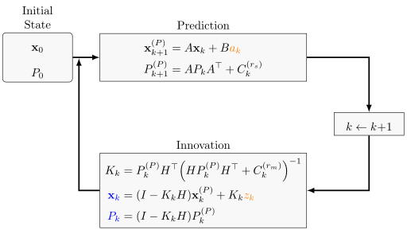

The Kalman Filter is an algorithm which helps to find a good state estimation
in the presence of time series data which is uncertain. For example, when you
want to track your current position, you can use GPS. However, GPS is not
totally accurate as you know if you ever used Google Maps on your mobile
device. Sensor data is noisy and the programmer and the users have to deal with
it.

> The GPS signal in space will provide a "worst case" pseudorange accuracy of
> 7.8 meters at a 95% confidence level.

Source: [gps.gov](http://www.gps.gov/systems/gps/performance/accuracy/), see also [What is the maximum Theoretical accuracy of GPS?](http://gis.stackexchange.com/a/43657/70242)

The Kalman filter is the optimal linear filter (BLUE: Best Linear Unbiased Estimator). This means,
there is no estimator for the state which has a linear state model which is
better. It assumes the noise is Gaussian. If the noise is Gaussian, then the Kalman filter
minimizes the mean squared error of the estimated state parameters. So it in
this case it is not only the best linear filter, but the best filter. The name
"filter" is used because the Kalman filter removes (filters) the noise.

## Step-by-step

### Step 1: Problem description

First, note what you're given. This should be:

* The type of data you measure $z \in \mathbb{R}^{n_z}$,
* the type of values you want to derive from that $\mathbf{x} \in \mathbb{R}^{n_x}$,
* the types of action $a_k \in \mathbb{R}^{n_a}$ you can do.

### Step 2: Modelling

The Kalman Filter is a linear filter. This means you have to model your **system**
in the form

$$\mathbf{x}_{k+1} = A_k \mathbf{x}_k + B_k a_k + r_k^{(s)}$$

with

* $\mathbf{x}_{k+1}, \mathbf{x}_{k} \in \mathbb{R}^{n_x}$ being the state
  vectors,
* $A_k \in \mathbb{R}^{n_x \times n_x}$ being the system matrix,
* $B_k \in \mathbb{R}^{n_x \times n_a}$ being the control matrix,
* $a_k \in \mathbb{R}^{n_a}$ being the control matrix vector ($a$ for action),
* $r_k^{(s)} \sim \mathcal{N(0, C_k^{(r_s)})}$ with $C_k^{(r_s)} \in \mathbb{R}^{n_x \times n_x}$
  being Gaussian noise. $C_k^{(r_s)} \in \mathbb{R}^{n_x \times n_x}$ is called
  the process error covariance matrix.

You can also make a model of your **measurements**. They should be some linear
combination of the state with Gaussian noise $r_k^{(m)}$:

$$z_k = H \cdot \mathbf{x}_k + r_k^{(m)}$$

with

* $z_k \in \mathbb{R}^{n_m}$: The measurement vector
* $r_k^{(r_m)} \sim \mathcal{N(0, C_k^{(r_m)})}$ with $C_k^{(r_m)} \in \mathbb{R}^{n_m \times n_m}$
  being Gaussian noise. $C_k^{(r_m)} \in \mathbb{R}^{n_m \times n_m}$ is called
  the measurment noise covariance matrix.
* $H \in \mathbb{R}^{n_m \times n_x}$: A matrix which transforms the state
  vector $\mathbf{x}$ to a measurement vector. This matrix is a constant over
  the whole process. It is most likely to have only 0s and 1s as entrys.

### Step 3: The algorithm

<figure class="wp-caption aligncenter img-thumbnail">
    
    <figcaption class="text-center">Overview of the Kalman-filter. 
                                    The inputs are orange,
                                    the outputs are blue.</figcaption>
</figure>

The matrices which were not explained so far are:

* $P_k \in \mathbb{R}^{n_x \times n_x}$ is the state vector covariance matrix.
  It is the uncertainty.
* $K_k \in \mathbb{R}^{n_x \times n_m}$: The Kalman gain. Higher values
  indicate that we give more trust to the measurment. Lower values indicate
  that we give more trust to our last prediction. If the measurement
  uncertainty $C_k^{(m)}$ is small compared to the state uncertainty $P_k^{(P)}$,
  then the Kalman Gain is big. So we will rely more on the measurement and
  less of what we predicted before.

## Example

Suppose you want to track the position of a car in 2D. What you get as sensor
data is the current position. So the state is

$$\mathbf{x} = \begin{pmatrix}x\\y\\\dot{x}\\\dot{y}\end{pmatrix}$$

where $x \in \mathbb{R}$ is the position in m away from some predefined point,
$\dot{x} \in \mathbb{R}$ is the velocity in m/s at starting time and $\ddot{x}
\in \mathbb{R}$ is the acceleration in $m/s^2$. The measurements are

$$\mathbf{z} = \begin{pmatrix}x^{(M)}\\y^{(M)}\end{pmatrix}$$

What you get to choose is the acceleration at each time step $i$ (time steps
have the length $t$):

$$a = \begin{pmatrix}\ddot{x}^{(a)}\\\ddot{y}^{(a)}\end{pmatrix}$$

As the Kalman filter is a linear filter, the state model is:

$$\mathbf{x}^{(P)}_k = A\mathbf{x}_k + Ba_k$$

The measurement is dependent on the state, with some noise $r_k^m$:

$$\mathbf{z}_k = H \mathbf{x}_k + r_k^m$$

with $A \in \mathbb{R}^{4 \times 4}$, $H \in \mathbb{R}^{2 \times 4}$. As one
can decompose the acceleration / speed in the directions and the equation for
the new position is

$$\begin{align}x_{new}(t) &= x + \dot{x} t + 0.5 \ddot{x} t^2\\
y_{new}(t) &= y + \dot{y} t + 0.5 \ddot{y} t^2\\
\dot{x}_{new}(t) &= \dot{x} + \ddot{x} t\\
\dot{y}_{new}(t) &= \dot{y} + \ddot{y} t\end{align}$$

So given the state model, we get:

$$\mathbf{x}^{(P)} = \underbrace{\begin{pmatrix}1& 0 & t & 0\\
                                    0& 1 & 0 & t\\
                                    0& 0 & 1 & 0\\
                                    0& 0 & 0 & 1\end{pmatrix}}_{A_k} \mathbf{x}_k + \underbrace{\begin{pmatrix}0.5t^2 & 0\\
                                        0 & 0.5t^2\\
                                        t & 0\\
                                        0 & t\end{pmatrix}}_{B_k} \cdot a_k$$

The choice of the initial uncertainty covariance matrix
$P_0 \in \mathbb{R}^{4 \times 4}$ / the initial state $\mathbf{x}$ doesn't
matter too much. The Kalman filter algorithm will fix both over enough steps.
Common choices are the zero-vector for $\mathbb{x}$ and $P_0 = c \cdot I$
as the covariance matrix with the identity matrix $I$ and $c$ being big
compared with the noise.

For this example, a reasonable choice is the diagonal matrix $$P_0 = \begin{pmatrix}a_1 & 0 & 0 & 0\\
0 & a_2 & 0 & 0\\
0 & 0 & a_3 & 0\\
0 & 0 & 0 & a_4\end{pmatrix}$$ with $a_1 = a_2 = 20000000$ as the earths diameter is about $40000\textrm{ km}$ and $a_3=a_4=90$ as going more than $324\textrm{ km/h}$ is extremely rarely going to happen for a car.

For the initial state parameter, you could wait two time steps:
$$\mathbf{x}_0 = \begin{pmatrix}x^{(M)}_{-1}\\
                                y^{(M)}_{-1}\\
                                x^{(M)}_{-1} - x^{(M)}_{-2}\\
                                y^{(M)}_{-1} - y^{(M)}_{-2}\end{pmatrix}$$

**Prediction step**

The state prediction works as above:
$$\mathbf{x}^{(P)}_{k+1} = A_k \mathbf{x}_{k} + B_k a_k$$

Covariance prediction:

$$P_{k+1}^{(P)} = A P_k A^T + C_k^{(r_s)} \quad \text{with}\quad C_k^{(r_s)} \in \mathbb{R}^{4 \times 4}.$$

The process error covariance $C_k^{(r_s)}$ expresses the error in the system.
It is a covariance matrix and thus has to be symmetric and positive definite.
It encodes errors in the modeling itself as well as errors in the actions.

**Innovation step**

Innovation, which compares the measurement with the prediction:

$$\tilde{y}_{k+1} = z_{k+1} - H \mathbf{x}^{(P)}_{k+1}$$

The observation matrix $H \in \mathbb{R}^{2 \times 4}$ in the example is
$$H = \begin{pmatrix}1 & 0 & 0 & 0\\0 & 1 & 0 & 0\end{pmatrix},$$ as it encodes the relationship between the state and the measurement.

Innovation Covariance:

$$S_{k+1} = H P_{k+1}^{(P)} H^T + C_k^{(r_m)}$$

For the measurement error covariance $C_k^{(r_m)} \in \mathbb{R}^{2 \times 2}$ I have to know something about the way my sensors work. I guess this will usually be a diagonal matrix, as the sensors will be independent(?).

Kalman Gain:

$$K_{k+1} = P_{k+1}^{(P)} H^T S^{-1}_{k+1}$$

Now, finally the state and covariance update:

$$\mathbf{x}_{k+1} = \mathbf{x}^{(P)}_{k+1} + K_{k+1} \tilde{y}$$
$$P_{k+1} = (I - K_{k+1} H) P_{k+1}^{(P)}$$

## Miscallenious facts

### Error estimates

> How does the error estimate change in the Kalman filter steps?

In the prediction step, you have a matrix

$$\tilde{P} = A \cdot P \cdot A^T, \qquad A, P \in \mathbb{R}^{n \times n}$$

($A$ is the system matrix and $P$ is the estimate of the error.)

It has the property:

$$\det(\tilde{P}) = \det(A) \cdot \det(P) \cdot \det(A^T) = 2 \cdot \det(A) \cdot \det(P)$$

So if the determinant of $P$ is how we say if it gets bigger, then it will get
bigger in the prediction step if $\det(A) > 0.5$. Otherwise, it might still
get bigger as the system noise $C_{k}^{(s)}$ gets added.

In the filter step, things are more complicated. I don't know what to write
about it, so I asked for help:
[How does the error estimate change in the Kalman filter?](http://math.stackexchange.com/q/1851904/6876)

### Perfect sensor

> What is the value of $K_k$ if the sensor is perfect?

A perfect sensor has no uncertainty. This means the variance $C_k^{(m)}$ is 0.
It follows:

$$K_k = P_k^{(P)} H^T (H^T)^{-1} (P_k^{(P)})^{-1} H^{-1} = H^{-1}$$

This leads to the uncertainty $P_k$ getting 0 and the state $x_k$ will be the
measurement $z_k$.

### Really bad sensor

> What is the value of $K_k$ if the sensor is as bad as possible?

If we don't trust the sensor at all, the uncertainty is huge. The inverse of a
huge term is close to 0. so the Kalman gain $K_k$ is close to 0. This means
neither the state $x_k$ nor the error estimate $P_k$ will change.

## Extensions

* EKF: <a href="https://en.wikipedia.org/wiki/Extended_Kalman_filter">Extended Kalman Filter</a>
    * Linearization (multivariate Taylor Series expansions)
    * See: <a href="http://www.cbcity.de/das-extended-kalman-filter-einfach-erklaert">Das Extended Kalman Filter einfach erklärt</a> (German)
* UKF: Unscented Kalman filter
    * deterministic sampling
    * approximation of the first two moments

## Lectures

There are several lectures at KIT which introduce Kalman filters:

* [Probabilistische Planung](https://martin-thoma.com/probabilistische-planung/)
* [Informationsfusion](https://martin-thoma.com/informationsfusion/)
* Lokalisierung mobiler Agenten
* [Analyse und Entwurf multisensorieller Systeme](http://www.ite.kit.edu/lehrveranstaltungen_analyse_und_entwurf_multisens_sys.php)

There is also an series of YouTube videos I can recommend:

<iframe width="512" height="288" src="https://www.youtube-nocookie.com/embed/CaCcOwJPytQ?list=PLX2gX-ftPVXU3oUFNATxGXY90AULiqnWT" frameborder="0" allowfullscreen></iframe>

## Literature and Weblinks

* Bar-Shalom, Yaakov, X. Rong Li, and Thiagalingam Kirubarajan. Estimation with
  applications to tracking and navigation: theory algorithms and software. John
  Wiley & Sons, 2004.
* Greg Czerniak: [Introduction to Kalman filters](http://greg.czerniak.info/guides/kalman1/)
* [How do I choose the parameters of a Kalman filter?](http://dsp.stackexchange.com/q/31632/9101)
* StackExchange: <a href="http://math.stackexchange.com/questions/tagged/kalman-filter?sort=votes&pageSize=15">math</a>, <a href="http://stats.stackexchange.com/questions/tagged/kalman-filter">CV</a>, <a href="http://dsp.stackexchange.com/questions/tagged/kalman-filters?sort=votes&pageSize=15">DSP</a>
    * <a href="http://stats.stackexchange.com/q/168882/25741">What is the difference between kalman filter and extended kalman filter?</a>
