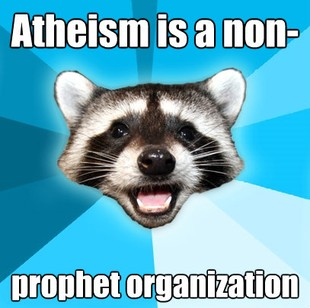
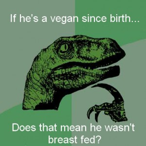
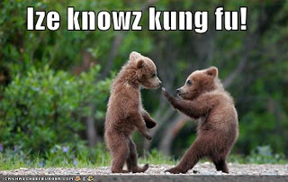
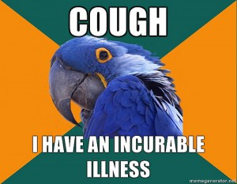
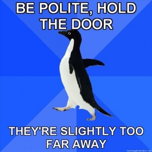
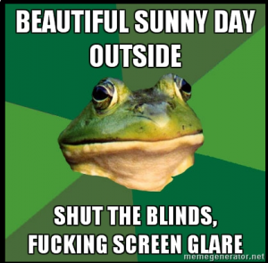
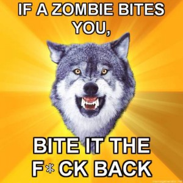

Animals are quite often in some web memes:
<h2>Lame Pun Coon</h2>
<figure>
    
    <figcaption>Lame Pun Coon</figcaption>
</figure>

<h2>Philosoraptor</h2>
<figure>
    
    <figcaption>Philosoraptor</figcaption>
</figure>

<h2>Kung Fu Bear</h2>
<figure>
    
    <figcaption>Ize knowz kung fu!</figcaption>
</figure>

<h2>Paranoid Parrot</h2>
<figure>
    
    <figcaption>Paranoid Parrot</figcaption>
</figure>

<h2>Socially Awkward Penguin</h2>
<figure>
    
    <figcaption>Socially Awkward Penguin</figcaption>
</figure>

<h2>Bachelor Frog</h2>
<figure>
    
    <figcaption>Foul Bachelor Frog</figcaption>
</figure>

<h2>Courage Wolf</h2>
<figure>
    
    <figcaption>Courage Wolf vs. Zombies</figcaption>
</figure>

Do you know more? Do you know some better ones of the described ones?
Please, post a comment!
