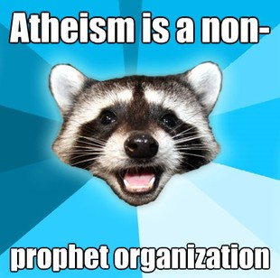
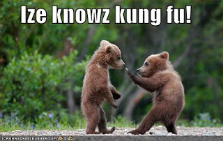

Animals are quite often in some web memes:
<h2>Lame Pun Coon</h2>
<figure class="aligncenter">
            
            <figcaption class="text-center">Lame Pun Coon</figcaption>
        </figure>

<h2>Philosoraptor</h2>
<figure class="alignnone">
            
            <figcaption class="text-center">Philosoraptor</figcaption>
        </figure>

<h2>Lolcat</h2>
<object width="512" height="341" classid="clsid:d27cdb6e-ae6d-11cf-96b8-444553540000" codebase="http://download.macromedia.com/pub/shockwave/cabs/flash/swflash.cab#version=6,0,40,0"><param name="flashvars" value="host=picasaweb.google.com&amp;hl=de&amp;feat=flashalbum&amp;RGB=0x000000&amp;feed=http%3A%2F%2Fpicasaweb.google.com%2Fdata%2Ffeed%2Fapi%2Fuser%2Fthemoosemind%2Falbumid%2F5444766564208572833%3Falt%3Drss%26kind%3Dphoto%26hl%3Dde" /><param name="pluginspage" value="http://www.macromedia.com/go/getflashplayer" /><param name="src" value="http://picasaweb.google.com/s/c/bin/slideshow.swf" /><embed width="512" height="341" type="application/x-shockwave-flash" src="http://picasaweb.google.com/s/c/bin/slideshow.swf" flashvars="host=picasaweb.google.com&amp;hl=de&amp;feat=flashalbum&amp;RGB=0x000000&amp;feed=http%3A%2F%2Fpicasaweb.google.com%2Fdata%2Ffeed%2Fapi%2Fuser%2Fthemoosemind%2Falbumid%2F5444766564208572833%3Falt%3Drss%26kind%3Dphoto%26hl%3Dde" pluginspage="http://www.macromedia.com/go/getflashplayer" /></object>

<h2>Kung Fu Bear</h2>
<figure class="alignnone">
            
            <figcaption class="text-center">Ize knowz kung fu!</figcaption>
        </figure>

<h2>Paranoid Parrot</h2>
<figure class="alignnone">
            
            <figcaption class="text-center">Paranoid Parrot</figcaption>
        </figure>

<h2>Socially Awkward Penguin</h2>
<figure class="alignnone">
            
            <figcaption class="text-center">Socially Awkward Penguin</figcaption>
        </figure>

<h2>Bachelor Frog</h2>
<figure class="alignnone">
            
            <figcaption class="text-center">Foul Bachelor Frog</figcaption>
        </figure>

<h2>Courage Wolf</h2>
<figure class="alignnone">
            
            <figcaption class="text-center">Courage Wolf vs. Zombies</figcaption>
        </figure>

Do you know more? Do you know some better ones of the described ones?
Please, post a comment!
