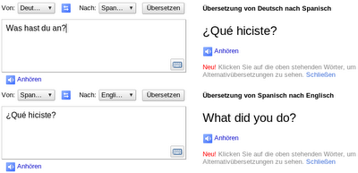

Online translation programs are getting better and they are great if you want to get a vague idea of the content of a Chinese website. Nevertheless, you should know that the translations are not good enough by now:

"Spielzeugladen" is German and means "toy store"

<figure>
    
</figure>

Note the missing point.

<figure>
    
</figure>

"Was hast du an?" means "What do you wear?"

<figure>
    
</figure>

Did you know the Beatbox?
Type "pv zk pv pv zk pv zk zk pv pv pv zk pv zk zk pzk pzk pvzkpkzvpvzk kkkkkk bsch", translate from German to German and listen to it:
<iframe width="512" height="321" src="//www.youtube.com/embed/KtjYKMtGNRc" frameborder="0" allowfullscreen></iframe>

Here you can listen to the translation-song:
<iframe width="512" height="321" src="//www.youtube.com/embed/mqsrPNXEGdc" frameborder="0" allowfullscreen></iframe>
