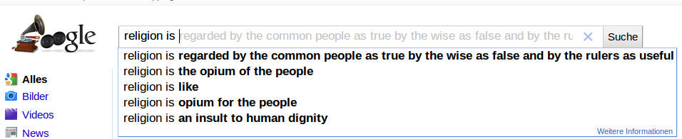

Did you notice some strange autocomplete-results? Keep in mind that Google gets those suggestions by other searches. They don't employ someone who tries to guess what you mean. So many others have searched for the term which is suggested.

Here are some I've tested:
<strong>Some nations:</strong>

<figure>
    
</figure>

<figure>
    
</figure>

If you really like to know, you should go to <a href="http://en.wikipedia.org/wiki/Obesity#Causes">Wikipedia</a>. They have an article about <a href="http://en.wikipedia.org/wiki/Obesity_in_the_United_States">Obesity in the United States</a>. I thought obesity would be a serious problem <a href="http://en.wikipedia.org/wiki/Obesity_in_Germany">in Germany</a>, too. According to Wikipedia, Germany is only on rank 43 of the fattest nations.
You can even find an article called "<a href="http://en.wikipedia.org/wiki/Epidemiology_of_obesity">Epidemiology of obesity</a>".

<figure>
    
</figure>

I've heard of this in <a href="http://en.wikipedia.org/wiki/How_i_met_your_mother">How I Met Your Mother</a>.

    <figure>
        
    </figure>
    <figure>
        
    </figure>
    <figure>
        
    </figure>
    <figure>
        
    </figure>

<strong>Some systems:</strong>

<figure>
    
</figure>

<figure>
    
</figure>

<a href="http://en.wikipedia.org/wiki/Apache_HTTP_Server">Apache</a> is one of the most common webservers.

<figure>
    
</figure>

<strong>And many others:</strong>

    <figure>
        
    </figure>
    <figure>
        
    </figure>
    <figure>
        
    </figure>

You don't search for Chuck Norris, Chuck Norris finds you!

<figure>
    
</figure>

<figure>
    
</figure>

I hope you have seen Terminator. Otherwise, you don't know <a href="http://en.wikipedia.org/wiki/Skynet_(Terminator)">Skynet</a>.

    <figure>
        
    </figure>
    <figure>
        
    </figure>
    <figure>
        
    </figure>
    <figure>
        
    </figure>
    <figure>
        
    </figure>
    <figure>
        
    </figure>
    <figure>
        
    </figure>
    <figure>
        
    </figure>
    <figure>
        
        <figcaption>Google Autocomplete: I hate it when ...</figcaption>
    </figure>

