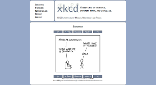
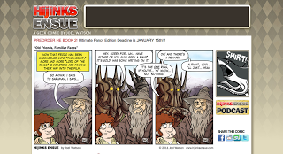
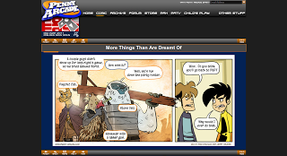
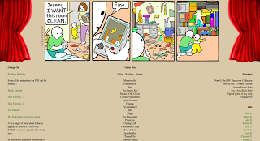
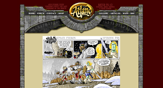

All of those Websites offer one small comic strip each day. Some of them are a bit geeky, so you might not understand them if you don't know anything about Linux / D&amp;D.
<h2>xkcd</h2>
<figure class="aligncenter">
            
            <figcaption class="text-center"><a href='http://xkcd.com/'>xkcd</a></figcaption>
        </figure>

<h2>hijinks ensue</h2>
<figure class="aligncenter">
            
            <figcaption class="text-center"><a href='http://hijinksensue.com/2011/01/11/failed-enterprises/' rel='nofollow'>www.hijinksensue.com</a></figcaption>
        </figure>

<h2>Penny Arcade</h2>
<figure class="aligncenter">
            
            <figcaption class="text-center"><a href='http://www.penny-arcade.com/comic/2010/10/13/' rel='nofollow'>www.penny-arcade.com/comic</a></figcaption>
        </figure>

<h2>The Perry Bible Fellowship Comics</h2>
<figure class="aligncenter">
            
            <figcaption class="text-center"><a href='http://www.pbfcomics.com/' rel='nofollow'>www.pbfcomics.com</a></figcaption>
        </figure>

<h2>Realm of Atland</h2>
<figure class="aligncenter">
            
            <figcaption class="text-center"><a href='http://www.realmofatland.com/?p=235' rel='nofollow'>www.realmofatland.com</a></figcaption>
        </figure>
