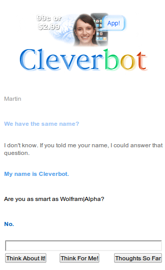
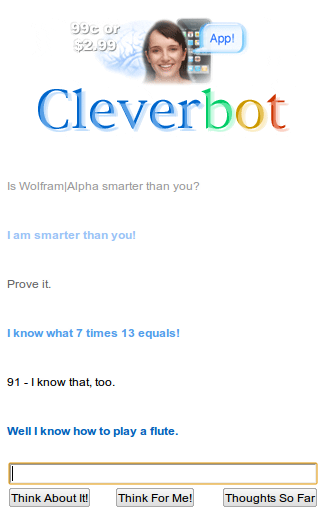

<a href="http://cleverbot.com/" title="Cleverbot">Cleverbot</a> is an AI web application. You can chat with it and it tries to guess a good answer. This can be quite funny.

I was curious how Cleverbot would answer when I compared it to <a href="http://www.wolframalpha.com/" title="answer engine">Wolfram|Alpha</a>, a useful answering engine.

Here are two of my conversations:

<figure class="aligncenter">
            
            <figcaption class="text-center">Cleverbot</figcaption>
        </figure>

<figure class="aligncenter">
            
            <figcaption class="text-center">Cleverbot</figcaption>
        </figure>

This Cleverbot isn't very clever...

Did you get some funny chats? Please post a link to a screenshot of your chat!

edit: I just found this video. Too funny ☺

<iframe width="512" height="288" src="//www.youtube-nocookie.com/embed/WnzlbyTZsQY" frameborder="0" allowfullscreen></iframe>
