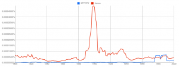
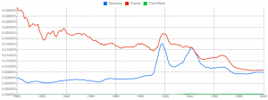
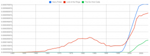
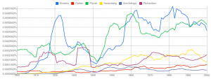
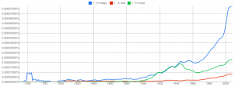

On October 14, 2010 Google announced that the number of scanned books is over 15 million. They did not simply scan those books, but they digitalized them. They can access not only image files, but the actual text. This allows Google to search in those books and to analyze the information.

Google has processed 1,024,908,267,229 words of running text and is publishing the counts for all 1,176,470,663 five-word sequences that appear at least 40 times. One five-word-sequence would be a five-gram, a four-word-sequence a four-gram.

Google has published the Ngram Viewer. This is a tool which allows the user to specify some Ngrams and search how often they appear over the years.

Here is an example search:

<figure class="alignnone">
            
            <figcaption class="text-center">Google Ngram Viewer: Germany vs France</figcaption>
        </figure>

The x-axis shows the years, the y-axis shows the percentage of the specified ngram of all ngrams.
Don't bother with the numbers. If one curve is higher than the other, more books contained the specified Ngram.

My example shows that the term "France" was more often in books than "Germany". Why is this the case? My first thought was that in the time of the two world wars more books should have been written about Germany. The answer is simply that I wrote "germany" instead of "Germany". So it's case sensitive:

<figure class="alignnone">
            
            <figcaption class="text-center">Google Ngram Viewer: Germany vs. France vs. Third-Reich</figcaption>
        </figure>

You can compare how successful some books are:
<figure class="alignnone">
            
            <figcaption class="text-center">Google Ngram Viewer: Harry Potter vs. Lord of the Rings vs. The Da Vinci Code</figcaption>
        </figure>

Quite interesting is also the interest in famous physicists:
<figure class="alignnone">
            
            <figcaption class="text-center">Google Ngram Viewer: Famous physicists</figcaption>
        </figure>

You can try all sort of things:
<figure class="alignnone">
            
            <figcaption class="text-center">Google Ngram Viewer: Happy</figcaption>
        </figure>

Did you get some interesting results? Please post a link!

<h2>Sources</h2>
<ul>
	<li><a title="Google Books" href="http://en.wikipedia.org/wiki/Google_Books">Google Books</a>. Received 24 September 2011.</li>
	<li><a href="http://googleresearch.blogspot.com/2006/08/all-our-n-gram-are-belong-to-you.html">All Our N-gram are Belong to You</a>. Received 24 September 2011.</li>
	<li>Video: <a href="http://www.ted.com/talks/what_we_learned_from_5_million_books.html">What we learned from 5 million books</a>.</li>
</ul>
