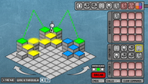

<figure class="aligncenter">
    
    <figcaption>Lightbot 2.0</figcaption>
</figure>

<b>Go to the Game</b>: <a href="http://www.kongregate.com/games/Coolio_Niato/lighbot-2-0">Lightbot 2.0 on Kongregate</a>

<b>Task</b>: Solve the levels

<b>How to play</b>: You can programm the Lightbot to move, jump and to switch its light on. By defining functions and using recursion you can keep your program code small. It's a nice online game where you can start to learn programming.

<b>My Record</b>: All Basic and Recursion-Levels done.
