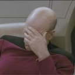

With the Internet came a lot of new words. <a href="http://en.wikipedia.org/wiki/Cyberculture">Cyberculture</a> could be one of them, <a href="http://en.wikipedia.org/wiki/Google_(verb)">Googling</a> or <a href="http://en.wikipedia.org/wiki/Hacktivism">Hacktivism</a> would be others.

Did you know that the famous gesture of Piccard is called a <a href="http://en.wikipedia.org/wiki/Facepalm">Facepalm</a>?
<figure class="aligncenter">
            
            <figcaption class="text-center">Piccard Facepalm</figcaption>
        </figure>

The same word seems to exist also in German, so I'm quite sure that the word is new. (Although the <a href="http://en.wikipedia.org/wiki/Duden">Duden</a> doesn't know it.)

Although the gesture itself is obviously old:

<figure class="aligncenter">
            
            <figcaption class="text-center"><a href='http://commons.wikimedia.org/wiki/File:Cain_Henri_Vidal_Tuileries.jpg'>Cain</a> by Henri Vidal, in the Tuileries Gardens, Paris, 1896</figcaption>
        </figure>
