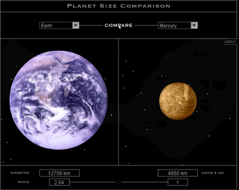

The diameter of Mercury measures about 4880 km. Can you imagine how much that is? I could not. But with <a href="http://www.sciencenetlinks.com/interactives/messenger/psc/PlanetSize.html">www.sciencenetlinks.com</a> you can compare it with the earth:

<figure class="aligncenter">
            
            <figcaption class="text-center">Planet Size Comparison</figcaption>
        </figure>

By the way, if you are interested in the universe, you should go to a <a href="http://en.wikipedia.org/wiki/Planetarium">planetarium</a>. You can search the next one with <a href="http://maps.google.com/maps?f=q&source=s_q&hl=de&geocode=&q=planetarium+in+england&aq=&sll=52.629729,-1.318359&sspn=7.190682,19.753418&ie=UTF8&hq=planetarium&hnear=England,+Vereinigtes+K%C3%B6nigreich&ll=52.469397,-1.252441&spn=7.553141,19.753418&t=h&z=6">maps.google.com</a>. In Augsburg (Germany) it costs less than going to a 3D-cinema, but the movie showen in the planetarium is in 3D.
