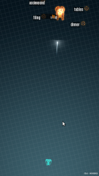

<figure class="aligncenter">
            
            <figcaption class="text-center">Z-Type</figcaption>
        </figure>

<b>Go to the Game</b>: <a href="http://www.phoboslab.org/ztype/" rel="nofollow">www.phoboslab.org/ztype</a>
<b>Task</b>: Survive as long as possible
<b>How to play</b>: Type the words which appear at the top as fast as possible. The ship shoots at the words.
<b>My Record</b>: Final Score: 1505 with Accuracy of 94.2%
<b>Programming</b>: This game is written in JavaScript with <a href="http://impactjs.com/" rel="nofollow">Impact</a>.
