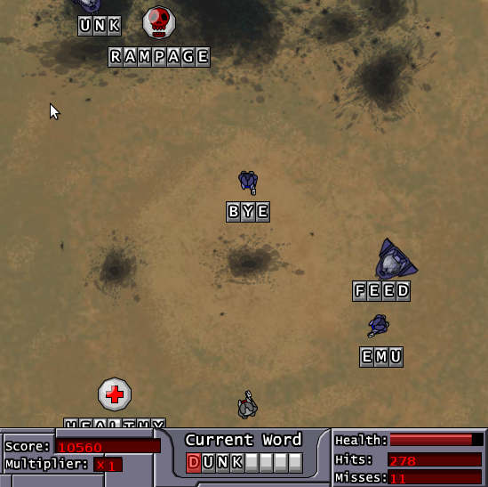
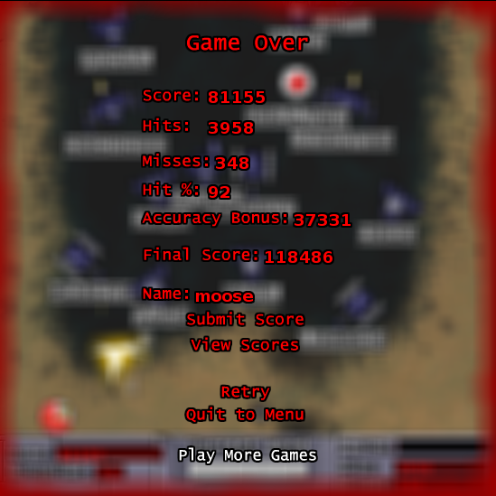

<figure class="aligncenter">
            
            <figcaption class="text-center">QWERTY Warriors 2</figcaption>
        </figure>
<b>Go to the Game</b>: <a href="http://www.kongregate.com/games/Weasel/qwerty-warriors-2">QWERTY Warriors 2 on Kongregate</a>
<b>Task</b>: Survive as long as possible.
<b>How to play</b>: You have to type the enemy-words as fast as possible. Your figure will automatically shoot at them when you type.
<b>My Record</b>: 118,486 (Final Score, see below)
<figure class="aligncenter">
            
            <figcaption class="text-center">QWERTY Warriors 2: Score</figcaption>
        </figure>
