Most of you might know that I am currently a student. Living near the University is quite important for me as I hate traveling long. In the central part of <a href="http://en.wikipedia.org/wiki/Karlsruhe">Karlsruhe</a>, the city I study in, most houses are very old. The house I live in was built around 1900 and modernized from time to time. A heater and electricity were added, for example.

The flat is shared by students. My hirer told me that he will pay all cost of materials if I wanted to improve something. As a new leaser came and we had no washing machine we thought it was time to renovate the kitchen.
<h2>The old kitchen</h2>
<h3>Why did I renovate?</h3>
<ul>
	<li>We needed more space for a new washing machine.</li>
	<li>The old countertop was ugly, molded and had a water damage.</li>
	<li>The tap was loose.</li>
	<li>The tube for hot water was loose.</li>
</ul>
<h3>Some photos</h3>

    <figure>
        <a href="../images/2011/10/kitchen-before-countertop.jpg">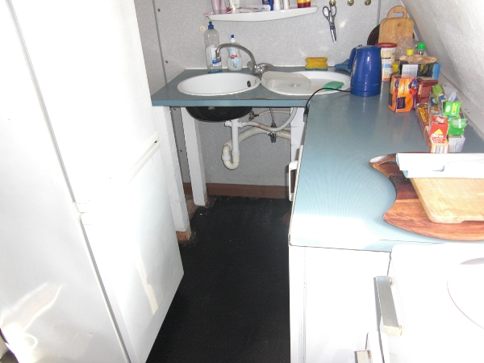</a>
        <figcaption>Old countertop of our kitchen</figcaption>
    </figure>
    <figure>
        <a href="../images/2011/10/kitchen-before-countertop-old.jpg">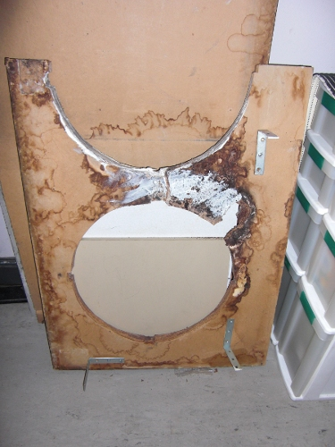</a>
        <figcaption>The old countertop</figcaption>
    </figure>
    <figure>
        <a href="../images/2011/10/kitchen-before-countertop-old-top.jpg">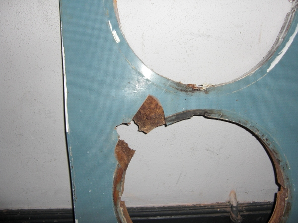</a>
        <figcaption>Top of the old countertop</figcaption>
    </figure>

<h2>Plans</h2>
<figure>
    <a href="../images/2011/10/kitchen-before-plan.png">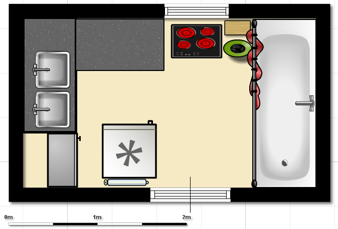</a>
    <figcaption>Kitchen before renovation</figcaption>
</figure>

<figure>
    <a href="../images/2011/10/kitchen-after-plan.png">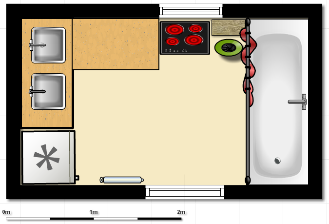</a>
    <figcaption>Kitchen after renovation</figcaption>
</figure>
<h2>The renovation</h2>
<h3>Tools</h3>
I needed quite a lot of tools. I had to buy most of them when I saw that I couldn't continue without them:

    <figure>
        <a href="../images/2011/10/tool-drilling-machine.jpg">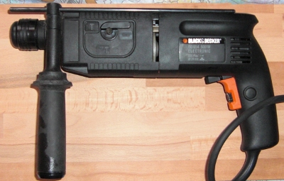</a>
        <figcaption>Drilling machine</figcaption>
    </figure>
    <figure>
        <a href="../images/2011/10/tool-plumber-wrench.jpg">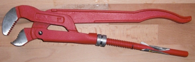</a>
        <figcaption>Plumber wrench</figcaption>
    </figure>
    <figure>
        <a href="../images/2011/10/tool-screwdriver.jpg">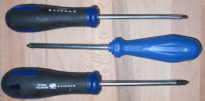</a>
        <figcaption>Screwdrivers</figcaption>
    </figure>
    <figure>
        <a href="../images/2011/10/tool-silicone-cartridge.jpg">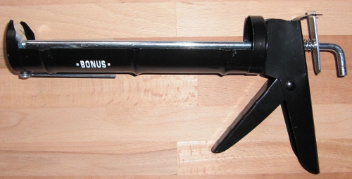</a>
        <figcaption>Silicone cartridge</figcaption>
    </figure>
    <figure>
        <a href="../images/2011/10/tool-spirit-level.jpg">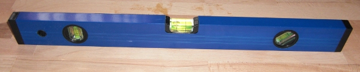</a>
        <figcaption>Spirit level</figcaption>
    </figure>
    <figure>
        <a href="../images/2011/10/tool-wrench.jpg">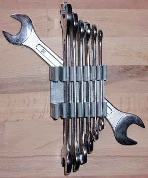</a>
        <figcaption>Wrench</figcaption>
    </figure>

Additionally I needed a hammer to get the wall plugs into the wall, some different screws and wall plugs, pliers, some tubes and some <a href="http://en.wikipedia.org/wiki/O-ring">O-rings</a>.

<h3>Photos while working</h3>

    <figure>
        <a href="../images/2011/10/kitchen-working-crooked-wall2-196x300.jpg">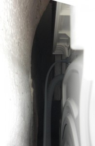</a>
        <figcaption>Crooked wall</figcaption>
    </figure>
    <figure>
        <a href="../images/2011/10/kitchen-after-heating-pipe-225x300.jpg">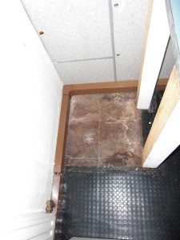</a>
        <figcaption>Heating pipes</figcaption>
    </figure>
    <figure>
        <a href="../images/2011/10/kitchen-working-washing-machine-300x225.jpg">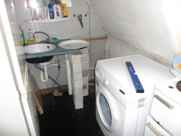</a>
        <figcaption>To save some money and to be sure that it really fits, I waited with the renovation until the washing machine was delivered. After it was here I had to move it quite often to get the ledge at its place.</figcaption>
    </figure>
    <figure>
        <a href="../images/2011/10/kitchen-working-loose-tube-300x225.jpg">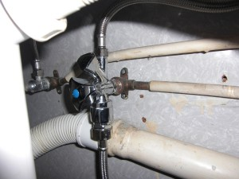</a>
        <figcaption>As I removed the old countertop, I saw that a tube was loose. This had to be fixed. So I mounted it to the wall.</figcaption>
    </figure>
    <figure>
        <a href="../images/2011/10/kitchen-working-ledge2-300x225.jpg">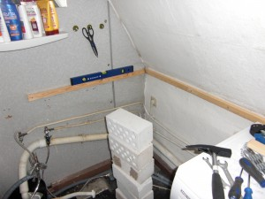</a>
        <figcaption>Adding a working ledge is very important. I simply took some wood which was about the right size (4cm x 1cm) / length (about 1.5m). It gives your countertop the needed stability and you can make sure that it's exactly horizontal. Therefore you should use a spirit level. I drilled a small, long hole in the wall and used long wall plugs / screws. They are about 4cm in the wall. As you don't see those later, it doesn't have to look nice, but it has to be stable.</figcaption>
    </figure>
    <figure>
        <a href="../images/2011/10/kitchen-working-connection-300x214.jpg">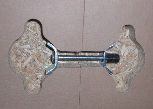</a>
        <figcaption>You have to connect both countertops very well. If you don&#039;t do so, you will get water in there which will destroy the countertop over time. So we filled the space in between with wood glue and pressed them together with this screw construction.</figcaption>
    </figure>
    <figure>
        <a href="../images/2011/10/kitchen-working-tab-259x300.jpg">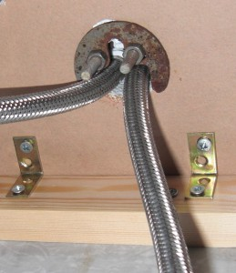</a>
        <figcaption>This little metal plate fixates the tap to the countertop. I put it for two days into vinegar to get rid of most of the rust, dirt and chalk. Before I did so, the whole plate was brown.</figcaption>
    </figure>
    <figure>
        <a href="../images/2011/10/kitchen-working-angle-joints-300x225.jpg">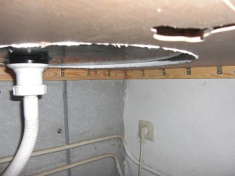</a>
        <figcaption>Angle joints fix the countertop to the wall. I used 23 angle joints with 46 screws. Nothing will separate my countertop from the wall :D</figcaption>
    </figure>
    <figure>
        <a href="../images/2011/10/kitchen-working-silicone-leftovers-300x225.jpg">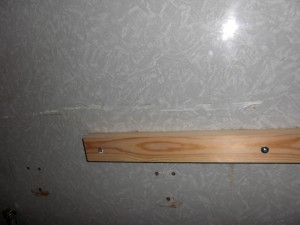</a>
        <figcaption>Removing silicone leftovers is a pretty time intensive work. You can remove a lot with a knife, but if the underground is tender you have to use some chemicals.</figcaption>
    </figure>

The chemicals I used are called "Max Bahr - Silikon Entferner". It seems to be
called "Caulk Remover" in English. I had to apply mine with a brush which was
in the package. After 10 minutes, I could remove some more of the caulk.

<figure>
    <a href="../images/2011/10/kitchen-masked-countertop-300x225.jpg">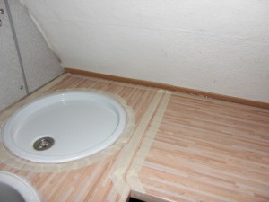</a>
    <figcaption>If you want to make a clean silicone clogging, you should mask the surrounding area.</figcaption>
</figure>

<figure>
    <a href="../images/2011/10/kitchen-after-baseboard-300x225.jpg">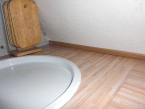</a>
    <figcaption>Adding a baseboard was one of the last steps. This small piece of wood should prevent water from touching the wallpaper. Moreover it looks nice ☺</figcaption>
</figure>

<h2>The new kitchen</h2>
<figure>
    <a href="../images/2011/10/kitchen-after.png">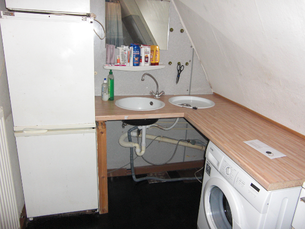</a>
    <figcaption>Kitchen after renovation</figcaption>
</figure>

<figure>
    <a href="../images/2011/10/kitchen-after-exact-work-300x225.jpg">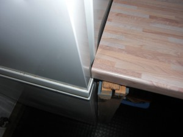</a>
    <figcaption>Exact work: It fitted only with a few millimeters left. Good that I added some space to make sure it will fit. If I made the plate exactly as big as it could have been according to my first plan, I would have been in trouble.</figcaption>
</figure>

<h2>Conclusion</h2>
I am proud of the result. The new kitchen looks nice, the countertop is very exact horizontally, no water drips out. Some parts could have been done better (like the silicone clogging), but I guess most could not be much better.

The next time I do something like this I will hopefully not have to go about ten times to the hardware store :-/ Now I have some more tools :D
