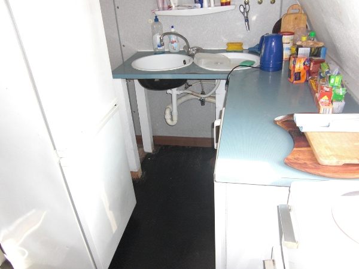
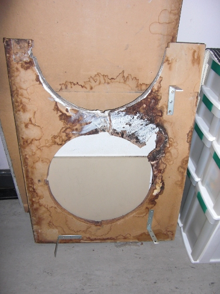
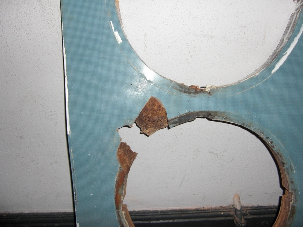
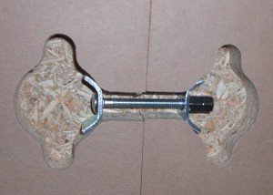
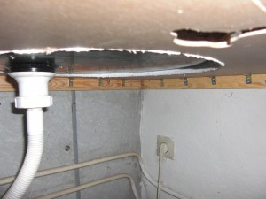
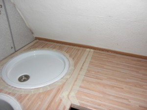

Most of you might know that I am currently a student. Living near the University is quite important for me as I hate traveling long. In the central part of <a href="http://en.wikipedia.org/wiki/Karlsruhe">Karlsruhe</a>, the city I study in, most houses are very old. The house I live in was built around 1900 and modernized from time to time. A heater and electricity were added, for example.

The flat is shared by students. My hirer told me that he will pay all cost of materials if I wanted to improve something. As a new leaser came and we had no washing machine we thought it was time to renovate the kitchen.
<h2>The old kitchen</h2>
<h3>Why did I renovate?</h3>
<ul>
	<li>We needed more space for a new washing machine.</li>
	<li>The old countertop was ugly, molded and had a water damage.</li>
	<li>The tap was loose.</li>
	<li>The tube for hot water was loose.</li>
</ul>
<h3>Some photos</h3>
<figure class="aligncenter">
            
            <figcaption class="text-center">Old countertop of our kitchen</figcaption>
        </figure>

<figure class="aligncenter">
            
            <figcaption class="text-center">The old countertop</figcaption>
        </figure>

<figure class="aligncenter">
            
            <figcaption class="text-center">Top of the old countertop</figcaption>
        </figure>
<h2>Plans</h2>
<figure class="aligncenter">
            
            <figcaption class="text-center">Kitchen before renovation</figcaption>
        </figure>

<figure class="aligncenter">
            
            <figcaption class="text-center">Kitchen after renovation</figcaption>
        </figure>
<h2>The renovation</h2>
<h3>Tools</h3>
I needed quite a lot of tools. I had to buy most of them when I saw that I couldn't continue without them:

<figure class="aligncenter">
            
            <figcaption class="text-center">Drilling machine</figcaption>
        </figure>

<figure class="aligncenter">
            
            <figcaption class="text-center">Plumber wrench</figcaption>
        </figure>

<figure class="aligncenter">
            
            <figcaption class="text-center">Screwdrivers</figcaption>
        </figure>

<figure class="aligncenter">
            
            <figcaption class="text-center">Silicone cartridge</figcaption>
        </figure>

<figure class="aligncenter">
            
            <figcaption class="text-center">Spirit level</figcaption>
        </figure>

<figure class="aligncenter">
            
            <figcaption class="text-center">Wrench</figcaption>
        </figure>

Additionally I needed a hammer to get the wall plugs into the wall, some different screws and wall plugs, pliers, some tubes and some <a href="http://en.wikipedia.org/wiki/O-ring">O-rings</a>.

<h3>Photos while working</h3>
<figure class="aligncenter">
            
            <figcaption class="text-center">Crooked wall</figcaption>
        </figure>

<figure class="aligncenter">
            
            <figcaption class="text-center">Heating pipes</figcaption>
        </figure>

<figure class="aligncenter">
            
            <figcaption class="text-center">To save some money and to be sure that it really fits, I waited with the renovation until the washing machine was delivered. After it was here I had to move it quite often to get the ledge at it&#039;s place.</figcaption>
        </figure>

<figure class="aligncenter">
            
            <figcaption class="text-center">As I removed the old countertop, I saw that a tube was loose. This had to be fixed. So I mounted it to the wall.</figcaption>
        </figure>

<figure class="aligncenter">
            
            <figcaption class="text-center">Adding a working ledge is very important. I simply took some wood which was about the right size (4cm x 1cm) / length (about 1.5m). It gives your countertop the needed stability and you can make sure that it&#039;s exactly horizontally.  Therefore you should use a spirit level. I drilled a small, long hole in the wall and used long wall plugs / screws. They are about 4cm in the wall. As you don't see those later, it doesn't have to look nice, but it has to be stable.</figcaption>
        </figure>

<figure class="aligncenter">
            
            <figcaption class="text-center">You have to connect both countertops very good. If you don&#039;t do so, you will get water in there which will destroy the countertop over time. So we filled the space in between with wood glue and pressed them together with this screw construction.</figcaption>
        </figure>

<figure class="aligncenter">
            
            <figcaption class="text-center">This little metal plate fixates the tap to the countertop. I put it for two days into vinegar to get rid of most of the rust, dirt and chalk. Before I did so, the whole plate was brown.</figcaption>
        </figure>

<figure class="aligncenter">
            
            <figcaption class="text-center">Angle joints fix the countertop to the wall. I used 23 angle joints with 46 screws. Nothing will separate my countertop from the wall :D</figcaption>
        </figure>

<figure class="aligncenter">
            
            <figcaption class="text-center">Removing silicone leftovers is a pretty time intensive work. You can remove a lot with a knife, but if the underground is tender you have to use some chemicals.</figcaption>
        </figure>

The chemicals I used are called "Max Bahr - Silikon Entferner". It seems to be
called "Caulk Remover" in English. I had to apply mine with a brush which was
in the package. After 10 minutes, I could remove some more of the caulk.

<figure class="aligncenter">
            
            <figcaption class="text-center">If you want to make a clean silicone clogging, you should mask the surrounding area.</figcaption>
        </figure>

<figure class="aligncenter">
            
            <figcaption class="text-center">Adding a baseboard was one of the last steps. This small piece of would should prevent water from touching the wallpaper. Moreover it looks nice ☺</figcaption>
        </figure>

<h2>The new kitchen</h2>
<figure class="aligncenter">
            
            <figcaption class="text-center">Kitchen after renovation</figcaption>
        </figure>

<figure class="aligncenter">
            
            <figcaption class="text-center">Exact work: It fitted only with a few millimeters left. Good that I added some space to make sure it will fit. If I made the plate exactly as big as it could have been according to my first plan, I would have been in trouble.</figcaption>
        </figure>

<h2>Conclusion</h2>
I am proud of the result. The new kitchen looks nice, the countertop is very exact horizontally, no water drips out. Some parts could have been done better (like the silicone clogging), but I guess most could not be much better.

The next time I do something like this I will hopefully not have to go about ten times to the hardware store :-/ Now I have some more tools :D
