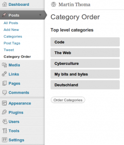

Today, I've introduced a new category: My bits and bytes. I wanted to write something about my <a href="../kitchen-renovation-part-1/">kitchen renovation</a>. Additionally, I thing I will write from time to time about other topics than computer related ones.

As I looked at my categories, I saw that they were ordered lexicographically. But I called my Blog "Code, the Web and Cyberculture", not "Code, Cyberculture and the Web". So I had to change it.

Luckily, a plugin called <a href="http://wordpress.org/extend/plugins/order-categories/">Category Orders</a> exists. It works fine with the latest WordPress (3.2.1):

<figure class="aligncenter">
            
            <figcaption class="text-center">WordPress Plugin: Category Orders</figcaption>
        </figure>
