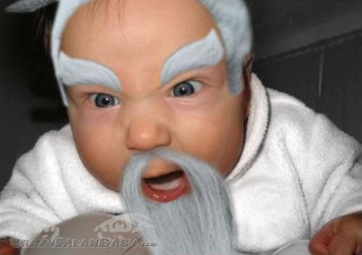
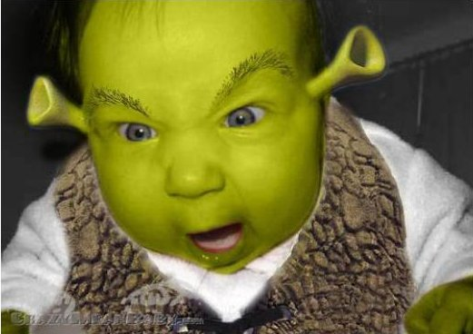

It's so funny what happens when Geeks become parents.

This is what happens if your dad is a designer:

<figure class="aligncenter">
            
            <figcaption class="text-center">Baby Batman</figcaption>
        </figure>

<figure class="aligncenter">
            
            <figcaption class="text-center">Baby <a href='http://en.wikipedia.org/wiki/Terry_Gene_Bollea'>Hulk Hogan</a></figcaption>
        </figure>

<figure class="aligncenter">
            
            <figcaption class="text-center">Baby Ogre</figcaption>
        </figure>

<figure class="aligncenter">
            
            <figcaption class="text-center">Baby Soldier</figcaption>
        </figure>

<figure class="aligncenter">
            
            <figcaption class="text-center">Baby Vampire</figcaption>
        </figure>

The Original (or at least the highest resolution I found) is <a href="http://sneezl.com/wp-content/uploads/2008/04/graphic-designer-baby.pdf">here as PDF</a>.

Giving your child some funny T-shirts is also quite common:
<figure class="aligncenter">
            
            <figcaption class="text-center">Baby Geek: No! (found on <a href='http://www.zazzle.de/lieblingswort_ist_no_chemie_aussenseiter_baby_ones_tshirt-235215790093704490'>zazzle</a>)</figcaption>
        </figure>

<figure class="aligncenter">
            
            <figcaption class="text-center">It seems like someone liked RPGs <a href='http://postmortemstudios.wordpress.com/2011/09/12/sowygo1-a-geek-is-born/'>here</a> ☺</figcaption>
        </figure>

A friend of mine just shared this photo:
<figure class="aligncenter">
            
            <figcaption class="text-center">Twins: Copy and Paste. Thanks to Ren&eacute; for sharing</figcaption>
        </figure>

Do you have more images or perhaps stories of geeky parents? Please let me know in a comment!
