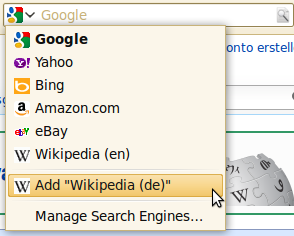
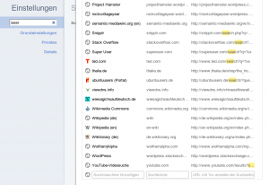

Recently I read a very good post about search engine autodiscovery <a href="http://www.knallisworld.de/blog/2011/04/14/autodiscovery-der-searchengine-in-google-chrome-opensearch/">by Jan Phillip</a>. Did you know that many browsers can detect an internal search engine automatically? 
Firefox gives you the possibility to add such a search engine to your browser:
<figure class="aligncenter">
            <a href="../images/2011/10/firefox-add-search-engine.png"></a>
            <figcaption class="text-center">Firefox: Add search engine detected via autodiscovery</figcaption>
        </figure>

<h2>OpenSearch</h2>
<a href="http://en.wikipedia.org/wiki/OpenSearch">OpenSearch</a> is a collection of technologies. This project aims to create a standard for publishing the metadata which describes a search engine: name, description, URL-pattern, language, ...

A <abbr title="OpenSearch Description Document">OSSD</abbr> looks like this:
```xml
<OpenSearchDescription xmlns="http://a9.com/-/spec/opensearch/1.1/">
    <ShortName>Example</ShortName>
    <Description>My example search engine</Description>
    <InputEncoding>UTF-8</InputEncoding>
    <Image height="16" width="16" type="image/x-icon">
        http://example.org/favicon.ico
    </Image>
    <Url type="text/html" 
         template="http://example.org/index.html#search={searchTerms}"/>
</OpenSearchDescription>
```

The browser needs a hint where it can find the OSSD. So you have to add the following tag to your website:
```xml
<link title = "Example" 
      type  = "application/opensearchdescription+xml" 
      rel   = "search" 
      href  = "http://example.org/opensearch.xml">
```

Now you can add the websites internal search engine automatically to Chrome and easily to Firefox and Internet Explorer 8+. 

Additionally, you can add this little piece of JavaScript to tell Firefox 2+ and Internet Explorer 7+ that your site supports OpenSearch:
```javascript
window.external.AddSearchProvider("http://exampl.org/opensearch.xml");
```

<h2>Google Chrome Autodiscovery</h2>
Google doesn't provide a <abbr title="user interface">UI</abbr> for adding an internal search engine. Instead, you can add it via Settings:

<figure class="aligncenter">
            <a href="../images/2011/10/google-chrome-add-search-300x206.png"></a>
            <figcaption class="text-center">Add Search Engines via Settings in Google Chrome</figcaption>
        </figure>

Chrome also adds the sites internal search engine automatically. Did you ever notice this? Here are some screenshots:

<figure class="aligncenter">
            <a href="../images/2011/10/google-chrome-search-1.png"></a>
            <figcaption class="text-center">Google Chrome Search - Hit tab to search this site</figcaption>
        </figure>

<figure class="aligncenter">
            <a href="../images/2011/10/google-chrome-search-2.png"></a>
            <figcaption class="text-center">Google Chrome Search - Search with the websites internal search engine</figcaption>
        </figure>

Interestingly the auto discovery only works if the search engine is at the homepage. You have to have either an input field of the type `search` or of the type `text` with the name `s`:

```html
<form>
  <input type="search" name="s" />
</form>
```

or

```html
<form>
  <input type="text" name="s" />
</form>
```

<h2>Drawbacks</h2>
<ul>
  <li>It seems as if Safari didn't support OSSD natively. (14.04.2011)</li>
  <li>Internet Explorer 9 seems not to support OSSD.</li>
  <li>No support by Opera.</li>
</ul>

<h2>This article in a nutshell</h2>
<ul>
  <li>opensearch.xml gives meta information about your websites internal search engine</li>
  <li>For Chromes autodiscovery you will need to add an input fild with "type=search" or "name=s"</li>
  <li>It is not necessary for Chrome that the user can see the form (display:none with CSS) nor that it the site start page is loaded long (meta redirect after 0 seconds).</li>
  <li>Adding the search engine manually is possible in almost all browsers</li>
  <li>With OSSD you can manage more than one internal search engine.</li>
</ul>

<h2>Further reading</h2>
<ul>
  <li>OpenSearch.org:
    <ul>
      <li><a href="http://www.opensearch.org/Community/OpenSearch_search_clients">OpenSearch search clients</a></li>
  <li><a href="http://www.opensearch.org/Documentation/Developer_best_practices_guide">Developer best practices guide</a></li>
    </ul>
  </li>
  <li>David Walsh: <a href="http://davidwalsh.name/open-search">Add Your Website to Firefox&rsquo;s Search Bar Using OpenSearch XML</a>.</li>
</ul>
