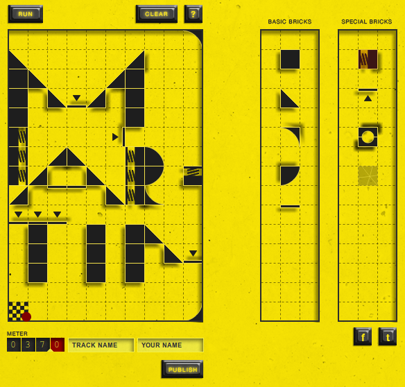

<figure class="alignleft">
            
            <figcaption class="text-center">Marble Run</figcaption>
        </figure>

<b>Go to the Game</b>: <a href="http://marblerun.at/tracks/new" rel="nofollow">marblerun.at</a>
<b>Task</b>: Create a Track for that little red dot, which is as long as possible.
<b>How to play</b>: On the right side of the screen you can see a toolbar. Different bricks, some with special functions, can be used to build your track.
<b>My Record</b>: 37m
<b>Programming</b>: The entire page is written in HTML + JavaScript. They used the Prototype JS library.
