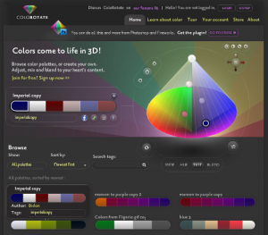
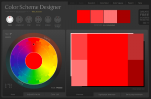
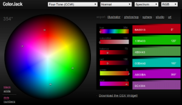
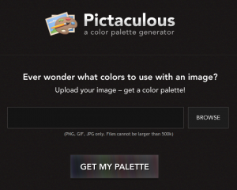
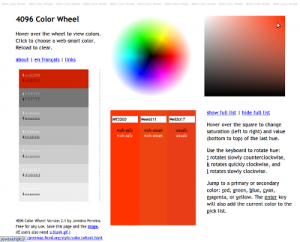
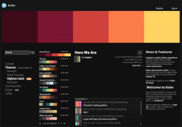
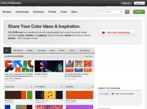
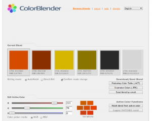

Here are some nice online tools to create color schemes

<h2>Color Rotate</h2>
<figure class="aligncenter">
            
            <figcaption class="text-center"><a href='http://www.colorotate.org/'>Color Rotate</a></figcaption>
        </figure>

<h2>Color Scheme Designer</h2>
<figure class="aligncenter">
            
            <figcaption class="text-center"><a href='http://colorschemedesigner.com/'>Color Scheme Designer</a></figcaption>
        </figure>

<h2>Color Jack</h2>
<figure class="aligncenter">
            
            <figcaption class="text-center"><a href='http://mudcu.be/sphere/'>Color Jack</a></figcaption>
        </figure>

<h2>Pictaculous</h2>
<figure class="aligncenter">
            
            <figcaption class="text-center"><a href='http://pictaculous.com/'>Pictaculous</a> - A color Palette Generator</figcaption>
        </figure>

<h2>4096 Color Wheel</h2>
<figure class="aligncenter">
            
            <figcaption class="text-center"><a href='http://www.ficml.org/jemimap/style/color/wheel.html'>4096 Color Wheel</a></figcaption>
        </figure>

<h2>Kuler</h2>
<figure class="aligncenter">
            
            <figcaption class="text-center"><a href='http://kuler.adobe.com/'>kuler</a></figcaption>
        </figure>

<h2>Colour Lovers</h2>
<figure class="aligncenter">
            
            <figcaption class="text-center"><a href='http://www.colourlovers.com/'>COLOURlovers</a></figcaption>
        </figure>

<h2>Color Blender</h2>
<figure class="aligncenter">
            
            <figcaption class="text-center"><a href='http://www.colorblender.com/'>Color Blender</a></figcaption>
        </figure>
