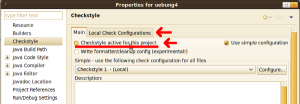

	<li></li>
I have to go to a programming course at KIT at the moment where we are taught how to program with Java. They create exercises which get evaluated automatically. One part of the evaluation is checkstyle.

So it is a good idea to test the files on my machine before uploading them.

<h2>Installation</h2>
You can install it on an Ubuntu system with this command:
```bash
sudo apt-get install checkstyle
```

<h2>Usage</h2>
You can call checkstyle with this command:
```bash
checkstyle -c /usr/share/checkstyle/sun_checks.xml YourCode.java
```

Another example would be:
```bash
checkstyle -c /path/to/config/Progr_WS11_Checkstyle1.xml KITBook.java
```

It will generate some output similar to this:
```bash
Starting audit...
KITBook.java:173:64: '{' is not preceded with whitespace.
KITBook.java:174:69: '-' is not preceded with whitespace.
KITBook.java:174:70: '-' is not followed by whitespace.
Audit done.

```

<h2>Resolve warnings</h2>
```bash
[warning] /usr/bin/checkstyle: No java runtime was found
[warning] /usr/bin/checkstyle: No JAVA_CMD set for run_java, falling back to JAVA_CMD = java
```
You have to set the path:
```bash
JAVA_CMD=/usr/lib/jvm/java-6-sun/bin/java
export JAVA_CMD
```

<h2>Check all files in a folder</h2>
```bash
checkstyle -c /home/moose/Downloads/Progr_WS11_Checkstyle1.xml -r .
```

<h2>Checkstyle and eclipse</h2>
Go to <code><u>H</u>elp &rarr; Install New <u>S</u>oftware ...</code>
<figure class="aligncenter">
            <a href="../images/2011/11/eclipse-path-updates-300x173.png"></a>
            <figcaption class="text-center">Install new software or plugins in eclipse</figcaption>
        </figure>

Install <code>http://eclipse-cs.sf.net/update/</code> as a new "repository".

After you have installed the plugin, you have to activate it for your project. To do so, you have to go to <code><u>P</u>roject &rarr; <u>P</u>roperties</code> and check <code>Checkstyle active for this project</code>. Then you have to change to the <code>Local Check Configurations</code> tab and load your personal checkstyle xml files. 

<figure class="aligncenter">
            <a href="../images/2011/11/eclipse-checkstyle-properties-300x104.png"></a>
            <figcaption class="text-center">Checkstyle properties in eclipse</figcaption>
        </figure>

Click on <code>New</code>, give it a name and click on <code>import</code>. Go back to the main tab and use your personal checkstyle. You will have to rebuild the project.

You might want to use more than one checkstyle file. You can do that if you uncheck <code>Use simple configuration</code>:

<figure class="aligncenter">
            <a href="../images/2011/11/eclipse-checkstyle-multiple-files.png"></a>
            <figcaption class="text-center">Multiple Checkstyle files in Eclipse</figcaption>
        </figure>

Now you can set <code>File Set Configuration</code> to <code>All</code>, select your <code>Check Configuration</code>, click on <code>OK</code> and enable it in the <code>Main</code> tab.

<h2>Further reading and resources </h2>
<ul>
    <li><a href="http://en.wikipedia.org/wiki/Checkstyle">Wikipedia</a></li>
    <li><a href="http://checkstyle.sourceforge.net/index.html">Official Website</a></li>
</ul>

<h3>KIT</h3>
If you are a student at KIT and you can download the KIT checkstyle-files from <a href="http://zvi.ipd.kit.edu/lehre_programmieren_ws11.php#Zusaetzliches_Material">zvi.ipd.kit.edu</a>. If you can't do it from home via VPN, you could use SSH.

These commands work fine on Ubuntu and I guess on every Linux machine. If you use Windows, you will have to install Putty or something similar.

Login with your personal account that begins with u. I'll use uabcd in this example.
```bash
ssh uabcd@rzstud.stud.uni-karlsruhe.de
```

Then download the files with wget:
```bash
wget ftp://ftp.ira.uka.de/pub/ZVI/KIT/programmieren_ws11/material/Progr_WS11_Checkstyle1.xml
wget ftp://ftp.ira.uka.de/pub/ZVI/KIT/programmieren_ws11/material/Progr_WS11_Checkstyle2.xml
```

Now you can exit the bash with <code>exit</code> and download the files from your account with <code>scp</code>:
```bash
scp uabcd@rzstud.stud.uni-karlsruhe.de:~/Progr_WS11_Checkstyle1.xml ~/Progr_WS11_Checkstyle1.xml
scp uabcd@rzstud.stud.uni-karlsruhe.de:~/Progr_WS11_Checkstyle1.xml ~/Progr_WS11_Checkstyle1.xml
```
