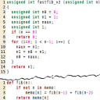

<figure class="alignright">
            
            <figcaption class="text-center">Compare programming languages</figcaption>
        </figure>

If you want to compare programming languages, I can recommend the following links:
<ul>
	<li><a href="http://en.literateprograms.org/">literateprograms.org</a>, </li>
	<li><a href="http://rosettacode.org/wiki/Rosetta_Code">Rosetta Code</a>, </li>
	<li><a href="http://www.99-bottles-of-beer.net/abc.html">99-bottles-of-beer.net</a>,</li>
	<li><a href="http://en.wikipedia.org/wiki/Comparison_of_programming_languages_(basic_instructions)">Comparison of programming languages (basic instructions)</a>, </li>
	<li><a href="http://en.wikipedia.org/wiki/Comparison_of_programming_languages">Comparison of programming languages</a></li>
</ul>

In particular, I like the following pages:
<ul>
<li>Fibonacci numbers (<a href="http://en.literateprograms.org/Fibonacci_numbers_%28Python%29">literateprograms</a>, <a href="http://rosettacode.org/wiki/Fibonacci_sequence">rosettacode</a>)</li>
<li>Hello World (<a href="http://en.literateprograms.org/Hello_World_%28Python%29">literateprograms</a>, <a href="http://rosettacode.org/wiki/Hello_world">rosettacode</a>)</li>
</ul>

If you want to learn a new language you can look at the implementation of one problem and learn how the new language can be used.
