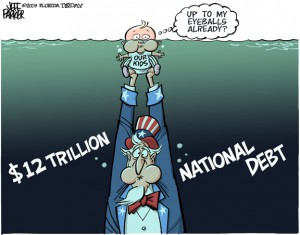

I am not the first person you should ask if you want to know something about the United States. I've never been there and I know only one American. But I am reading quite a lot of websites which publish regularly political caricatures. This post is simply a collection of different caricatures I've stumbled over. For most of them I had to search the source, so I hope you will enjoy them.

If you are the owner of one of these websites and don't want me to publish your caricatures, I'll remove them. But I will also remove the link to your website.

<h2>We are the 99%</h2>
<a href="http://en.wikipedia.org/wiki/We_are_the_99%25">We are the 99%</a> is a political slogan of "Occupy" protesters. It refers to the vast concentration of wealth among the top 1% of income earners compared to the other 99%, and indicates that most people are paying the price for the mistakes of a tiny minority.

<figure class="aligncenter">
            
            <figcaption class="text-center">We are the 99% - Caricature from mattbors.com</figcaption>
        </figure>
(mattbors.com has some more caricatures from the occupy protesters)

<figure class="aligncenter">
            
            <figcaption class="text-center">Wall Street - Demonstrators vs. Bankers (from&nbsp;<a href=http://www.startribune.com/opinion/131177628.html>Startribune.com</a>)</figcaption>
        </figure>

<figure class="aligncenter">
            
            <figcaption class="text-center">Dessert - the american style (from <a href=http://blog.seattlepi.com/davidhorsey/2011/09/19/how-we-slice-the-pie-in-the-usa/>David Horsey</a>)</figcaption>
        </figure>

Some of the best caricatures are made by <a href="http://en.wikipedia.org/wiki/David_Horsey">David Horsey</a>.

<h2>Republicans</h2>
The <a href="http://en.wikipedia.org/wiki/Republican_Party_(United_States)">Republican Party</a> is one of the two major contemporary political parties in the United States, along with the Democratic Party. Founded by anti-slavery expansion activists in 1854, it is often called the GOP (Grand Old Party). The party's platform generally reflects American conservatism in the U.S. political spectrum and is considered center-right, in contrast to the center-left Democratic Party.

<figure class="aligncenter">
            
            <figcaption class="text-center">The Principled Pachyderm (from <a href=http://www.politico.com/wuerker/archive/20111201-the-principled-pachyderm.html>M. Wuerker</a>)</figcaption>
        </figure>

<h2>Tea Party</h2>
The <a href="http://en.wikipedia.org/wiki/Tea_Party_movement">Tea Party movement</a> is an American populist political movement that is generally recognized as conservative and libertarian, and has sponsored protests and supported political candidates since 2009. It endorses reduced government spending, opposition to taxation in varying degrees, reduction of the national debt and federal budget deficit, and adherence to an originalist interpretation of the United States Constitution.

<figure class="aligncenter">
            
            <figcaption class="text-center">Tea Party and big gouvernment</figcaption>
        </figure>

Phil Hands has also made a nice one, but I've only found a page which clearly states "pay per use". What a pity!

I've just found the category tea party of <a href="http://theweek.com/section/cartoon/19/220783/the-tea-party">theweek.com</a>.

<h2>Education</h2>
<figure class="aligncenter">
            
            <figcaption class="text-center">Education in China, Africa and the U.S. (from <a href=http://www.inconsequentiallogic.com/2009/11/reality-can-bite.html>inconsequentiallogic.com</a>)</figcaption>
        </figure>

<figure class="aligncenter">
            
            <figcaption class="text-center">University student dept (By Jeff Parker &copy; 2006 Florida Today)</figcaption>
        </figure>

<h2>National debt</h2>
<figure class="aligncenter">
            
            <figcaption class="text-center">National dept (from <a href=http://jeffparker.flatoday.net/2009/11/1120-cartoon-debt-flood.shtml>flatoday.net</a>)</figcaption>
        </figure>

I was very astonished that I did not find much about torture (e.g. <a href="http://en.wikipedia.org/wiki/Waterboarding">waterboarding</a>), human and civil rights (e.g. <a href="http://en.wikipedia.org/wiki/Guantanamo_Bay_detention_camp">Guantanamo Bay</a>, <a href="http://en.wikipedia.org/wiki/Capital_punishment_in_the_United_States">death penalty</a>) and the widespread ownership of arms (see <a href="http://en.wikipedia.org/wiki/Second_Amendment_to_the_United_States_Constitution">2nd Amendment</a>, <a href="http://en.wikipedia.org/wiki/List_of_countries_by_intentional_homicide_rate">List of countries by intentional homicide rate</a>).

Do you know some good sites with caricatures? What do you think are the problems of Europe / Germany?
