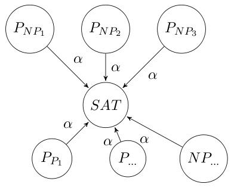

Komplexit&auml;tsklassen werden in der Theoretischen Informatik verwendet um den Ressourcenbedarf von Algorithmen bzw. Problemen einzuordnen. Meist betrachtet man die Laufzeit- und die Speicherplatzkomplexit&auml;t, aber es w&auml;re prinzipiell auf Vorstellbar, dass man andere Kriterien nutzt. Ich werde in diesem Artikel mal kurz die in der Vorlesung behandelten Klassen vorstellen.

Da es umst&auml;ndlich ist, werde ich im Folgenden nur noch von Problemen reden. Gemeint sind aber meist auch formale Sprachen und Algorithmen.

<h2>Die Klasse P</h2>
In der Klasse $\cal P$ sind alle Probleme, die mit einer deterministischen Turingmaschine in polynomialzeit l&ouml;sbar sind. Das sind also alle Probleme, f&uuml;r die es einen Algorithmus gibt, der in $\cal O(n^i), i \in \mathbb{N}_0$ ist.

Wenn es allerdings <em>noch</em> keinen Algorithmus gibt, der ein Problem in polynomialzeit l&ouml;st, kann das Problem dennoch in $\cal P$ liegen. Dann muss es einen besseren Algorithmus zur L&ouml;sung des Problems geben.

<h2>Die Klasse NP</h2>
In der Klasse $\cal NP$ sind alle Probleme, die mit einer <strong>nicht-deterministischen</strong> Turingmaschine in polynomialzeit l&ouml;sbar sind. Das besondere an einer nicht-determinisitschen Turingmaschine ist das Orakelmodul. Es liefert einfach die L&ouml;sung. Wie es das macht, wissen wir nicht. Irgendwie geht es halt. Diese L&ouml;sung muss in polynomialzeit von einer deterministischen Turingmaschine verifiziert werden.

Was liegt dann nicht in $\cal NP$? Das Orakelmodul h&ouml;rt sich so m&auml;chtig an, dass eventuell alle Probleme in $\cal NP$ liegen k&ouml;nnten. Weit gefehlt. Suchprobleme liegen h&auml;ufig (aber nicht immer) au&szlig;erhalb von $\cal NP$. Das sind dann Probleme mit einer Fragestellung &agrave; la "Gib eine optimale Tour durch eine gegebene Menge an St&auml;dten an". Wenn das Orakel-Modul eine solche Tour liefert, muss der deterministische Teil noch schauen, ob es eventuell eine l&auml;ngere Tour gibt.

Die wohl ber&uuml;hmteste Fragestellung der Theoretischen Informatik lautet nun:

<strong>P vs. NP</strong>: Gibt es Probleme, die in NP liegen, aber nicht in P?

Es ist wohl anschaulich klar, dass gilt: $\cal P \subset NP$. P vs. NP ist die Frage, ob $\cal P = NP$ oder $\cal P \subsetneq NP$. Oder nochmals anders formuliert: $\cal NP \setminus P \stackrel{?}{=} \emptyset$

<h3>Die Klasse NPC</h3>
Die Klasse der NP-Vollst&auml;ndigen Probleme ist echt in NP, also $\cal NPC \subsetneq NP$. Das besondere an $\cal NPC$ ist, dass jedes Probleminstanz in $\cal NP$ in eine Instanz eines beliebigen Problems in $\cal NPC$ umgewandelt werden kann.

Das es ein solches Problem gibt, hat Cook 1971 mit <a href="http://de.wikipedia.org/wiki/Erf%C3%BCllbarkeitsproblem_der_Aussagenlogik">SAT</a> gezeigt. Cook hat also anschaulich folgendes gemacht:
<figure class="aligncenter">
            
            <figcaption class="text-center">SAT ist in NPC</figcaption>
        </figure>

F&uuml;r alle folgenden Beweise, dass ein Problem in $\cal NPC$ liegt, wurde der Satz von Cook verwendet.
Laut diesem Satz (dessen Beweis wahnsinning lang ist) l&auml;sst sich jede Probleminstanz von Problemen in $\cal NP$ sich in eine Instanz von SAT umwandeln. Es reicht also zu zeigen, dass sich eine beliebige SAT-Instanz I  in eine Instanz I' des neuen Problems in polynomialzeit umwandeln l&auml;sst. Diese beiden Instzanzen m&uuml;ssen in folgender Beziehung stehen:
F&uuml;r I existiert eine L&ouml;sung $\Leftrightarrow$ f&uuml;r I' existiert eine L&ouml;sung:
<figure class="aligncenter">
            
            <figcaption class="text-center">Beweis, dass 3-SAT in NPC liegt</figcaption>
        </figure>

Sobald man von einem Problem sicher wei&szlig;, dass es in $\cal NPC$ liegt, kann man nat&uuml;rlich auch etwas anderes als SAT verwenden.

Im Bezug auf P vs. NP ist es vor allem interessant. Wenn ein Problem nicht in P, aber in NP liegt, dann ist sicher jedes Problem in NPC au&szlig;erhalb von P. Also: $\cal P \neq NP \Rightarrow P \cap NPC = \emptyset$.
Warum? Angenommen es existiert ein Problem P f&uuml;r das gilt:
<ul>
  <li>$P \in \cal NP$</li>
  <li>$P \notin \cal P$</li>
  <li>$P \notin \cal NPC$</li>
</ul>
Dann gibt es eine polynomielle Transformation von jeder Instanz von P in eine Probleminstanz von einem beliebigem Problem in $\cal NPC$. Damit kann jedes Problem in $\cal NPC$ nicht mehr in $\cal P$ liegen, da sonst auch $P \in \cal P$.

<h2>NPI, co-P und co-NP</h2>
Formal gilt: $\cal NPI := NP \setminus (P \cup NPC)$.
Es sind also alle Probleme, die innerhalb von $\cal NP$ sind, aber au&szlig;erhalb von $\cal P$ und noch nicht in $\cal NPC$ in $\cal NPI$. Es ist also so eine Art "Zwischenklasse".

Um es etwas anschaulicher zu machen, habe ich mal folgendes Bildchen erstellt:
<figure class="aligncenter">
            
            <figcaption class="text-center">P vs. NP: Die Klassen P, NP, NPC und NPI im &Uuml;berblick</figcaption>
        </figure>

Bemerkenswert ist folgende Aussage:
Im Fall $\cal P = NP$ ist auch ${\cal P} \setminus \{\emptyset, \Sigma^*\} = {\cal NPC}$ (siehe Nachklausur von 2007 / 2008, Frage 5).
Warum stimmt das? Damit ein Problem $\in \cal NPC$ ist, muss es nur eine polynomielle Transformation von jedem Problem in NP auf das eine Problem geben. Das ist offensichtlich der Fall, wenn man alle Probleme in NP in polynomieller Zeit l&ouml;sen kann. In diesem Fall kann man das Entscheidungsproblem l&ouml;sen und eine Ja-Instanz auf eine beliebige andere Ja-Instanz abbilden und analog Nein-Instanzen auf Nein-Instanzen abbilden. Da $\emptyset$ keine Ja-Instanz hat und $\Sigma$ keine Nein-Instanz hat, muss man diese herausnehmen.

Formal gilt: $\text{co-}{\cal P} := \{L \in \Sigma^* | L^C \in {\cal P}\}$ und analog $\text{co-}{\cal NP} := \{L \in \Sigma^* | L^C \in {\cal NP}\}$.

Folgende Aussage finde ich dazu sehr interessant:
$L \in {\cal NPC} \land L \in \text{co-}{\cal NP} \Rightarrow {\cal NP} = \text{co-}{\cal NP}$

<h2>D-TAPE und N-TAPE</h2>
Im Skript wurde das seltsam geschrieben ($\cal DTAPE$). Ich habe so nicht mehr erkannt, dass es TAPE hei&szlig;en soll. In der Klausur sollte man sich davon nicht irritieren lassen.

Formal: $D-TAPE(s(n)) := \{L | \text{Es existiert eine determinitistische TM, die L mit Platzbedarf s(n) akzeptiert.}\}$
$N-TAPE(s(n)) := \{L | \text{Es existiert eine nicht-determinitistische TM, die L mit Platzbedarf s(n) akzeptiert.}\}$

<h2>Quellen und Material</h2>
<ul>
  <li><a href="http://i11www.iti.uni-karlsruhe.de/_media/teaching/winter2011/tgi/tgi_skript_ws11.pdf">Theoretische Grundlagen der Informatik</a>: Skript von Prof. Dr. Dorothea Wagner</li>
  <li>Die Bilder stehen hier zur Verf&uuml;gung: <a href='../images/2012/02/komplexitaetsklassen-material.zip'>Material zu den Komplexit&auml;tsklassen</a></li>
</ul>
