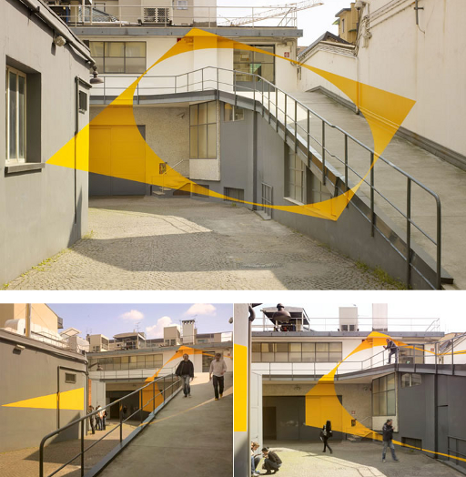
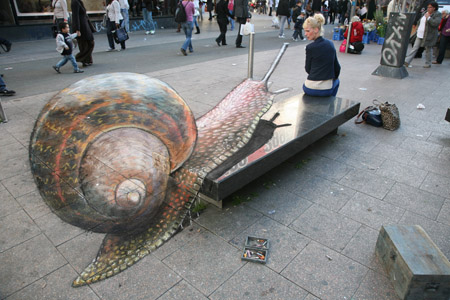
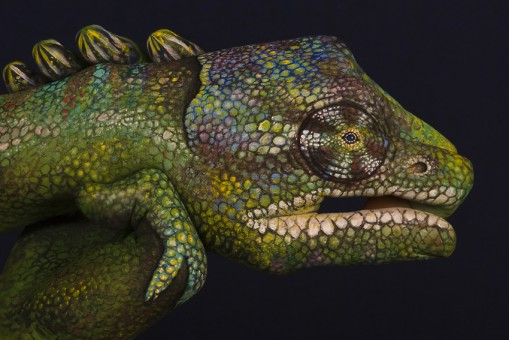
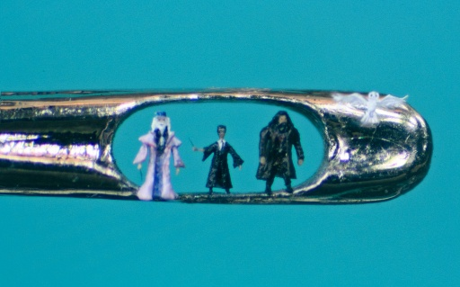
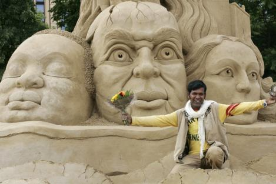
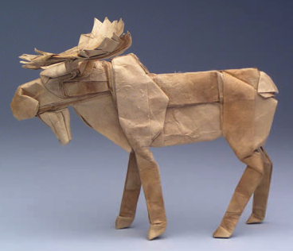

<h2>Anamorphic Art</h2>
<a href="http://en.wikipedia.org/wiki/Anamorphosis">Anamorphosis</a> is a distorted projection or perspective requiring the viewer to use special devices or occupy a specific vantage point to reconstitute the image.

Here is a good example by <a href="http://www.varini.org/">Felice Varini</a>:
<figure class="aligncenter">
            
            <figcaption class="text-center">Anamorphic Art - Source: illusion.scene360.com</figcaption>
        </figure>

<h2>Pavement Drawings</h2>
Pavement Drawings can be combined with anamorphic art. One great artist I've found is <a href="http://www.julianbeever.net/pave.htm">Julian Beever</a>. Here is one example:

<figure class="aligncenter">
            
            <figcaption class="text-center">Pavement Drawing by Julian Beever</figcaption>
        </figure>

<h2>Hand Painting</h2>
You might already know body painting. <a href="http://www.guidodaniele.com/?page_id=8">Guido Daniele</a> does something very simmilar he calls "Hand Painting". Here is one example:
<figure class="aligncenter">
            
            <figcaption class="text-center">Hand Painting by Guido Daniele</figcaption>
        </figure>

<h2>Hair Sculptures</h2>
<a href="http://en.wikipedia.org/wiki/Willard_Wigan">Willard Wigan</a> is a sculptor from Birmingham, England, who makes microscopic art. His sculptures are typically placed in the eye of a needle or on the head of a pin. A single sculpture can be as small as 0.005 mm. Here is an example from his <a href="http://www.willard-wigan.com/gallery.aspx">gallery</a>:
<figure class="aligncenter">
            
            <figcaption class="text-center">Harry Potter by Willard Wigan</figcaption>
        </figure>

<h2>Sand Art</h2>
It is amazing what can be done with sand. <a href="http://en.wikipedia.org/wiki/Sudarshan_Pattnaik">Sudarsan Pattnaik</a> created this sculpture:
<figure class="aligncenter">
            
            <figcaption class="text-center">Sand Art: Global Warming by Sudarshan Pattnaik</figcaption>
        </figure>

<h2>Origami</h2>
Robert J. Lang seems to invest a serious amount of time in <a href="http://en.wikipedia.org/wiki/Origami">Origami</a>. His <a href="http://www.langorigami.com/art/gallery/gallery.php?tag=mammals&name=bull_moose">gallery of mammals</a> is very impressive. Here is a moose:
<figure class="aligncenter">
            
            <figcaption class="text-center">Origami moose by Robert J. Lang</figcaption>
        </figure>

<h2>Domino Day</h2>
This is not done by one artist, but it should be mentioned:
<iframe width="512" height="377" src="//www.youtube.com/embed/yeF7yLkEECs" frameborder="0" allowfullscreen></iframe>
