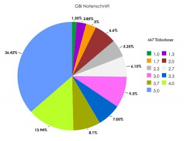

Für die Klausur in den Grundbegriffen der Informatik (GBI) sollte man Folgendes auf jeden Fall wissen:
<ul>
  <li>Wie funktionieren Induktionsbeweise? &rarr; <a href="../wie-fuhre-ich-einen-induktionsbeweis/" title="Wie führe ich einen Induktionsbeweis?">Antwort</a></li>
  <li>Was ist ein Alphabet, eine formale Sprache und was eine formale Grammatik? &rarr; <a href="../definitionen-aus-gbi/#formale-sprachen" title="Definitionen aus GBI">Antwort</a></li>
  <li>Was bedeuten für zwei formale Sprachen $L_1, L_2$ folgende Operationen: $\cdot, \cup, \cap, \setminus, L_1^3, L_1^+, L_1^*$? &rarr; <a href="../definitionen-aus-gbi/#formale-sprachen" title="Definitionen aus GBI">Antwort</a></li>
  <li>Was ist eine Abbildung, was eine Relation? &rarr; <a href="../definitionen-aus-gbi/#abbildungen-und-relationen" title="Definitionen aus GBI">Antwort</a></li>
  <li>Was ist Injektivität, Surjektivität, Bijektivität, Reflexivität, Symmetrie, Antisymmetrie und Transitivität? &rarr; <a href="../definitionen-aus-gbi/#abbildungen-und-relationen" title="Definitionen aus GBI">Antwort</a></li>
  <li>Wie sind eine Äquivalenzrelation, eine Ordnungsrelation, eine Halbordnung und eine Totalordnung definiert? &rarr; <a href="../definitionen-aus-gbi/#abbildungen-und-relationen" title="Definitionen aus GBI">Antwort</a></li>
  <li>Wie ist ein minimales Element und wie das kleinste Element einer Halbordnung definiert? &rarr; <a href="../definitionen-aus-gbi/#abbildungen-und-relationen" title="Definitionen aus GBI">Antwort</a></li>
  <li>Wie sind die Landau-Symbole $\cal O(f(n)), \Theta(f(n)), \Omega(f(n))$ definiert? &rarr; <a href="../definitionen-aus-gbi/#komplexitatstheorie" title="Definitionen aus GBI">Antwort</a> und <a href="../die-landau-symbole/">Nachtrag</a></li>
  <li>Was ist eine Turingmaschine und wie gibt man eine Konfiguration davon an?</li>
  <li>Wie ist ein Graph definiert und wie ein Baum? &rarr; <a href="../definitionen-aus-gbi/#graphentheorie" title="Definitionen aus GBI">Antwort</a></li>
  <li>Wann sind zwei Graphen isomorph?</li>
  <li>Was ist ein Pfad, eine Schlinge, ein Kreis und ein Zyklus?</li>
  <li>Wann ist ein Graph zusammenhängend und wann vollständig / streng zusammenhängend?</li>
  <li>Was ist eine Adjazenzmatrix und was ist eine Wegematrix?</li>
  <li>Wie lautet die Wahrheitstabelle von $A \Rightarrow B$?</li>
  <li>Wie unterscheiden sich Mealy- und Moore-Automaten? Welche Sprachen akzeptieren sie und wie stellt man sie dar?</li>
  <li>Was ist eine Huffman-Kodierung und wie stellt man sie dar?</li>
  <li>Was haben alle Wörter einer Äquivalenzklasse der Nerode-Relation gemeinsam?</li>
  <li>Was ist ein Hasse-Diagramm?</li>
  <li>Wie lautet das Master-Theorem? &rarr; <a href="http://de.wikipedia.org/wiki/Master-Theorem#Allgemeine_Form">Antwort</a></li>
</ul>

Wenn die Antwort auf eine dieser Fragen noch unklar ist, sollte man sich das <a href="http://gbi.ira.uka.de/vorlesungen/skript.pdf">Skript</a> nochmals anschauen.

Was man auf jeden Fall üben sollte, sind die Aufgaben zu Turingmaschinen. Das kommt sicher dran und man ist sicher zu langsam, wenn man nicht ein paar Aufgaben dazu macht.

<h2>Some Random Facts</h2>
<ul>
  <li>Ein Mebibyte (MiB) sind $2^{20}$ Byte, ein Megabyte (MB) sind $10^6$ Byte.</li>
  <li>$\{\varepsilon\} \neq \emptyset = \{\}$</li>
  <li>$\cal P(\emptyset) = \{\emptyset\} = \{\{\}\}$ und $|{\cal P}(\emptyset)| = 1$, aber $|\emptyset| = 0$.</li>
  <li>$\text{Num}_2(111)$ ist die Zahl 7, $\text{Repr}_2(\text{die Zahl } 7) = 111$</li>
  <li>$\langle \emptyset \rangle = \{\}$ und $\langle \emptyset * \rangle = \{\varepsilon\}$</li>
  <li>Ein paar Beziehungen von Komplexitätsklassen:
   <ul>
    <li>${\cal O}(\log(n)) \subsetneq {\cal O}(n)$</li>
    <li>${\cal O}(n^{2.1}) \subsetneq {\cal O}(n^{2.2})$</li>
    <li>${\cal O}(n^{100}) \subsetneq {\cal O}(n!)$</li>
    <li>${\cal O}(2^n) \subsetneq {\cal O}(n!) \subsetneq {\cal O}(n^n) \subsetneq {\cal O}(2^{n^2})$</li>
    <li>${\cal O}((n^n)^n) \subsetneq {\cal O}(n^{(n^3)})$</li>
    </ul>
  </li>
  <li>Logarithmusgesetze:
    <ul>
      <li>$\log(x \cdot y) = \log(x) + \log(y)$</li>
      <li>$\log(\frac{x}{y}) = \log(x) - \log(y)$</li>
      <li>$\log(x^r) = r \cdot \log(x)$</li>
    </ul>
  </li>
  <li>Ein <a href="../minimierung-eines-automaten-mittels-aquivalenzklassenkonstruktion/">minimaler endlicher Automat</a> zu einer regulären Sprache $L$ hat $n$ Zustände $\Leftrightarrow$ Es gibt $n$ Äquivalenzklassen bzgl. der Nerode-Relation zu $L$.</li>
  <li>Der Index der Nerode-Relation zu einer Sprache $L$ ist nicht endlich $\Leftrightarrow$ $L$ ist nicht regulär.</li>
  <li>$S \circ R = \{(x, z) \in M_1 \times M_3 | \exists y \in M_2: (x, y) \in R \land (y, z) \in S\}$</li>
  <li>$r$ ist Wurzel von $G = (V, E) \Leftrightarrow \forall x \in V:$ Es gibt genau einen Pfad von $r$ nach $x$.</li>
</ul>

Zum Üben habe ich mal eine "Klausur" erstellt. Hier ist die <a href='../images/2012/02/gbi-klausurvorbereitung.pdf'>PDF</a> und hier die <a href='../images/2012/02/gbi-klausurvorbereitung.zip'>LaTeX</a>-Datei.

<h3>Groß-O-Notation</h3>
<strong>Beh</strong>: $\mathcal{O}(n!) \nsubseteq \mathcal{O}(2^n)$

<strong>Bew</strong>: z.Z.: $n! \notin \mathcal{O}(2^n)$

Annahme: $\exists c \in \mathbb{R}\, \exists n_0 \in \mathbb{N}\, \forall n \geq n_0: n! \leq c \cdot 2^n$

Für diese $n$ gilt:

\begin{align}
& n! \leq c \cdot 2^n\\
\Leftrightarrow & \frac{n!}{2^n} \leq c\\
\Leftrightarrow & \frac{\prod_{i=1}^n i}{\prod_{i=1}^n 2} \leq c\\
\Leftrightarrow & \prod_{i=1}^n \frac{i}{2} \leq c
\end{align}

Es gilt für $n \geq 3$: $\prod_{i=1}^n \frac{i}{2} = \frac{1}{2} \cdot 1 \cdot \frac{3}{2} \cdot \prod_{i=4}^n \frac{i}{2} \geq \frac{3}{4} \cdot 2^{n-3}$

$\Rightarrow \forall c \in \mathbb{R}\, \exists n_1 \in \mathbb{N}\, \forall n \geq n_1: n! > c \cdot 2^n$

Das ist ein Widerspruch zur Annahme, also ist $\mathcal{O}(n!) \nsubseteq \mathcal{O}(2^n)$.

<h2>Formalismen</h2>
<ul>
  <li>Ableitungen benutzen Doppelpfeile, Ableitungsregeln einfache Pfeile.</li>
  <li>Bei ungerichteten Graphen werden die Kanten als Mengen mit zwei Elementen beschrieben, bei gerichteten als Tupel.</li>
</ul>

<h2>Termin</h2>
Alle wichtigen Informationen stehen auf der <a href="http://gbi.ira.uka.de/pruefungen/klausuren.html">Klausurseite</a>.

* <strong>Datum</strong>: 05.03.2012 um 11:00 Uhr. Anwesend sollte man ab ca. 10:30 - 10:40 Uhr sein.
* <strong>Ort</strong>: <a href="http://gbi.ira.uka.de/pruefungen/hoersaal_einteilung_gbi_2012.pdf">Liste der Zuweisung</a> - Das sind ganze 729 Matrikelnummern! (Ich schreib im Benz).
* <strong>Dauer</strong>: 120 min.
* <strong>Punkte</strong>: 40 - 50, mit der Hälfte hat man auf jeden Fall bestanden.
* <strong>Nicht vergessen</strong>: Studentenausweis
* <strong>Nachklausur</strong>: am 18.09.2012. Hinweise sind <a href="http://www.informatik.kit.edu/klausuren.php?kid=388.35">hier</a>.

<h2>Ergebnisse</h2>
Die <a href="http://gbi.ira.uka.de/pruefungen/aushang.pdf">Ergebnisse</a> sind nun hier verfügbar.

Das ist eine Notenverteilung, die mir ein Kommilitone zugeschickt hat:
<figure>
    
    <figcaption>GBI Ergebnisse</figcaption>
</figure>
